# 04 — Modelos de dados

> Todos os models da aplicação, agrupados por app, com os campos que importam,
> relacionamentos (`related_name`), enums e constraints. Campos triviais
> (`created_at`, `name`) aparecem só quando têm regra. A modelagem conceitual do
> produto está em `Regras/08_BANCO_DE_DADOS.md`.
>
> **Vocabulário.** Desde 01/10/2026 a interface e as URLs dizem **Demanda**, mas o
> código segue com `Activity` (models, tabelas, `related_name`, chaves de enum e de
> permissão no código); este documento usa os nomes do código e escreve "demanda"
> no texto corrido. Desde 02/10/2026 os textos da interface dizem **Etapa**
> (`ActivityStage`/`TaskStage`) e **Status** (`WorkflowStatus`, que o código e os
> docs mais antigos chamam de *condição*). Esse "Status" manual por setor **não** é
> o `Activity.status`/`Task.status` operacional.
>
> Estado descrito: HEAD `add5acd` (02/10/2026). Atualizado em 03/10/2026.

---

## 1. Visão geral

Os diagramas estão divididos por domínio para caberem numa página. Só aparecem
entidades e relacionamentos; os campos estão nas seções 2 a 7. `User` é o
`auth.User` do Django. Em todos os diagramas `AccessProfile` é `acessos.Profile`
e `Profile` é `accounts.Profile`.

### 1.1 Pessoas, organização e cadastros

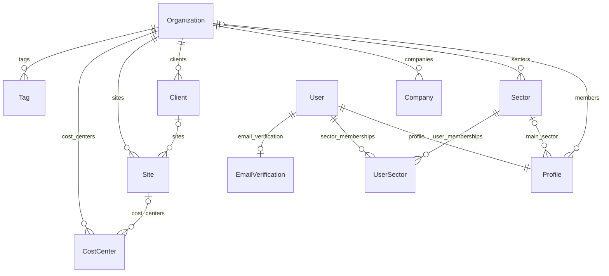

### 1.2 Acesso (perfis, ações e escopos)

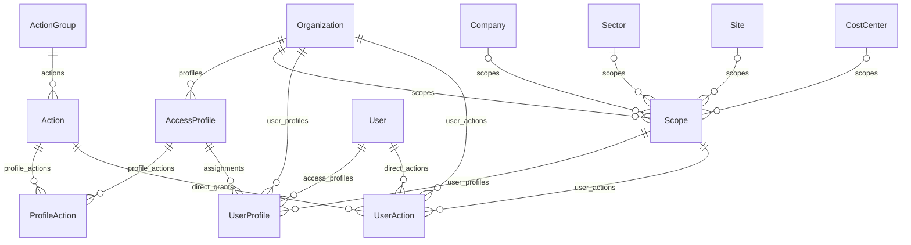

### 1.3 Etapas, status manuais e cores por setor

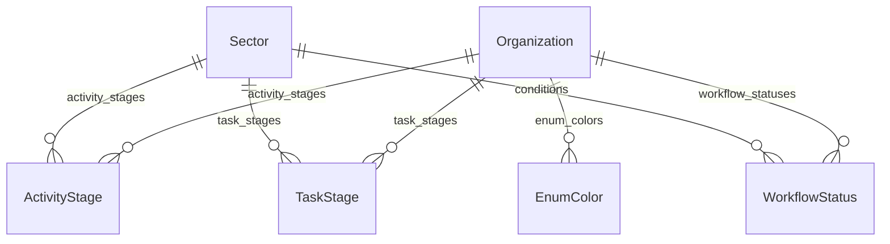

### 1.4 Demanda (`Activity`)

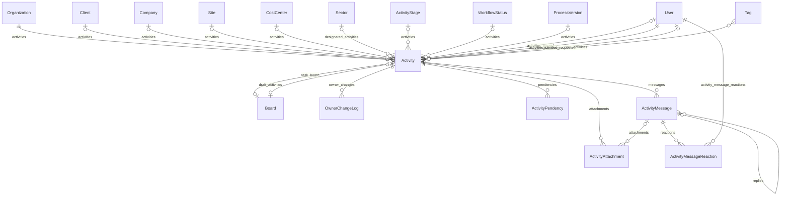

### 1.5 Tarefa (`Task`)

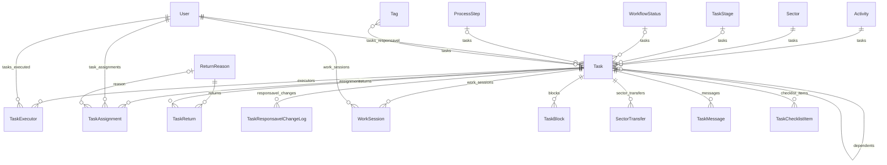

### 1.6 Fila e prazo

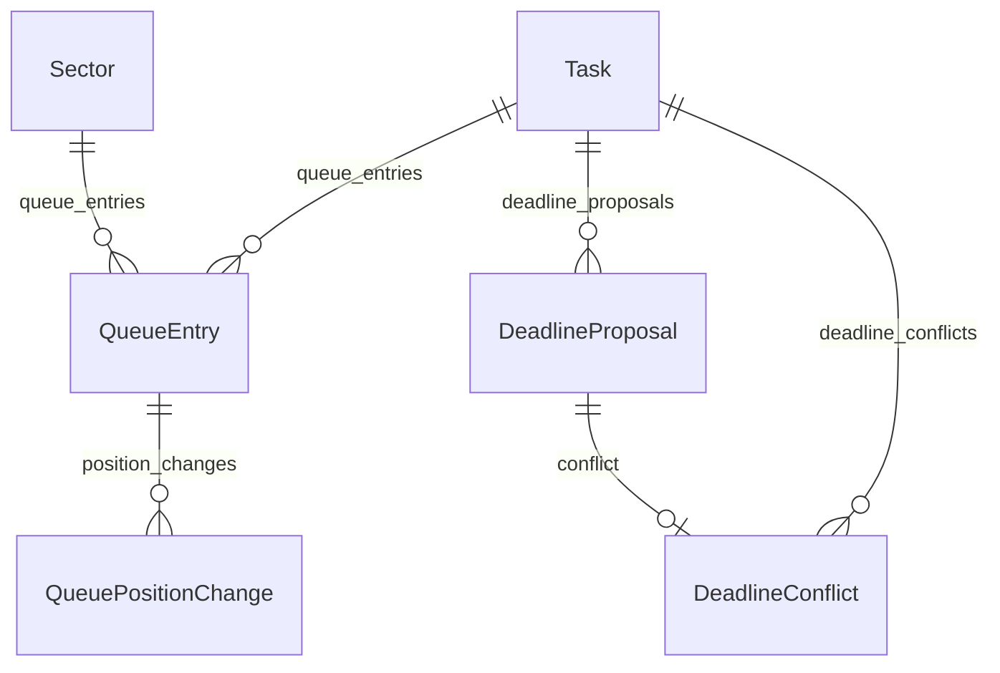

### 1.7 Processos

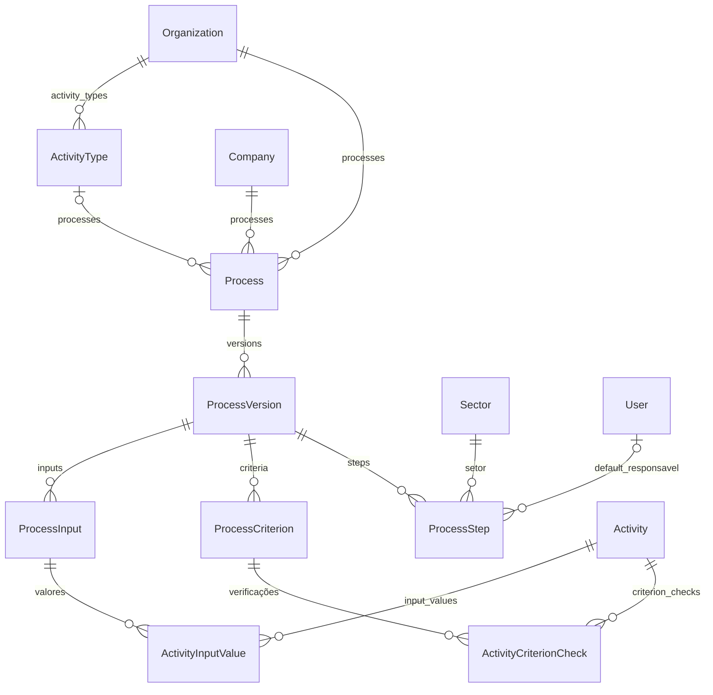

Os diagramas de notificações e auditoria (§7), Caixa de Entrada (§7.1) e quadros
(§7.2 e §7.3) estão nas respectivas seções.

---

## 2. `core`

Todos, exceto `Organization`, têm `organization` → `Organization` (CASCADE).

| Model | Campos relevantes | Constraints / regras |
|---|---|---|
| `Organization` | `name` (único), `is_active` | O tenant. Ordenação por `name`. |
| `Company` | `name`, `document`, `is_active` | Único por (org, name). Empresa operacional **interna** (Regras 05 §9). |
| `Sector` | `name`, `description`, `color` (hex, padrão `#3B82F6`; migração `core/0015`), `is_active`, `created_by` (null, SET_NULL) | Único por (org, name). Nunca fixo no código. |
| `Client` | `name`, `document`, `phone`, `email`, `address`, `is_active` | Único por (org, name). Quem **solicita** o serviço; diferente de `Company`. |
| `Site` (obra) | `client` → `Client` (null, SET_NULL, `sites`), `name`, `is_active` | Regras 10 §11. Não tem mais `company` (migração `0010`). Sem unicidade de nome. |
| `CostCenter` | `site` → `Site` (null, SET_NULL, `cost_centers`), `name`, `is_active` | Sem unicidade de nome. |
| `Tag` | `name`, `color` (hex da paleta de 36 cores), `is_active`, `created_by` | Único por (org, name). |
| `ActivityStage` | `sector` → `Sector` (CASCADE, `activity_stages`), `name`, `order`, `color`, `is_active`, `is_default`, `column_limit` (inteiro curto, null), `created_by` | Único por (org, sector, name); **uma** etapa padrão por (org, sector) (constraint parcial `is_default`). Coluna do Kanban de demandas; **nunca** altera `Activity.status`. `column_limit` só avisa (nunca impede mover ou criar). Na interface: **Etapa**. |
| `TaskStage` | `sector` → `Sector` (CASCADE, `task_stages`), `name`, `order`, `color`, `is_active`, `is_default`, `column_limit`, `created_by` | Igual a `ActivityStage`, para tarefas; **nunca** altera `Task.status`. |
| `WorkflowStatus` | `sector` → `Sector` (CASCADE, `conditions`), `domain` (`activity`/`task`), `name`, `description`, `behavior` (**legado**: vazio, não é usado), `color`, `order`, `is_active`, `is_default`, `created_by` | Único por (org, sector, domain, name); **um** padrão por (org, sector, domain) (constraint parcial). Nunca movimenta fila, cronômetro, bloqueio, conclusão ou transição. Cada setor ganhou um "Normal" padrão (migração `0014`). Na interface: **Status**. É referenciado por `Activity.condition` e `Task.condition` (SET_NULL). |
| `EnumColor` | `domain` (`activity_status`, `task_status`, `activity_urgency`, `task_priority`), `code`, `color`, `label`, `description`, `is_hidden`, `updated_by` (null, SET_NULL), `updated_at` | Único por (org, domain, code). Sobrescreve cor/rótulo de um valor de enum fixo (`code` não é FK: o service o valida contra o `TextChoices`); o significado do código não muda. `is_hidden` só tira o código das opções oferecidas. |

`Organization`, `Company`, `Sector`, `Client`, `Site`, `CostCenter` e `Tag` têm
`ordering = ["name"]`. `ActivityStage`, `TaskStage` e `WorkflowStatus` ordenam por
(org, sector, [domain,] order, name).

As etapas e os status são **por setor** desde 01/10/2026 (migração
`core/0012_sector_scoped_stages_conditions`, que copiou o cadastro antigo da
organização para cada setor). Uma demanda sem setor perdeu a etapa global antiga.

A paleta e as cores padrão ficam em `core/colors.py` (`PALETTE`, `DEFAULTS`),
espelhadas em `static/js/color-utils.js`.

---

## 3. `accounts`

| Model | Campos relevantes | Constraints / regras |
|---|---|---|
| `Profile` | `user` 1:1 (CASCADE, `profile`), `organization` (null, PROTECT, `members`), `phone`, `main_sector` (null, SET_NULL), `must_change_password`, `created_at` | Criado vazio por signal (`accounts/signals.py`) ao criar um `User`. `main_sector` é só o filtro padrão das telas (Regras 05 §29). `must_change_password` liga com a senha provisória e desliga quando a pessoa escolhe a própria (doc 07). |
| `UserSector` | `user` (CASCADE, `sector_memberships`), `sector` (CASCADE, `user_memberships`), `role` (`MEMBRO`, `GESTOR`), `joined_at`, `removed_at` (null) | Único por (user, sector) **enquanto** `removed_at` é nulo (constraint parcial `unique_active_user_sector`) — sair e voltar abre novo período. Ordenação `-joined_at`. Ser GESTOR não concede autorização por si só. Salvar/apagar invalida o cache de escopos do motor de autorização (signal). |
| `EmailVerification` | `user` 1:1 (CASCADE, `email_verification`), `code` (6 dígitos), `created_at`, `expires_at`, `attempts`, `confirmed_at` (null) | `CODE_TTL`=15 min, `RESEND_COOLDOWN`=60 s, `MAX_ATTEMPTS`=5. `issue(user)` substitui o código anterior (mesma linha). |

---

## 4. `acessos`

| Model | Campos relevantes | Constraints / regras |
|---|---|---|
| `ActionGroup` | `key` (slug, único), `name`, `description`, `order`, `is_active` | Só organiza a interface. |
| `Action` | `group` (PROTECT, `actions`), `key` (único, ex. `fila.reordenar`), `name`, `description`, `is_sensitive`, `is_active` | Definida pelo produto em `catalog.py` (semeada por `seed_acoes`), nunca pelo cliente. `is_sensitive` só destaca na UI/auditoria. Índice (group, is_active). |
| `Profile` (perfil de acesso) | `organization` (CASCADE, `profiles`), `name`, `description`, `actions` (M2M via `ProfileAction`, `profiles`), `is_active`, `created_by`, `updated_at` | Único por (org, name). Índice (org, is_active). |
| `ProfileAction` | `profile` (`profile_actions`), `action` (`profile_actions`), `created_by` | Único por (profile, action). |
| `Scope` | `organization` (`scopes`), `type`, `company`/`sector`/`site`/`cost_center` (opcionais, CASCADE, `scopes`), `relation`, `is_active` | `clean()` exige exatamente o campo do tipo; chamado no `save()`. Linhas reutilizáveis. Índice (org, type). |
| `UserProfile` | `organization` (`user_profiles`), `user` (`access_profiles`), `profile` (CASCADE, `assignments`), `scope` (PROTECT, `user_profiles`), `is_active`, `created_by` | Único por (user, profile, scope) enquanto ativo (constraint parcial). Índices (user, is_active) e (profile, is_active). |
| `UserAction` (concessão direta) | `organization` (`user_actions`), `user` (`direct_actions`), `action` (`direct_grants`), `scope` (PROTECT, `user_actions`), `is_active`, `created_by` | Único por (user, action, scope) enquanto ativo. Só positiva — não existe "negar". |

`Scope.type`: `ORGANIZACAO`, `EMPRESA`, `SETOR`, `OBRA`, `CENTRO_CUSTO`, `RELACIONAL`.
`Scope.relation`: `MINHAS_ATIVIDADES` (rótulo "Demandas das quais sou dono"),
`MINHAS_TAREFAS`, `MEUS_SETORES`, `SETORES_GERENCIADOS`.
O significado de cada um está em [05_AUTORIZACAO.md](05_AUTORIZACAO.md).

O catálogo ganhou, no ciclo de 01–02/10/2026, as chaves `demanda.*` (renomeadas de
`atividade.*`; grupo `demandas`), `*.definir_etapa`/`*.definir_condicao`,
`etapa.gerir`, `condicao.gerir` e o grupo `quadros` com `quadro.visualizar`,
`quadro.criar`, `quadro.editar`, `quadro.excluir` (sensível), `quadro.gerir_colunas`,
`quadro.criar_item`, `quadro.editar_item` e `quadro.excluir_item` — ver migrações
`acessos/0003` a `0005` na seção 8.

---

## 5. `activities`

### Demanda

`Activity` (rótulo "demanda"; `Meta.ordering = ["-created_at"]`):

| Campo | Tipo / relação | Regras |
|---|---|---|
| `code` | Char(20), único, null/blank, `editable=False` | `DEM-AAAA-NNNNN`, gerado no primeiro `save()` (Regra 12); até 01/10/2026 era `ATV-…`, reescrito pela migração `activities/0020`. A busca ainda aceita o prefixo antigo (`code_search_term`). |
| `title` | Char(200) | O resultado esperado. Rascunho sem título usa `DRAFT_TITLE_PLACEHOLDER` ("Rascunho sem título"). |
| `description` | Text, blank | HTML sanitizado no formulário. |
| `internal_notes` | Text, blank | Nunca aparece para o cliente. |
| `status` | Char(14), `Status`, padrão `ABERTA` | Verdade operacional. |
| `urgency` | Char(6), `Urgency`, padrão `MEDIA` | Na interface: Prioridade. |
| `organization` | FK `Organization` (PROTECT, `activities`) | |
| `client` | FK `Client` (null, SET_NULL, `activities`) | Quem solicitou o serviço. |
| `company` | FK `Company` (null, PROTECT, `activities`) | |
| `site` | FK `Site` (null, SET_NULL, `activities`) | Obra. |
| `cost_center` | FK `CostCenter` (null, SET_NULL, `activities`) | |
| `sector` | FK `Sector` (null, SET_NULL, `designated_activities`) | "Grupo designado": setor a que a demanda é endereçada, distinto do setor de cada tarefa. |
| `stage`, `stage_changed_at` | FK `ActivityStage` (null, SET_NULL, `activities`); datetime null | Camada visual; não altera `status`. `stage_changed_at` alimenta o indicador de tempo parado do Kanban. |
| `condition` | FK `WorkflowStatus` (null, SET_NULL, `activities`) | "Status" manual por setor (leitura do trabalho); não altera `status`. |
| `owner` | FK `User` (null/blank, PROTECT, `activities_owned`) | Único dono; nulo só em rascunho. |
| `requested_by` | FK `User` (null, SET_NULL, `activities_requested`) | Solicitante **interno**. |
| `external_requester` | Char(150), blank | Quem pediu fora da organização — texto livre, não é cadastro. |
| `created_by` | FK `User` (PROTECT, `activities_created`) | |
| `address` | Char(255), blank | Endereço adicional ao do cadastro do cliente. |
| `files_location` | Char(500), blank | Link ou caminho dos arquivos — a LPS não guarda esses arquivos (os anexos de `ActivityAttachment` são outra coisa). |
| `tags` | M2M `Tag` (blank, `activities`) | |
| `requested_deadline` | datetime null | |
| `board_setup_mode` | Char(12), `BoardSetupMode`, padrão `BLANK` | Escolha do passo "Quadro de tarefas" da criação: em branco ou a partir de um modelo. O quadro **real** (`Board.source_template`) é quem manda. |
| `board_template` | FK `boards.Board` (null, SET_NULL, `draft_activities`) | Modelo escolhido no rascunho. |
| `process_version` | FK `ProcessVersion` (null, PROTECT, `activities`) | Gravado uma única vez (ver seção 6). |
| `completion_outcome` | Char(28), blank, `CompletionOutcome` | Escolhido ao finalizar. |
| `created_at`, `updated_at` | datetime (`auto_now_add`/`auto_now`) | `updated_at` mostra há quanto tempo um rascunho está parado. |
| `first_action_at`, `completed_at`, `cancelled_at`, `reopened_at` | datetime null | |
| `completed_by` | FK `User` (null, SET_NULL, sem `related_name`) | |
| `cancelled_reason` | Text, blank | |

Satélites da demanda:

| Model | Campos relevantes |
|---|---|
| `OwnerChangeLog` | `activity` (CASCADE, `owner_changes`), `previous_owner`, `new_owner`, `changed_by` (todos PROTECT), `changed_at` — nunca sobrescrito |
| `ActivityPendency` | `activity` (`pendencies`), `reason`, `status`, `comment`, `decision_deadline` (null), `notify_client`, `previous_owner`/`approver` (null, SET_NULL), `opened_by` (PROTECT), `opened_at`, `resolved_by`/`resolved_at` (null), `resolution_comment` |
| `ActivityMessage` | `activity` (`messages`), `author` (PROTECT), `body`, `kind`, `parent` → `self` (null, CASCADE, `replies`: respostas em fio), `visibility` (`MessageVisibility`, padrão `ALL`: aplicada na leitura, não só no seletor), `created_at` |
| `ActivityAttachment` | `activity` (`attachments`), `message` → `ActivityMessage` (null, SET_NULL, `attachments`), `file` (storage em `ACTIVITY_FILES_ROOT`, caminho `<empresa>/<código>/<arquivo>`), `original_name`, `uploaded_by` (PROTECT), `uploaded_at` |
| `ActivityMessageReaction` | `message` (CASCADE, `reactions`), `user` (CASCADE, `activity_message_reactions`), `emoji` (até 12 caracteres), `created_at` — único por (message, user, emoji): clicar de novo remove a reação |
| `ReturnReason` | `organization` (`return_reasons`), `name`, `is_active` — único por (org, name) |

Enums:

| Enum | Valores |
|---|---|
| `Activity.Status` | `RASCUNHO`, `ABERTA` (padrão), `EM_ANDAMENTO`, `BLOQUEADA`, `PENDENTE`, `CONCLUIDA`, `CANCELADA` |
| `Activity.Urgency` | `BAIXA`, `MEDIA` (padrão), `ALTA` |
| `Activity.CompletionOutcome` | `SUCESSO`, `CONCLUIDO_COM_PENDENCIAS`, `DECLINADO`, `CANCELADO` |
| `Activity.BoardSetupMode` | `BLANK` (padrão; "Começar em branco"), `TEMPLATE` ("Usar quadro existente") |
| `ActivityPendency.Reason` | `APROVACAO_GESTOR`, `AJUSTES_REVISOES` (as duas exigem aprovação), `MATERIAL`, `INFORMACOES_CLIENTE` |
| `ActivityPendency.Status` | `ABERTA`, `APROVADA`, `ENCERRADA` |
| `MessageKind` (demanda e tarefa) | `NORMAL`, `DECISAO`, `RISCO`, `COMPROMISSO`, `IMPEDIMENTO` |
| `MessageVisibility` (só `ActivityMessage`) | `ALL` (todas as pessoas com acesso), `PARTICIPANTS`, `SECTOR` |

### Tarefa

`Task` (`Meta.ordering = ["activity", "order"]`):

| Campo | Tipo / relação | Regras |
|---|---|---|
| `activity` | FK `Activity` (CASCADE, `tasks`) | |
| `sector` | FK `Sector` (PROTECT, `tasks`) | Setor responsável. |
| `stage`, `stage_changed_at` | FK `TaskStage` (null, SET_NULL, `tasks`); datetime null | Camada visual; não altera `status`. |
| `condition` | FK `WorkflowStatus` (null, SET_NULL, `tasks`) | "Status" manual por setor. |
| `responsavel` | FK `User` (PROTECT, `tasks_responsavel`) | Obrigatório desde a migração `0015`. |
| `created_by` | FK `User` (PROTECT) | |
| `depends_on` | FK `self` (null, SET_NULL, `dependents`) | Única dependência entre tarefas irmãs. |
| `process_step` | FK `processes.ProcessStep` (null, PROTECT, `tasks`) | Vazio nas tarefas manuais. |
| `order` | PositiveInt, padrão 1 | |
| `title`, `description` | Char(200); Text blank | |
| `tags` | M2M `Tag` (blank, `tasks`) | |
| `status` | Char(14), `Status`, padrão `NAO_INICIADA` | Verdade operacional. |
| `priority` | Char(8), `Priority`, padrão `MEDIA` | Migração `0022` (02/10/2026). Cor/rótulo configuráveis por `EnumColor` (`task_priority`). |
| `requested_deadline`, `committed_deadline` | datetime null | |
| `created_at`, `first_action_at`, `completed_at`, `cancelled_at` | datetime | |
| `completed_by` | FK `User` (null, SET_NULL) | Quem concluiu — limpo ao reabrir. |
| `overdue_notified_at` | datetime null | Evita reenviar a notificação de atraso. |

| Model | Campos relevantes |
|---|---|
| `TaskExecutor` (participante) | `task` (CASCADE, `executors`), `user` (PROTECT, `tasks_executed`), `added_by` (PROTECT), `added_at`, `removed_at` (remoção lógica). Sem constraint de unicidade |
| `TaskAssignment` | `task` (`assignments`), `user` (PROTECT, `task_assignments`), `assigned_by`, `assigned_at`, `status` (`PENDENTE` padrão, `ACEITA`, `RECUSADA`), `decided_at`, `reason` → `ReturnReason` (null, PROTECT), `observation` |
| `TaskResponsavelChangeLog` | `task` (`responsavel_changes`), `previous_responsavel`, `new_responsavel`, `changed_by` (PROTECT), `changed_at` |
| `WorkSession` | `task` (`work_sessions`), `user` (PROTECT, `work_sessions`), `started_at`, `ended_at` (null; **quando o trabalho aconteceu**), `is_manual` (período informado pela pessoa, não cronometrado), `logged_at` (**quando o sistema soube**; nulo no cronômetro e nas sessões antigas), `manual_reason` (`WorkSession.ManualReason`: `ESQUECI_INICIAR`, `FORA_DA_LPS`, `AJUSTE_PERIODO`, `OUTRO`; vazio no cronômetro e em "Adicionar tempo trabalhado"), `note` (até 255 caracteres) — propriedade `duration` |
| `TaskBlock` | `task` (`blocks`), `reason` (Char 255), `observation`, `started_by` (PROTECT)/`started_at`, `ended_by` (null, SET_NULL)/`ended_at` (null) |
| `SectorTransfer` | `task` (`sector_transfers`), `from_sector` (null, PROTECT), `to_sector` (PROTECT), `moved_by`, `moved_at`, `note` |
| `TaskReturn` | `task` (`returns`), `from_sector`, `to_sector` (PROTECT), `reason` → `ReturnReason` (PROTECT, `returns`), `observation`, `returned_by`, `returned_at` |
| `TaskMessage` | `task` (`messages`), `author`, `body`, `kind` (`MessageKind`), `created_at` — sem fio nem visibilidade (isso é só de `ActivityMessage`) |
| `TaskChecklistItem` | `task` (`checklist_items`), `text`, `is_done`, `order`, `created_by` (PROTECT), `done_by` (null, SET_NULL), `done_at` |

`Task.Status`: `NAO_INICIADA` (padrão do model, mas nenhum fluxo deixa a tarefa
nele), `DISPONIVEL`, `EM_FILA`, `EM_EXECUCAO`, `BLOQUEADA`, `DEVOLVIDA`,
`CONCLUIDA`, `CANCELADA`.
`Task.Priority`: `BAIXA`, `MEDIA` (padrão), `ALTA`.

**Constraint de `Task`:** `unique_task_per_activity_process_step` — `UniqueConstraint`
em (`activity`, `process_step`) com `condition=process_step IS NOT NULL`. Uma
etapa de processo gera no máximo uma tarefa por demanda; tarefas manuais
(`process_step` nulo) não participam. Índice parcial, suportado por SQLite e
PostgreSQL.

**Tarefa que aguarda a etapa anterior:** é `DISPONIVEL`, **sem** `QueueEntry`,
com `depends_on` apontando para uma tarefa ainda não `CONCLUIDA`. Ao concluir a
predecessora, `TaskService` a enfileira e ela vira `EM_FILA`. A propriedade
`Task.waiting_for` devolve a predecessora pendente (só para exibição) e
`Task.status_label` mostra "Aguardando etapa anterior" nesse caso.

**Tarefas e quadros da demanda (02/10/2026).** A migração `boards/0008` cancelou
todas as `Task` ainda operacionais (`CANCELADA`, com `AuditLog` de motivo
"Tarefa operacional arquivada na centralização do quadro."; encerrou sessões e
saídas de fila abertas). Os registros `Task` e seus satélites continuam no banco
como histórico, mas o fluxo ativo de tarefas de uma demanda vive no **quadro da
demanda** (`Board` com `kind = DEMAND`, itens `BoardItem`; ver §7.2). Não confundir
as duas coisas ao ler o código: `Task` é o modelo operacional original (fila,
cronômetro, prazo); `BoardItem` é a tarefa do quadro.

### Fila e prazo

| Model | Campos relevantes |
|---|---|
| `QueueEntry` | `task` (CASCADE, `queue_entries`), `sector` (PROTECT, `queue_entries`), `position`, `queue_size_at_entry`, `entered_at`, `left_at` (null) — uma linha por passagem pela fila (Regras 04 §37); propriedade `is_active` = `left_at` nulo. Ordenação (sector, position) |
| `QueuePositionChange` | `queue_entry` (`position_changes`), `old/new_position`, `old/new_total`, `reason` (`AUTOMATICA_CONCLUSAO`, `AUTOMATICA_ENTRADA`, `MANUAL`, `ENTRADA_PRIORITARIA`), `note`, `changed_by` (null, SET_NULL; nulo = automático), `changed_at` |
| `DeadlineProposal` | `task` (`deadline_proposals`), `proposed_deadline`, `proposed_by` (PROTECT), `proposed_at`, `status` (`PENDENTE` padrão, `ACEITO`, `RECUSADO`), `decided_by` (null, SET_NULL), `decided_at`, `decision_note` |
| `DeadlineConflict` | `task` (`deadline_conflicts`), `proposal` 1:1 (CASCADE, `conflict`), `status` (`ABERTO` padrão, `RESOLVIDO`), `opened_at`, `resolution_note`, `resolved_by` (null, SET_NULL), `resolved_at` |

`Activity`, `Task` e `DeadlineConflict` ainda declaram `Meta.permissions` do
Django (`can_view_all_activities`, `can_change_owner`, `can_reopen_activity`,
`can_cancel_activity`; `can_assume_task`, `can_assign_task`, `can_reorder_queue`,
`can_view_full_queue`; `can_resolve_deadline_conflict`). São legado: a
autorização real é o motor do `acessos`.

---

## 6. `processes`

> **Desativado na interface desde 02/10/2026.** Todas as rotas de `processes/`
> respondem **410 Gone** ("Processos foram desativados. Use o quadro da Demanda.")
> por `RetiredProcessView`. Os models e os dados continuam preservados; o que
> segue descreve o que está no banco.

| Model | Campos relevantes |
|---|---|
| `ActivityType` | `organization` (CASCADE, `activity_types`), `name`, `is_active`, `created_at` — único por (org, name); rótulo "tipo de demanda" |
| `Process` | `organization` (`processes`), `company` (PROTECT, `processes`), `activity_type` (null, SET_NULL, `processes`), `name`, `description`, `is_active`, `created_by` (PROTECT), `created_at` — único por (company, name); propriedades `published_version`, `draft_version` |
| `ProcessVersion` | `process` (CASCADE, `versions`), `number`, `status` (`RASCUNHO` padrão, `PUBLICADO`, `SUBSTITUIDO`), `output_description`, `output_evidence_type` (`ARQUIVO`, `LINK`, `CHECKLIST`, `CONFIRMACAO`; blank), `created_by` (PROTECT), `created_at`, `published_by` (null, SET_NULL)/`published_at` — único por (process, number); só editável em rascunho (`is_editable`) |
| `ProcessInput` | `version` (`inputs`), `name`, `input_type` (`TEXTO` padrão, `ARQUIVO`, `DATA`, `NUMERO`, `LINK`, `SELECAO`), `is_required` (padrão verdadeiro), `source` (`SOLICITANTE`, `EXECUTOR`, `TERCEIRO`; blank), `help_text`, `order` |
| `ProcessCriterion` | `version` (`criteria`), `name`, `is_required`, `order` |
| `ProcessStep` | `version` (`steps`), `sector` (PROTECT), `name`, `order`, `depends_on_previous` (padrão verdadeiro), `default_responsavel` → `User` (null, SET_NULL) |
| `ActivityInputValue` | `activity` (CASCADE, `input_values`), `process_input` (PROTECT), `value`, `is_received`, `received_at`, `received_by` (null, SET_NULL) — único por (activity, process_input) |
| `ActivityCriterionCheck` | `activity` (CASCADE, `criterion_checks`), `process_criterion` (PROTECT), `is_met`, `met_at`, `met_by` (null, SET_NULL) — único por (activity, process_criterion) |

`ProcessInput`, `ProcessCriterion` e `ProcessStep` ordenam por (version, order);
`ProcessVersion`, por (process, `-number`). Os `related_name` de `ProcessInput`
→ `ActivityInputValue`, `ProcessCriterion` → `ActivityCriterionCheck`,
`ProcessStep.sector` e `default_responsavel` são `+` (sem acesso reverso).

**`ProcessStep.default_responsavel`** — quem responde pela tarefa gerada pela
etapa. Opcional; precisa ser uma pessoa **ativa da mesma organização** do
processo (validado em `ProcessStep.clean()`/`save()` e em
`ProcessStepService`), mas **não** precisa participar do setor da etapa — a
criação manual de tarefas já aceita qualquer pessoa da organização como
responsável. Só se altera em rascunho; `create_new_version` copia o valor.

**`ActivityInputValue.value`** é texto. `TEXTO` guarda o texto; `DATA`, a data
ISO (`AAAA-MM-DD`); `NUMERO`, o decimal normalizado (`1500.5`); `LINK`, uma URL
http(s). `ARQUIVO` e `SELECAO` guardam apenas a confirmação de recebimento
(`is_received`) e uma observação livre em `value` — não há vínculo com anexos
nem lista de opções no molde (ver
[13_PENDENCIAS_CONHECIDAS.md](13_PENDENCIAS_CONHECIDAS.md)).

**Vínculo permanente:** `Activity.process_version` é gravado uma única vez, por
`ProcessApplicationService.apply` (`activities/process_application.py`), e nunca é trocado nem removido. Publicar a
versão 2 de um processo não altera demandas que receberam a versão 1.

---

## 7. `notifications` e `audit`

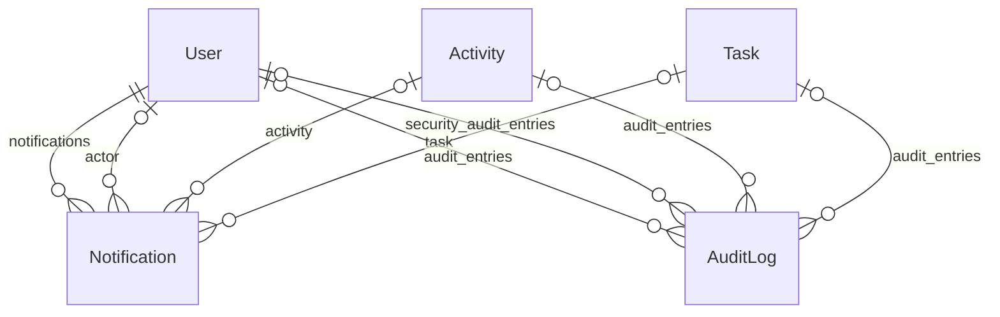

| Model | Campos relevantes |
|---|---|
| `Notification` | `recipient` (CASCADE, `notifications`), `event_type` (Char 24), `actor` (null, SET_NULL, `+`: quem delegou, propôs, mencionou ou concluiu), `activity` (null, CASCADE, `+`), `task` (null, CASCADE, `+`), `title` (150), `message` (255), `url` (255, blank), `is_read`, `created_at`, `read_at` — índice (recipient, is_read); ordenação `-created_at` |
| `AuditLog` | `user` (null, SET_NULL, `audit_entries`), `activity` (null, SET_NULL, `audit_entries`), `task` (null, SET_NULL, `audit_entries`), `target_user` (null, SET_NULL, `security_audit_entries`; eventos de segurança), `action` (Char 24), `field_name`, `old_value`, `new_value`, `reason`, `target_type` (Char 64, blank), `target_id` (inteiro grande, null), `metadata` (JSON, padrão `{}`), `timestamp` — índices (activity, timestamp), (task, timestamp) e (target_type, target_id, timestamp) |

`target_type`/`target_id`/`metadata` (migração `audit/0010`, 02/10/2026) existem
para os eventos que não pertencem a uma demanda nem a uma tarefa — hoje, os dos
quadros (`BOARD_*`, com `metadata["board_id"]`).

Os valores de `Notification.EventType` e `AuditLog.Action` estão em
[08_NOTIFICACOES_E_AUDITORIA.md](08_NOTIFICACOES_E_AUDITORIA.md).

---

## 7.1 `intake` (Caixa de Entrada)

> **Inativa por padrão desde 01/10/2026** (`INTAKE_ENABLED=false`): o item
> "Entrada" some do menu e `/entrada/…` dá 404. O app, as tabelas, as migrações e as
> permissões `entrada.*` continuam no banco; o que segue descreve os models.

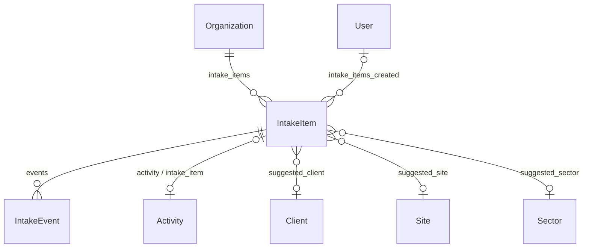

| Model | Campos relevantes |
|---|---|
| `IntakeItem` | `organization` (PROTECT, `intake_items`), `source` (`EMAIL` padrão, `TEAMS`, `USUARIO`, `FORMULARIO`), `external_id`, `subject`, `sender_name`, `sender_email` (minúsculas), `raw_content` (**texto puro**, nunca renderizado como HTML; máx. 20.000 caracteres), `content_hash` (sha256 do conteúdo normalizado, anti-duplicata; `db_index`, `editable=False`), `received_at` (padrão agora), `status` (`NOVO` padrão, `CONVERTIDO`, `IGNORADO`), `suggested_title`/`suggested_client`/`suggested_site`/`suggested_sector` (null, SET_NULL, `+`)/`suggested_deadline`, `confidence` (0 a 100), `suggestion_reasons` (JSON: lista de frases), `activity` (1:1, null, SET_NULL, `intake_item`), `created_by` (null, SET_NULL, `intake_items_created`), `created_at`, `resolved_by` (null, SET_NULL, `+`)/`resolved_at`/`resolution_note` |
| `IntakeEvent` | `item` (CASCADE, `events`), `user` (null, SET_NULL, `+`), `kind` (`REGISTRADA`, `EDITADA`, `CONVERTIDA`, `IGNORADA`, `RESTAURADA`), `note`, `created_at` |

- **Constraints:** `unique_intake_external_id_per_source` — único por (organização, origem,
  `external_id`) quando `external_id` não é vazio (a mesma mensagem não entra duas vezes por
  um canal); `intake_confidence_0_100`. Índice `intake_org_status_idx` em
  `(organization, status, -received_at)`. Ordenação `-received_at`, `-id`.
- **Confiança:** `confidence_level` é `ALTA` (≥ 70), `MEDIA` (40–69) ou `BAIXA` (< 40).
- **`IntakeEvent` em vez de `AuditLog`:** `AuditLog` só liga a `Activity` e `Task`, então o que
  acontece com a solicitação antes de a demanda existir (e depois) fica em `IntakeEvent`. A
  demanda criada tem a sua auditoria normal (`CREATE`). A nota do evento `CONVERTIDA` guarda o
  código da demanda (`DEM-…`; migração `intake/0003` trocou o prefixo antigo `ATV-`).
- **Estados:** `NOVO → CONVERTIDO` (terminal), `NOVO → IGNORADO`, `IGNORADO → NOVO`
  (`intake/policies.py`).

---

## 7.2 `boards` (Quadros dinâmicos)

Há dois tipos de quadro (`Board.kind`):

- **`TEMPLATE` (Modelo)** — quadro avulso da organização, com setor (`sector`),
  usado como modelo. Não tem demanda.
- **`DEMAND` (Demanda)** — o quadro de tarefas **de uma demanda**: `Board.activity`
  é 1:1 com `Activity` (CASCADE, `related_name="task_board"`). Nasce em branco (com
  as colunas padrão, o Kanban e o Calendário) ou como **cópia de um modelo**
  (`source_template`, SET_NULL, `instances`), por
  `BoardInstantiationService.create_for_activity` (`boards/demand_services.py`).
  O setor do quadro tem de ser o setor da demanda (`Board.clean()`).

Desde `boards/0008` o quadro é a única fonte de verdade das tarefas da demanda: o
título e o responsável são o nome do item e uma coluna de Pessoa comuns (os campos
`BoardColumn.binding` e `BoardItem.task`, criados em `0007`, foram removidos).
Quem pode ver ou editar é decidido por `DemandBoardAccess` (dono, criador e quem
aparece numa célula de Pessoa participam; as ações `quadro.*` seguem valendo).

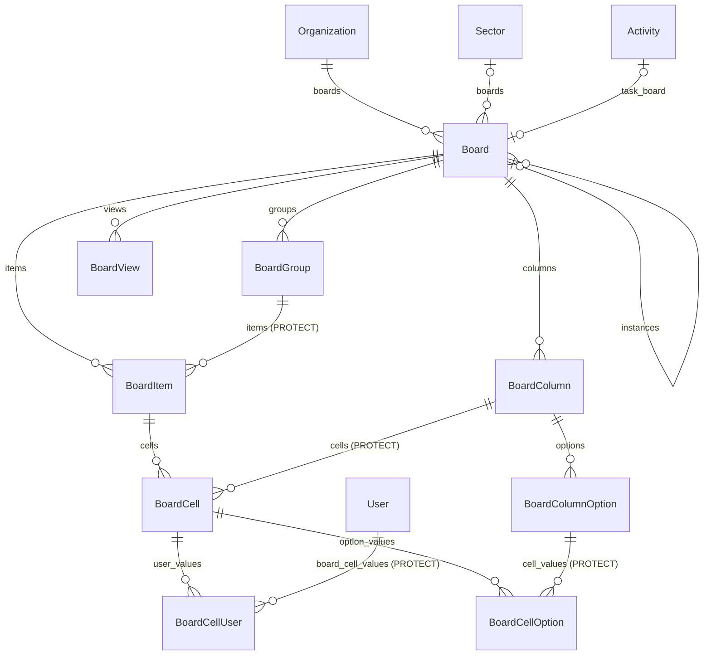

| Modelo | Campos principais |
|---|---|
| `Board` | `organization` (CASCADE, `boards`), `name` (160), `description`, `item_label` (como a primeira coluna se chama; padrão "Nome da Tarefa" — era "Elemento" até `0007`, que migrou os existentes), `kind` (`TEMPLATE` padrão, `DEMAND`), `sector` (null, SET_NULL, `boards`; obrigatório para novos modelos, quadros legados podem não ter), `activity` (1:1, null, CASCADE, `task_board`), `source_template` (self, null, SET_NULL, `instances`), `is_active`, `created_by` (PROTECT, `boards_created`), `created_at`, `updated_at`. Ordenação (`name`, `id`) |
| `BoardGroup` | `board` (CASCADE, `groups`), `name`, `color` (`#RRGGBB`, padrão `#579BFC`), `position`, `is_active`. É organização visual, **não** um status: mover de grupo não muda dado |
| `BoardView` | `board` (`views`), `name` (até 80), `type` (`KANBAN` padrão, `CALENDAR`), `position`, `settings` (JSON, ver abaixo), `is_active`, `created_by` (PROTECT, `board_views_created`). **Não guarda dado de negócio**: é só a configuração de uma forma de enxergar os mesmos itens. A tabela ("Quadro principal") é implícita e não tem registro |
| `BoardColumn` | `board` (`columns`), `name` (120), `type` (ver tipos abaixo), `position`, `width` (96–640, padrão 160), `description`, `settings` (JSON), `is_required`, `is_visible`, `is_active`, `created_by` (PROTECT, `board_columns_created`), `updated_at` |
| `BoardColumnOption` | `column` (`options`), `label`, `color` (padrão `#C4C4C4`), `position`, `is_default`, `is_done`, `is_active` (etiqueta de **Status** e **Lista suspensa**) |
| `BoardItem` | `board` (`items`), `group` (PROTECT, `items`), `name` (255, pode ficar vazio), `position`, `is_active`, `created_by` (PROTECT, `board_items_created`), `updated_by` (PROTECT, `board_items_updated`), `created_at`, `updated_at` |
| `BoardCell` | `item` (`cells`), `column` (PROTECT, `cells`), `value_text`, `value_number` (Decimal 24,6), `value_date`, `value_datetime`, `value_boolean`, `value_json` (padrão `{}`), `updated_by` (PROTECT, `board_cells_updated`), `updated_at`. Única por `(item, column)` (`uniq_board_cell_item_column`); índices (column, value_number), (column, value_date), (column, value_boolean) |
| `BoardCellUser` / `BoardCellOption` | Ligam a célula a uma pessoa (PROTECT, `board_cell_values`) / uma etiqueta (PROTECT, `cell_values`), com `position`; únicas por par (`uniq_board_cell_user`, `uniq_board_cell_option`). Uma célula guarda **um** valor hoje; a tabela já comporta vários |

Todos expõem `organization_id` por um caminho curto (propriedade), porque a
autorização e o isolamento entre organizações dependem dele. As posições são
`DecimalField(20, 6)`, padrão 1000, e todas as listas ordenam por `position`.

**Constraints e índices de `Board`:** `board_kind_matches_activity` (`CheckConstraint`:
`TEMPLATE` exige `activity` nulo; `DEMAND` exige `activity` preenchido); índices
(organization, is_active) e (organization, kind, is_active).

- **Tipos de coluna** (`BoardColumn.Type`): ativos hoje `STATUS`, `DROPDOWN`, `TEXT`, `DATE`, `PERSON`, `NUMBER`, `CURRENCY`, `CHECKBOX`
  (`ACTIVE_TYPES`). Existem no enum, mas ainda **não** se criam nem se editam: `FILE`, `TIMELINE`, `PRIORITY`, `CONFIRMATION`,
  `RELATION`, `FORMULA`, `AI_EXTRACT`.
- **Valor tipado, não JSON:** número ordena como número e data como data **no banco**; relatórios e filtros futuros precisam disso.
  A conversão do que o usuário digitou fica em `boards/validators.py` (`normalize_cell_value`): moeda vira `Decimal`
  (aceita `1.234,56` e `1234.56`), data aceita ISO e `dd/mm/aaaa`, pessoa tem de ser usuário **ativo da mesma organização**,
  etiqueta tem de ser **ativa e da mesma coluna**, e `is_required` recusa limpar. O valor antigo só é apagado depois de o novo
  passar na validação.
- **`settings` por tipo** (só chaves conhecidas; as demais são descartadas): `DATE` → `show_time`, `allow_weekends`,
  `is_deadline` (destaca "vencido"), `format`; `NUMBER` → `decimal_places` (0–6), `unit`, `minimum`, `maximum`;
  `CURRENCY` → `currency` (`BRL`/`USD`/`EUR`), `decimal_places`, `minimum`, `maximum`; `PERSON` → `multiple` (só `false` por ora).
- **Posição decimal** (passo 1000): mover algo grava **uma** posição entre as vizinhas (ponto médio); quando a distância
  some (≤ 0,001) as irmãs são renumeradas (`PositionService.rebalance`). O cliente manda os vizinhos (`before_id` à
  esquerda/acima, `after_id` à direita/abaixo), nunca o número; se os dois não são mais adjacentes, vale a da esquerda.
- **Etiquetas em tabela própria** (não no JSON da coluna) para poder ordenar, referenciar e trocar a cor sem regravar as
  células. Status nasce com *Não iniciado* (padrão), *Em andamento* e *Concluído* (`is_done`); item novo já nasce com a
  etiqueta padrão de cada coluna. Excluir uma etiqueta é lógico e **limpa** as células que a usavam.
- **Conversão de tipo** (`ColumnService.conversion_plan` / `change_type`): `safe` (Número↔Moeda, Status↔Lista, qualquer
  tipo → Texto, escreve o texto que a tela mostrava), `parsed` (Texto → Número/Moeda/Data: o que não converte é limpo) e
  `destructive` (demais: limpa os valores). Fora de `safe` exige `confirm` (a view responde **409** com a contagem).
- **Visualizações (Kanban)** (`boards/kanban.py`): o Kanban **lê as colunas e os itens do quadro**; cada etiqueta da coluna
  agrupadora vira uma raia (então renomear ou recolorir a etiqueta muda a raia na hora: não há outro cadastro de nome ou de
  cor) e cada item é o mesmo item da tabela, nunca uma cópia. Todo quadro nasce com um Kanban (`ViewService.create_default_kanban`);
  o modelo Orçamentos já traz o seu configurado (por Status, soma do Valor). `BoardView.settings` aceita só estas chaves
  (as demais são descartadas e toda referência a coluna tem de ser de uma coluna **ativa deste quadro** do tipo certo):
  `group_by` (id de coluna de Status ou Lista suspensa; vazio = a primeira de Status, depois de Lista), `show_empty`
  (raias sem cartão), `blank_lane` (`auto` só quando há itens sem etiqueta · `always` · `never`), `sort`
  (`{by: manual|name|created|<id de coluna>, dir}`), `sum_column` (Número ou Moeda: soma no cabeçalho da raia),
  `card_fields` (ids na ordem do cartão; vazio = os 4 primeiros campos visíveis, fora o agrupador), `show_field_names`.
  Item sem etiqueta (ou com a etiqueta apagada) cai na raia **"Em branco"**. Arrastar o cartão grava a etiqueta da coluna
  agrupadora pelo mesmo serviço da célula (`CellService.set_value`): mesma validação, mesma auditoria.
- **Visualizações (Calendário)** (`boards/calendar_view.py`): o Calendário **lê os mesmos itens** e só decide em que **dia**
  mostrá-los, pela coluna de Data escolhida. Mover um cartão grava a **mesma célula** de data (`CellService.set_value`: a
  mesma permissão, validação e auditoria da tabela, que registra a data anterior e a nova), então não há cópia nem
  sincronização. `BoardView.type = CALENDAR`; `settings` aceita só: `date_field` (id de coluna de Data; vazio = a coluna
  marcada como prazo ou a primeira Data), `period` (hoje só `month`), `color_by` (id de coluna de Status/Lista, `group` ou
  `none`; vazio = o primeiro Status), `card_fields` (até 6 ids, na ordem; vazio = Status, a primeira Pessoa e mais um campo
  visível, no máximo 3; a coluna de Data da lente não entra), `show_weekends`, `show_completed`. Criar exige uma coluna de
  Data (`BoardError` se o quadro não tem) e já grava a coluna de Data e a de cor que o servidor resolveria, para criar outra
  Data depois não trocar a lente de lugar. Só se busca o intervalo da grade (o mês e as semanas de ponta). Item **sem data**
  não está na grade: tem contador e lista "Sem data". **Concluído** = etiqueta com `is_done` na primeira coluna de
  **Status**; **atrasado** = coluna marcada como prazo (`is_deadline`) com data anterior a hoje e item aberto. A hora só
  existe quando a coluna tem `show_time` **e** a célula tem hora (dia sem hora é "dia inteiro": nunca se inventa 00:00).
- **Exclusão lógica** em tudo (`is_active`). Excluir coluna **mantém** as células no banco; grupo só sai se estiver sem itens.
- **Auditoria genérica:** `audit.AuditLog` ganhou `target_type` (ex.: `board_cell`), `target_id` e `metadata` (JSON). Todo
  registro do quadro leva `metadata["board_id"]`, que alimenta o histórico do quadro (`/quadros/<id>/historico/`). Migração
  `audit/0010`; `audit/0011` acrescentou as ações `BOARD_VIEW_*`.
- **Migrações do app:** ver a seção 8.

---

## 7.3 `boards` — quadros de domínio (Demandas e Tarefas)

Camada que guarda **só a configuração** das lentes (Tabela, Kanban, Calendário) da
tela de Demandas e da de Tarefas. Os registros continuam sendo `Activity` e
`Task`; não há cópia de dado operacional (`boards/domain_defaults.py`,
`domain_services.py`). Criada em `boards/0004` e semeada para cada organização por
`boards/0005` (e sob demanda por `ensure_domain_board`, idempotente).

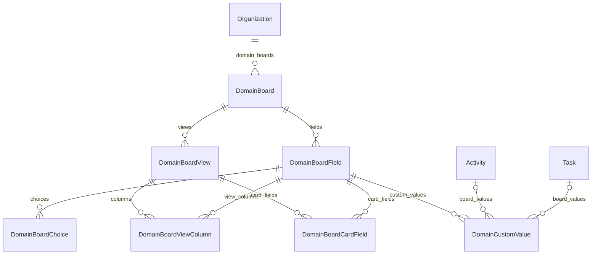

| Modelo | Campos principais |
|---|---|
| `DomainBoard` | `organization` (CASCADE, `domain_boards`), `domain` (`DEMAND`, `TASK`), `name`, `created_at`, `updated_at`. Único por (organization, domain) — `uniq_domain_board_org_domain` |
| `DomainBoardField` | `board` (CASCADE, `fields`), `key` (slug, 64), `label`, `type` (`TEXT`, `NUMBER`, `CURRENCY`, `DATETIME`, `PERSON`, `STAGE`, `SECTOR`, `PRIORITY`, `SELECT`, `BOOLEAN`, `CHECKLIST`, `RELATION`), `position`, `settings` (JSON), `is_system` (campo nativo da demanda/tarefa), `is_active`. Único por (board, key) |
| `DomainBoardChoice` | `field` (`choices`), `label`, `color` (padrão `#94A3B8`), `position`, `is_active` — opções de um campo `SELECT` |
| `DomainBoardView` | `board` (`views`), `name` (80), `type` (`TABLE` "Quadro principal", `KANBAN`, `CALENDAR`), `position`, `settings` (JSON), `is_default`, `is_active`. Único por (board, name) |
| `DomainBoardViewColumn` | `view` (`columns`), `field` (`view_columns`), `position`, `width` (padrão 160), `is_visible`. Único por (view, field) |
| `DomainBoardCardField` | `view` (`card_fields`), `field` (`card_fields`), `position`, `is_visible`. Único por (view, field) |
| `DomainCustomValue` | `field` (`custom_values`), `activity` (null, CASCADE, `board_values`), `task` (null, CASCADE, `board_values`), `value` (JSON), `updated_by` (null, SET_NULL, `domain_board_values_updated`), `updated_at` |

- **`DomainCustomValue` tem exatamente um alvo:** `domain_custom_value_one_target`
  (`CheckConstraint`: ou `activity` ou `task`, nunca os dois nem nenhum), e valor
  único por campo e alvo (`uniq_domain_value_activity`, `uniq_domain_value_task`,
  constraints parciais).
- **Campos de sistema semeados** — demandas: `title`, `owner`, `sector`, `urgency`,
  `requested_deadline`, `stage`, `condition`, `tasks`; tarefas: `title`, `activity`,
  `responsavel`, `sector`, `priority`, `requested_deadline`, `stage`, `checklist`.
  Visualizações padrão: "Quadro principal" (`TABLE`, `group_by=stage`, a padrão),
  "Kanban" (`group_by=stage`, `show_empty`) e "Calendário"
  (`date_field=requested_deadline`).

---

## 8. Migrations

- Cada app tem suas migrations em `<app>/migrations/`. `painel` e o pacote de projeto
  `config` não têm models nem migrations.
- Estado em 03/10/2026 (HEAD `add5acd`):

| App | Migrations (última) | Observação |
|---|---|---|
| `accounts` | `0001` a `0003_emailverification` | |
| `acessos` | `0001` a `0005_quadros_actions` | `0002` rótulos; `0003`, `0004` e `0005` mexem em dados (abaixo) |
| `activities` | `0001` a `0024_activity_board_setup` | dois `0005_*` unidos por `0006_merge_*` |
| `audit` | `0001` a `0011_visualizacoes_de_quadro` | `0002` acrescenta `target_user`; `0003`–`0008` e `0011` só ampliam `AuditLog.Action`; `0009` rótulos; `0010` campos genéricos (`target_type`, `target_id`, `metadata`) e índice |
| `boards` | `0001` a `0008_centralize_demand_board_items` | |
| `core` | `0001` a `0016_enumcolor_prioridade_da_tarefa` | |
| `intake` | `0001` a `0003_codigo_da_demanda_nas_notas` | |
| `notifications` | `0001` a `0008_demanda_nas_mensagens_gravadas` | `0002` acrescenta `actor`; `0002`–`0007` ampliam `Notification.EventType`; `0008` ajusta texto gravado |
| `processes` | `0001` a `0003_atividade_vira_demanda_nos_rotulos` | |

- Migrations de dados e mudanças de esquema que valem conhecer:
  - `activities/0012_fix_stuck_em_execucao_tasks`: corrige tarefas `EM_EXECUCAO` sem sessão aberta.
  - `activities/0014_populate_task_responsavel` e `0015_task_responsavel_not_null`: preenchem e tornam obrigatório o responsável.
  - `core/0006`–`0007`: migram cores de tag para hex.
  - `core/0010_remove_site_company_site_client`: obra passa a ter cliente em vez de empresa.
  - Aplicação de processo (30/09/2026): `processes/0002_processstep_default_responsavel`,
    `activities/0016_task_process_step` (campo + constraint parcial),
    `audit/0007_process_execution_actions` (novos valores de `AuditLog.Action`) e
    `notifications/0006_process_applied_event` (novo `Notification.EventType`).
  - Trabalho informado depois (30/09/2026): `activities/0017_trabalho_informado_depois`
    (`WorkSession.logged_at`, `manual_reason`, `note`) e `audit/0008`.
  - Demanda externa e arquivos (30/09/2026): `activities/0018` (`external_requester`,
    `files_location`).
  - Caixa de Entrada (01/10/2026): `intake/0001_initial`. Só cria tabelas novas; **não** altera
    `activities`, `audit` nem `notifications`.
  - **Atividade → Demanda (01/10/2026):** `activities/0019`, `core/0011`, `acessos/0002`, `audit/0009`,
    `intake/0002`, `notifications/0007` e `processes/0003` só trocam rótulos (`verbose_name`, `choices`,
    `help_text`). `activities/0020_codigo_da_demanda` **reescreve dados**: o prefixo do código `ATV-` vira `DEM-`
    e a pasta de anexos `<empresa>/<código>/` é renomeada (reversível e idempotente);
    `intake/0003` acompanha nas notas de evento; `notifications/0008` ajusta o texto fixo já gravado nas
    notificações; `acessos/0003_chaves_demanda` renomeia as chaves de permissão (`atividade.*` → `demanda.*`, grupo
    `atividades` → `demandas`) no próprio registro, preservando perfis e concessões.
  - **Etapas e status por setor (01/10/2026):** `core/0012_sector_scoped_stages_conditions` (dados:
    copia o cadastro da organização para cada setor, remapeia as etapas das demandas e tarefas; exige
    o `SET CONSTRAINTS` no PostgreSQL, corrigido em 02/10/2026), `core/0013_stage_column_limit`,
    `core/0014_seed_default_conditions` (dados: um status "Normal" padrão por setor e domínio),
    `core/0015_sector_color`, `activities/0021_activity_task_condition` (`Activity.condition`,
    `Task.condition`) e `acessos/0004_etapas_condicoes_actions` (dados: novas ações, concedidas a quem já
    tinha `demanda.mover_estagio`/`tarefa.mover_estagio`, `estagio_tarefa.gerir` ou `cor_status.gerir`).
  - **Quadros dinâmicos (01–02/10/2026):** `boards/0001_initial`, `boards/0002_boardview`,
    `boards/0003_kanban_padrao_nos_quadros` (dados: dá um Kanban aos quadros existentes; reversível),
    `boards/0006_visualizacao_calendario` (só acrescenta `CALENDAR` às escolhas de `BoardView.type`),
    `audit/0010_auditoria_generica_de_quadros` e `audit/0011_visualizacoes_de_quadro`, e
    `acessos/0005_quadros_actions` (cria o grupo `quadros` e **concede por mapeamento** aos perfis
    existentes: quem tem `demanda.criar` recebe visualizar/criar item/editar item; quem tem
    `demanda.aprovar_pendencia`, também criar/editar quadro, gerir colunas e excluir item; quem tem
    `seguranca.gerir_perfis`, tudo; reversível).
  - **Quadros de domínio e prioridade da tarefa (02/10/2026):** `boards/0004_quadros_de_dominio` (cria as
    sete tabelas `DomainBoard*`/`DomainCustomValue`), `boards/0005_seed_domain_workboards` (dados:
    semeia Demandas e Tarefas em cada organização), `activities/0022_task_priority` (`Task.priority`) e
    `core/0016_enumcolor_prioridade_da_tarefa` (valor `task_priority` em `EnumColor.domain`).
  - **Quadro por demanda e conversa (02/10/2026):** `activities/0023_activity_message_threads`
    (`ActivityMessage.parent`/`visibility`, `ActivityAttachment.message`, `ActivityMessageReaction`),
    `activities/0024_activity_board_setup` (`Activity.board_setup_mode`, `board_template`),
    `boards/0007_demand_boards` (`Board.kind`/`sector`/`activity`/`source_template`, `BoardColumn.binding` e
    `BoardItem.task` provisórios, constraint `board_kind_matches_activity`, `item_label` "Elemento" →
    "Nome da Tarefa") e `boards/0008_centralize_demand_board_items` (**dados:** converte as tarefas ligadas a
    itens em itens comuns, **cancela todas as `Task` ainda operacionais**, encerra sessões e saídas de fila
    abertas e remove `binding` e `BoardItem.task`; **não é reversível** em dados).
- Depois de mudar um model: `python manage.py makemigrations` e confira com
  `python manage.py makemigrations --check --dry-run` antes de commitar.
