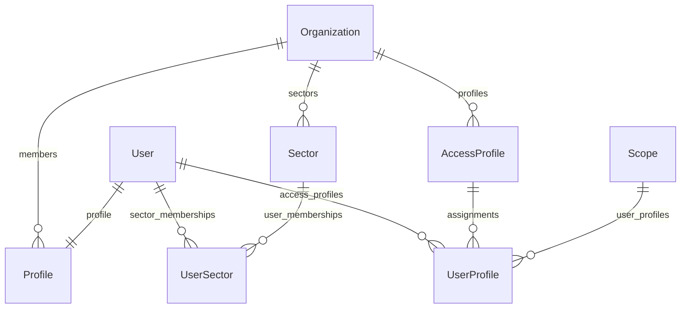
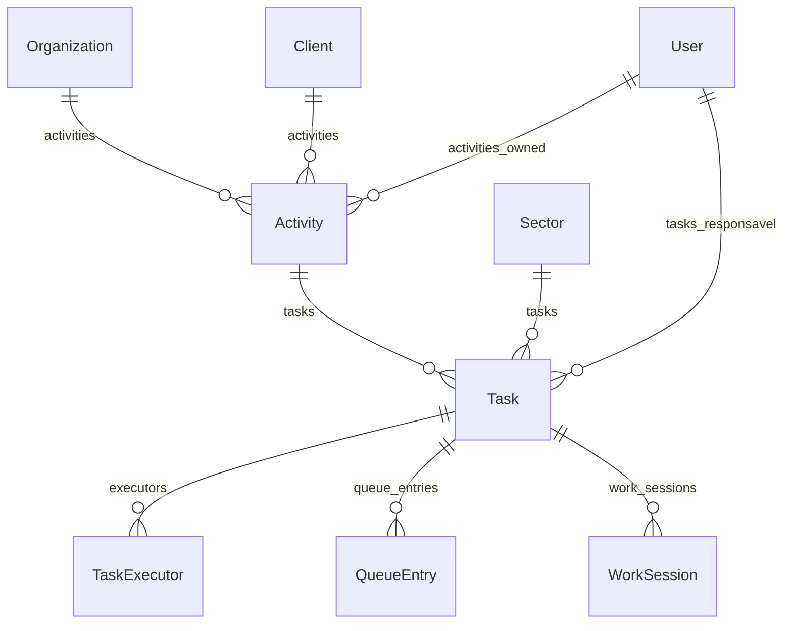

# 04 — Modelos de dados

> Todos os models da aplicação, agrupados por app, com os campos que importam,
> relacionamentos (`related_name`), enums e constraints. Campos triviais
> (`created_at`, `name`) aparecem só quando têm regra. A modelagem conceitual do
> produto está em `Regras/08_BANCO_DE_DADOS.md`.

---

## 1. Visão do núcleo

**Pessoas, organização e acesso**

(`AccessProfile` é `acessos.Profile`; `Profile` é `accounts.Profile`.)

**Trabalho: atividade, tarefa e fila**

---

## 2. `core`

Todos, exceto `Organization`, têm `organization` → `Organization` (CASCADE).

| Model | Campos relevantes | Constraints / regras |
|---|---|---|
| `Organization` | `name` (único), `is_active` | O tenant. |
| `Company` | `name`, `document`, `is_active` | Único por (org, name). Empresa operacional **interna** (Regras 05 §9). |
| `Sector` | `name`, `description`, `is_active`, `created_by` | Único por (org, name). Nunca fixo no código. |
| `Client` | `name`, `document`, `phone`, `email`, `address`, `is_active` | Único por (org, name). Quem **solicita** o serviço; diferente de `Company`. |
| `Site` (obra) | `client` → `Client` (null, `sites`), `name`, `is_active` | Regras 10 §11. Não tem mais `company` (migration `0010`). |
| `CostCenter` | `site` → `Site` (null, `cost_centers`), `name`, `is_active` | |
| `Tag` | `name`, `color` (hex da paleta de 36 cores), `is_active` | Único por (org, name). |
| `TaskStage` | `name`, `order`, `color`, `is_active` | Único por (org, name). Coluna do Kanban de tarefas; **nunca** altera `Task.status`. |
| `ActivityStage` | `name`, `order`, `color`, `is_active` | Único por (org, name). Coluna do Kanban de atividades; **nunca** altera `Activity.status`. |
| `WorkflowStatus` | `domain` (activity/task), `name`, `description`, `behavior` (código nativo que imita), `color`, `is_active` | Único por (org, domain, name). Status definidos pela organização, preparados para telas futuras. |
| `EnumColor` | `domain` (`activity_status`, `task_status`, `activity_urgency`), `code`, `color`, `label`, `description`, `is_hidden`, `updated_by` | Único por (org, domain, code). Sobrescreve cor/rótulo de um valor de enum fixo; o significado do código não muda. |

A paleta e as cores padrão ficam em `core/colors.py` (`PALETTE`, `DEFAULTS`),
espelhadas em `static/js/color-utils.js`.

---

## 3. `accounts`

| Model | Campos relevantes | Constraints / regras |
|---|---|---|
| `Profile` | `user` 1:1 (`profile`), `organization` (null, PROTECT, `members`), `phone`, `main_sector` (null, SET_NULL) | Criado vazio por signal ao criar um `User`. `main_sector` é só o filtro padrão das telas (Regras 05 §29). |
| `UserSector` | `user` (`sector_memberships`), `sector` (`user_memberships`), `role` (`MEMBRO`, `GESTOR`), `joined_at`, `removed_at` | Único por (user, sector) **enquanto** `removed_at` é nulo — sair e voltar abre novo período. Ser GESTOR não concede autorização por si só. |
| `EmailVerification` | `user` 1:1, `code` (6 dígitos), `expires_at`, `attempts`, `confirmed_at` | `CODE_TTL`=15 min, `RESEND_COOLDOWN`=60 s, `MAX_ATTEMPTS`=5. `issue(user)` substitui o código anterior. |

---

## 4. `acessos`

| Model | Campos relevantes | Constraints / regras |
|---|---|---|
| `ActionGroup` | `key`, `name`, `order`, `is_active` | Só organiza a interface. |
| `Action` | `group`, `key` (único, ex. `fila.reordenar`), `name`, `description`, `is_sensitive`, `is_active` | Definida pelo produto em `catalog.py`, nunca pelo cliente. `is_sensitive` só destaca na UI/auditoria. |
| `Profile` (perfil de acesso) | `organization` (`profiles`), `name`, `actions` (M2M via `ProfileAction`), `is_active` | Único por (org, name). |
| `ProfileAction` | `profile`, `action` | Único por (profile, action). |
| `Scope` | `organization`, `type`, `company`/`sector`/`site`/`cost_center` (opcionais), `relation`, `is_active` | `clean()` exige exatamente o campo do tipo; chamado no `save()`. Linhas reutilizáveis. |
| `UserProfile` | `user` (`access_profiles`), `profile` (`assignments`), `scope` (PROTECT) , `is_active` | Único por (user, profile, scope) enquanto ativo. |
| `UserAction` (concessão direta) | `user` (`direct_actions`), `action` (`direct_grants`), `scope` (PROTECT), `is_active` | Único por (user, action, scope) enquanto ativo. Só positiva — não existe "negar". |

`Scope.type`: `ORGANIZACAO`, `EMPRESA`, `SETOR`, `OBRA`, `CENTRO_CUSTO`, `RELACIONAL`.
`Scope.relation`: `MINHAS_ATIVIDADES`, `MINHAS_TAREFAS`, `MEUS_SETORES`, `SETORES_GERENCIADOS`.
O significado de cada um está em [05_AUTORIZACAO.md](05_AUTORIZACAO.md).

---

## 5. `activities`

### Atividade

| Model | Campos relevantes |
|---|---|
| `Activity` | `code` (único, `ATV-AAAA-NNNNN`, gerado no primeiro save — Regra 12), `title` (o resultado esperado), `description` (HTML sanitizado), `internal_notes`, `status`, `urgency`, `organization`, `client`, `company`, `site`, `cost_center`, `sector` (grupo designado), `stage` → `ActivityStage`, `owner` (PROTECT; nulo só em rascunho), `requested_by` (solicitante interno), `created_by`, `process_version` (PROTECT), `tags` (M2M), `requested_deadline`, `first_action_at`, `completed_at`, `completion_outcome`, `cancelled_at`, `cancelled_reason`, `reopened_at` |
| `OwnerChangeLog` | `activity` (`owner_changes`), `previous_owner`, `new_owner`, `changed_by` — nunca sobrescrito |
| `ActivityPendency` | `activity` (`pendencies`), `reason`, `status`, `comment`, `decision_deadline`, `notify_client`, `previous_owner`, `approver`, `opened_by`, `resolved_by`, `resolution_comment` |
| `ActivityMessage` | `activity` (`messages`), `author`, `body`, `kind` |
| `ActivityAttachment` | `activity` (`attachments`), `file` (storage em `ACTIVITY_FILES_ROOT`), `original_name`, `uploaded_by` |
| `ReturnReason` | `organization`, `name`, `is_active` — único por (org, name) |

Enums:

| Enum | Valores |
|---|---|
| `Activity.Status` | `RASCUNHO`, `ABERTA` (padrão), `EM_ANDAMENTO`, `BLOQUEADA`, `PENDENTE`, `CONCLUIDA`, `CANCELADA` |
| `Activity.Urgency` | `BAIXA`, `MEDIA` (padrão), `ALTA` |
| `Activity.CompletionOutcome` | `SUCESSO`, `CONCLUIDO_COM_PENDENCIAS`, `DECLINADO`, `CANCELADO` |
| `ActivityPendency.Reason` | `APROVACAO_GESTOR`, `AJUSTES_REVISOES` (as duas exigem aprovação), `MATERIAL`, `INFORMACOES_CLIENTE` |
| `ActivityPendency.Status` | `ABERTA`, `APROVADA`, `ENCERRADA` |
| `MessageKind` (atividade e tarefa) | `NORMAL`, `DECISAO`, `RISCO`, `COMPROMISSO`, `IMPEDIMENTO` |

### Tarefa

| Model | Campos relevantes |
|---|---|
| `Task` | `activity` (CASCADE, `tasks`), `sector` (PROTECT), `stage` → `TaskStage`, `responsavel` (PROTECT, obrigatório desde a migration `0015`), `depends_on` → `Task`, `order`, `title`, `description`, `status`, `requested_deadline`, `committed_deadline`, `first_action_at`, `completed_at`, `cancelled_at`, `overdue_notified_at`, `tags` |
| `TaskExecutor` (participante) | `task` (`executors`), `user` (`tasks_executed`), `added_by`, `removed_at` (remoção lógica) |
| `TaskAssignment` | `task` (`assignments`), `user`, `assigned_by`, `status` (`PENDENTE`, `ACEITA`, `RECUSADA`), `reason` → `ReturnReason`, `observation` |
| `TaskResponsavelChangeLog` | `task` (`responsavel_changes`), `previous_responsavel`, `new_responsavel`, `changed_by` |
| `WorkSession` | `task`, `user`, `started_at`, `ended_at`, `is_manual` — propriedade `duration` |
| `TaskBlock` | `task` (`blocks`), `reason`, `observation`, `started_by/at`, `ended_by/at` |
| `SectorTransfer` | `task`, `from_sector`, `to_sector`, `moved_by`, `note` |
| `TaskReturn` | `task`, `from_sector`, `to_sector`, `reason` → `ReturnReason`, `observation`, `returned_by` |
| `TaskMessage` | `task` (`messages`), `author`, `body`, `kind` |
| `TaskChecklistItem` | `task` (`checklist_items`), `text`, `is_done`, `order`, `done_by`, `done_at` |

`Task.Status`: `NAO_INICIADA` (padrão do model, mas nenhum fluxo deixa a tarefa
nele), `DISPONIVEL`, `EM_FILA`, `EM_EXECUCAO`, `BLOQUEADA`, `DEVOLVIDA`,
`CONCLUIDA`, `CANCELADA`.

### Fila e prazo

| Model | Campos relevantes |
|---|---|
| `QueueEntry` | `task`, `sector`, `position`, `queue_size_at_entry`, `entered_at`, `left_at` — uma linha por passagem pela fila (Regras 04 §37) |
| `QueuePositionChange` | `queue_entry`, `old/new_position`, `old/new_total`, `reason` (`AUTOMATICA_CONCLUSAO`, `AUTOMATICA_ENTRADA`, `MANUAL`, `ENTRADA_PRIORITARIA`), `changed_by` (nulo = automático) |
| `DeadlineProposal` | `task`, `proposed_deadline`, `proposed_by`, `status` (`PENDENTE`, `ACEITO`, `RECUSADO`), `decided_by`, `decision_note` |
| `DeadlineConflict` | `task`, `proposal` 1:1, `status` (`ABERTO`, `RESOLVIDO`), `resolution_note`, `resolved_by` |

`Activity`, `Task` e `DeadlineConflict` ainda declaram `Meta.permissions` do
Django (`can_change_owner`, `can_reorder_queue` etc.). São legado: a
autorização real é o motor do `acessos`.

---

## 6. `processes`

| Model | Campos relevantes |
|---|---|
| `ActivityType` | `organization`, `name` — único por (org, name) |
| `Process` | `organization`, `company` (PROTECT), `activity_type`, `name`, `description`, `is_active` — único por (company, name); propriedades `published_version`, `draft_version` |
| `ProcessVersion` | `process` (`versions`), `number`, `status` (`RASCUNHO`, `PUBLICADO`, `SUBSTITUIDO`), `output_description`, `output_evidence_type` (`ARQUIVO`, `LINK`, `CHECKLIST`, `CONFIRMACAO`), `published_by/at` — só editável em rascunho |
| `ProcessInput` | `version` (`inputs`), `name`, `input_type` (`TEXTO`, `ARQUIVO`, `DATA`, `NUMERO`, `LINK`, `SELECAO`), `is_required`, `source` (`SOLICITANTE`, `EXECUTOR`, `TERCEIRO`), `order` |
| `ProcessCriterion` | `version` (`criteria`), `name`, `is_required`, `order` |
| `ProcessStep` | `version` (`steps`), `sector`, `name`, `order`, `depends_on_previous` |
| `ActivityInputValue` | `activity`, `process_input`, `value`, `is_received` — único por (activity, input) |
| `ActivityCriterionCheck` | `activity`, `process_criterion`, `is_met` — único por (activity, criterion) |

---

## 7. `notifications` e `audit`

| Model | Campos relevantes |
|---|---|
| `Notification` | `recipient` (`notifications`), `event_type`, `actor`, `activity`, `task`, `title`, `message`, `url`, `is_read`, `read_at` — índice (recipient, is_read) |
| `AuditLog` | `user`, `activity`, `task`, `target_user` (eventos de segurança), `action`, `field_name`, `old_value`, `new_value`, `reason`, `timestamp` — índices (activity, timestamp) e (task, timestamp) |

Os valores de `Notification.EventType` e `AuditLog.Action` estão em
[08_NOTIFICACOES_E_AUDITORIA.md](08_NOTIFICACOES_E_AUDITORIA.md).

---

## 8. Migrations

- Cada app tem suas migrations em `<app>/migrations/`.
- `activities` tem dois `0005_*` unidos por `0006_merge_*`.
- Migrations de dados que valem conhecer:
  - `activities/0012_fix_stuck_em_execucao_tasks`: corrige tarefas `EM_EXECUCAO` sem sessão aberta.
  - `activities/0014_populate_task_responsavel` e `0015_task_responsavel_not_null`: preenchem e tornam obrigatório o responsável.
  - `core/0006`–`0007`: migram cores de tag para hex.
  - `core/0010_remove_site_company_site_client`: obra passa a ter cliente em vez de empresa.
- Depois de mudar um model: `python manage.py makemigrations` e confira com
  `python manage.py makemigrations --check --dry-run` antes de commitar.
