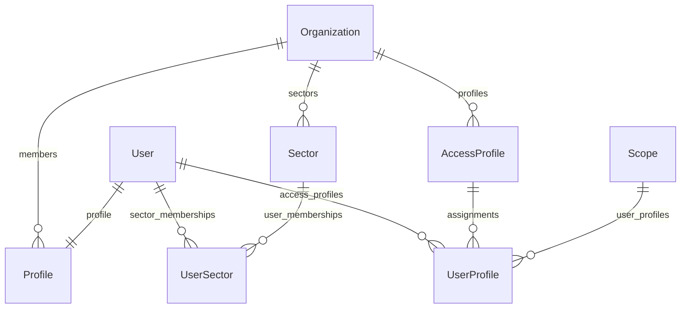
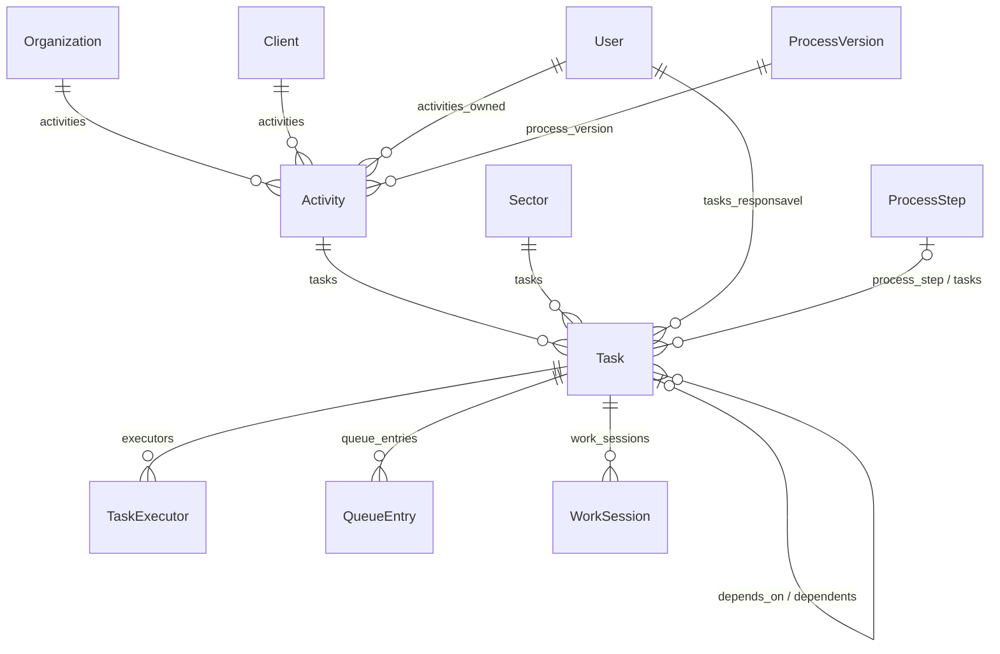
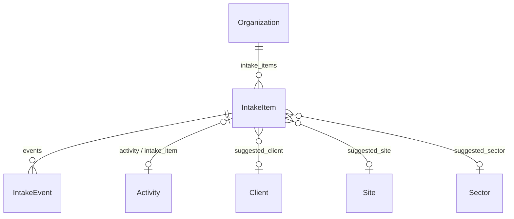
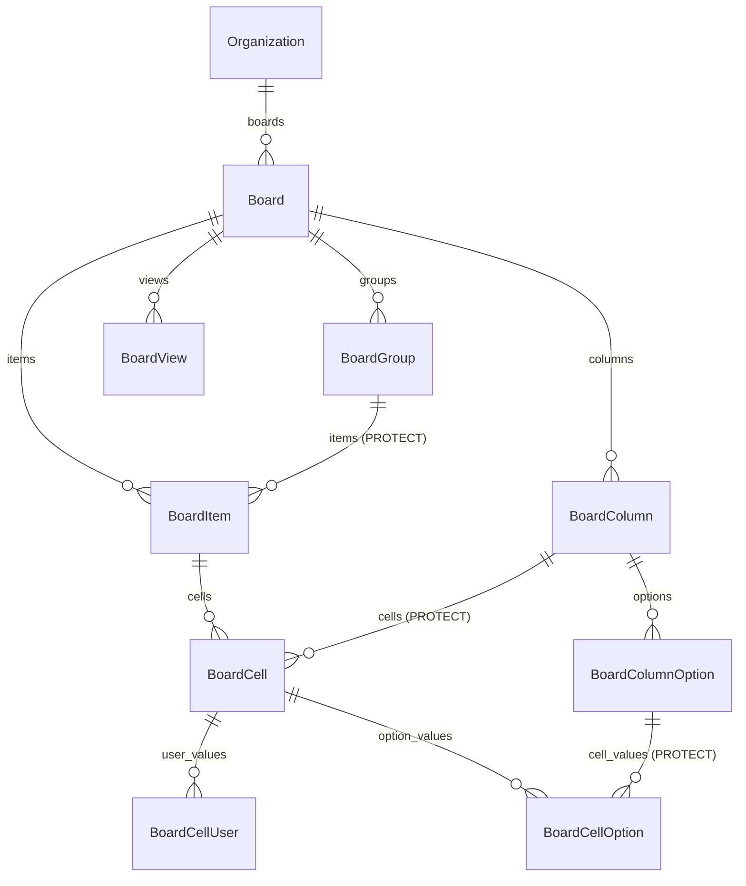

# 04 — Modelos de dados

> Todos os models da aplicação, agrupados por app, com os campos que importam,
> relacionamentos (`related_name`), enums e constraints. Campos triviais
> (`created_at`, `name`) aparecem só quando têm regra. A modelagem conceitual do
> produto está em `Regras/08_BANCO_DE_DADOS.md`.

---

## 1. Visão do núcleo

**Pessoas, organização e acesso**

(`AccessProfile` é `acessos.Profile`; `Profile` é `accounts.Profile`.)

**Trabalho: atividade, tarefa e fila**

---

## 2. `core`

Todos, exceto `Organization`, têm `organization` → `Organization` (CASCADE).

| Model | Campos relevantes | Constraints / regras |
|---|---|---|
| `Organization` | `name` (único), `is_active` | O tenant. |
| `Company` | `name`, `document`, `is_active` | Único por (org, name). Empresa operacional **interna** (Regras 05 §9). |
| `Sector` | `name`, `description`, `is_active`, `created_by` | Único por (org, name). Nunca fixo no código. |
| `Client` | `name`, `document`, `phone`, `email`, `address`, `is_active` | Único por (org, name). Quem **solicita** o serviço; diferente de `Company`. |
| `Site` (obra) | `client` → `Client` (null, `sites`), `name`, `is_active` | Regras 10 §11. Não tem mais `company` (migration `0010`). |
| `CostCenter` | `site` → `Site` (null, `cost_centers`), `name`, `is_active` | |
| `Tag` | `name`, `color` (hex da paleta de 36 cores), `is_active` | Único por (org, name). |
| `TaskStage` | `name`, `order`, `color`, `is_active` | Único por (org, name). Coluna do Kanban de tarefas; **nunca** altera `Task.status`. |
| `ActivityStage` | `name`, `order`, `color`, `is_active` | Único por (org, name). Coluna do Kanban de atividades; **nunca** altera `Activity.status`. |
| `WorkflowStatus` | `domain` (activity/task), `name`, `description`, `behavior` (código nativo que imita), `color`, `is_active` | Único por (org, domain, name). Status definidos pela organização, preparados para telas futuras. |
| `EnumColor` | `domain` (`activity_status`, `task_status`, `activity_urgency`), `code`, `color`, `label`, `description`, `is_hidden`, `updated_by` | Único por (org, domain, code). Sobrescreve cor/rótulo de um valor de enum fixo; o significado do código não muda. |

A paleta e as cores padrão ficam em `core/colors.py` (`PALETTE`, `DEFAULTS`),
espelhadas em `static/js/color-utils.js`.

---

## 3. `accounts`

| Model | Campos relevantes | Constraints / regras |
|---|---|---|
| `Profile` | `user` 1:1 (`profile`), `organization` (null, PROTECT, `members`), `phone`, `main_sector` (null, SET_NULL) | Criado vazio por signal ao criar um `User`. `main_sector` é só o filtro padrão das telas (Regras 05 §29). |
| `UserSector` | `user` (`sector_memberships`), `sector` (`user_memberships`), `role` (`MEMBRO`, `GESTOR`), `joined_at`, `removed_at` | Único por (user, sector) **enquanto** `removed_at` é nulo — sair e voltar abre novo período. Ser GESTOR não concede autorização por si só. |
| `EmailVerification` | `user` 1:1, `code` (6 dígitos), `expires_at`, `attempts`, `confirmed_at` | `CODE_TTL`=15 min, `RESEND_COOLDOWN`=60 s, `MAX_ATTEMPTS`=5. `issue(user)` substitui o código anterior. |

---

## 4. `acessos`

| Model | Campos relevantes | Constraints / regras |
|---|---|---|
| `ActionGroup` | `key`, `name`, `order`, `is_active` | Só organiza a interface. |
| `Action` | `group`, `key` (único, ex. `fila.reordenar`), `name`, `description`, `is_sensitive`, `is_active` | Definida pelo produto em `catalog.py`, nunca pelo cliente. `is_sensitive` só destaca na UI/auditoria. |
| `Profile` (perfil de acesso) | `organization` (`profiles`), `name`, `actions` (M2M via `ProfileAction`), `is_active` | Único por (org, name). |
| `ProfileAction` | `profile`, `action` | Único por (profile, action). |
| `Scope` | `organization`, `type`, `company`/`sector`/`site`/`cost_center` (opcionais), `relation`, `is_active` | `clean()` exige exatamente o campo do tipo; chamado no `save()`. Linhas reutilizáveis. |
| `UserProfile` | `user` (`access_profiles`), `profile` (`assignments`), `scope` (PROTECT) , `is_active` | Único por (user, profile, scope) enquanto ativo. |
| `UserAction` (concessão direta) | `user` (`direct_actions`), `action` (`direct_grants`), `scope` (PROTECT), `is_active` | Único por (user, action, scope) enquanto ativo. Só positiva — não existe "negar". |

`Scope.type`: `ORGANIZACAO`, `EMPRESA`, `SETOR`, `OBRA`, `CENTRO_CUSTO`, `RELACIONAL`.
`Scope.relation`: `MINHAS_ATIVIDADES`, `MINHAS_TAREFAS`, `MEUS_SETORES`, `SETORES_GERENCIADOS`.
O significado de cada um está em [05_AUTORIZACAO.md](05_AUTORIZACAO.md).

---

## 5. `activities`

### Atividade

| Model | Campos relevantes |
|---|---|
| `Activity` | `code` (único, `DEM-AAAA-NNNNN`, gerado no primeiro save — Regra 12; até 01/10/2026 era `ATV-…`, reescrito pela migração `activities/0020`), `title` (o resultado esperado), `description` (HTML sanitizado), `internal_notes`, `status`, `urgency`, `organization`, `client`, `company`, `site`, `cost_center`, `sector` (grupo designado), `stage` → `ActivityStage`, `owner` (PROTECT; nulo só em rascunho), `requested_by` (solicitante interno), `external_requester` (texto livre: quem pediu fora da organização), `files_location` (link ou caminho dos arquivos, até 500 caracteres — não há upload), `created_by`, `process_version` (PROTECT), `tags` (M2M), `requested_deadline`, `first_action_at`, `completed_at`, `completion_outcome`, `cancelled_at`, `cancelled_reason`, `reopened_at` |
| `OwnerChangeLog` | `activity` (`owner_changes`), `previous_owner`, `new_owner`, `changed_by` — nunca sobrescrito |
| `ActivityPendency` | `activity` (`pendencies`), `reason`, `status`, `comment`, `decision_deadline`, `notify_client`, `previous_owner`, `approver`, `opened_by`, `resolved_by`, `resolution_comment` |
| `ActivityMessage` | `activity` (`messages`), `author`, `body`, `kind` |
| `ActivityAttachment` | `activity` (`attachments`), `file` (storage em `ACTIVITY_FILES_ROOT`), `original_name`, `uploaded_by` |
| `ReturnReason` | `organization`, `name`, `is_active` — único por (org, name) |

Enums:

| Enum | Valores |
|---|---|
| `Activity.Status` | `RASCUNHO`, `ABERTA` (padrão), `EM_ANDAMENTO`, `BLOQUEADA`, `PENDENTE`, `CONCLUIDA`, `CANCELADA` |
| `Activity.Urgency` | `BAIXA`, `MEDIA` (padrão), `ALTA` |
| `Activity.CompletionOutcome` | `SUCESSO`, `CONCLUIDO_COM_PENDENCIAS`, `DECLINADO`, `CANCELADO` |
| `ActivityPendency.Reason` | `APROVACAO_GESTOR`, `AJUSTES_REVISOES` (as duas exigem aprovação), `MATERIAL`, `INFORMACOES_CLIENTE` |
| `ActivityPendency.Status` | `ABERTA`, `APROVADA`, `ENCERRADA` |
| `MessageKind` (atividade e tarefa) | `NORMAL`, `DECISAO`, `RISCO`, `COMPROMISSO`, `IMPEDIMENTO` |

### Tarefa

| Model | Campos relevantes |
|---|---|
| `Task` | `activity` (CASCADE, `tasks`), `sector` (PROTECT), `stage` → `TaskStage`, `responsavel` (PROTECT, obrigatório desde a migration `0015`), `depends_on` → `Task` (`dependents`), `process_step` → `processes.ProcessStep` (null, PROTECT, `tasks`), `order`, `title`, `description`, `status`, `requested_deadline`, `committed_deadline`, `first_action_at`, `completed_at`, `completed_by` (SET_NULL, null; quem concluiu — limpo ao reabrir), `cancelled_at`, `overdue_notified_at`, `tags` |
| `TaskExecutor` (participante) | `task` (`executors`), `user` (`tasks_executed`), `added_by`, `removed_at` (remoção lógica) |
| `TaskAssignment` | `task` (`assignments`), `user`, `assigned_by`, `status` (`PENDENTE`, `ACEITA`, `RECUSADA`), `reason` → `ReturnReason`, `observation` |
| `TaskResponsavelChangeLog` | `task` (`responsavel_changes`), `previous_responsavel`, `new_responsavel`, `changed_by` |
| `WorkSession` | `task`, `user`, `started_at`, `ended_at` (**quando o trabalho aconteceu**), `is_manual` (período informado pela pessoa, não cronometrado), `logged_at` (**quando o sistema soube**; nulo no cronômetro e nas sessões antigas), `manual_reason` (`WorkSession.ManualReason`: `ESQUECI_INICIAR`, `FORA_DA_LPS`, `AJUSTE_PERIODO`, `OUTRO`; vazio no cronômetro e em “Adicionar tempo trabalhado”), `note` (até 255 caracteres) — propriedade `duration` |
| `TaskBlock` | `task` (`blocks`), `reason`, `observation`, `started_by/at`, `ended_by/at` |
| `SectorTransfer` | `task`, `from_sector`, `to_sector`, `moved_by`, `note` |
| `TaskReturn` | `task`, `from_sector`, `to_sector`, `reason` → `ReturnReason`, `observation`, `returned_by` |
| `TaskMessage` | `task` (`messages`), `author`, `body`, `kind` |
| `TaskChecklistItem` | `task` (`checklist_items`), `text`, `is_done`, `order`, `done_by`, `done_at` |

`Task.Status`: `NAO_INICIADA` (padrão do model, mas nenhum fluxo deixa a tarefa
nele), `DISPONIVEL`, `EM_FILA`, `EM_EXECUCAO`, `BLOQUEADA`, `DEVOLVIDA`,
`CONCLUIDA`, `CANCELADA`.

**Constraint de `Task`:** `unique_task_per_activity_process_step` — `UniqueConstraint`
em (`activity`, `process_step`) com `condition=process_step IS NOT NULL`. Uma
etapa de processo gera no máximo uma tarefa por atividade; tarefas manuais
(`process_step` nulo) não participam. Índice parcial, suportado por SQLite e
PostgreSQL.

**Tarefa que aguarda a etapa anterior:** é `DISPONIVEL`, **sem** `QueueEntry`,
com `depends_on` apontando para uma tarefa ainda não `CONCLUIDA`. Ao concluir a
predecessora, `TaskService` a enfileira e ela vira `EM_FILA`. A propriedade
`Task.waiting_for` devolve a predecessora pendente (só para exibição) e
`Task.status_label` mostra "Aguardando etapa anterior" nesse caso.

### Fila e prazo

| Model | Campos relevantes |
|---|---|
| `QueueEntry` | `task`, `sector`, `position`, `queue_size_at_entry`, `entered_at`, `left_at` — uma linha por passagem pela fila (Regras 04 §37) |
| `QueuePositionChange` | `queue_entry`, `old/new_position`, `old/new_total`, `reason` (`AUTOMATICA_CONCLUSAO`, `AUTOMATICA_ENTRADA`, `MANUAL`, `ENTRADA_PRIORITARIA`), `changed_by` (nulo = automático) |
| `DeadlineProposal` | `task`, `proposed_deadline`, `proposed_by`, `status` (`PENDENTE`, `ACEITO`, `RECUSADO`), `decided_by`, `decision_note` |
| `DeadlineConflict` | `task`, `proposal` 1:1, `status` (`ABERTO`, `RESOLVIDO`), `resolution_note`, `resolved_by` |

`Activity`, `Task` e `DeadlineConflict` ainda declaram `Meta.permissions` do
Django (`can_change_owner`, `can_reorder_queue` etc.). São legado: a
autorização real é o motor do `acessos`.

---

## 6. `processes`

| Model | Campos relevantes |
|---|---|
| `ActivityType` | `organization`, `name` — único por (org, name) |
| `Process` | `organization`, `company` (PROTECT), `activity_type`, `name`, `description`, `is_active` — único por (company, name); propriedades `published_version`, `draft_version` |
| `ProcessVersion` | `process` (`versions`), `number`, `status` (`RASCUNHO`, `PUBLICADO`, `SUBSTITUIDO`), `output_description`, `output_evidence_type` (`ARQUIVO`, `LINK`, `CHECKLIST`, `CONFIRMACAO`), `published_by/at` — só editável em rascunho |
| `ProcessInput` | `version` (`inputs`), `name`, `input_type` (`TEXTO`, `ARQUIVO`, `DATA`, `NUMERO`, `LINK`, `SELECAO`), `is_required`, `source` (`SOLICITANTE`, `EXECUTOR`, `TERCEIRO`), `order` |
| `ProcessCriterion` | `version` (`criteria`), `name`, `is_required`, `order` |
| `ProcessStep` | `version` (`steps`), `sector`, `name`, `order`, `depends_on_previous`, `default_responsavel` → `User` (null, SET_NULL) |
| `ActivityInputValue` | `activity`, `process_input` (PROTECT), `value`, `is_received`, `received_at`, `received_by` — único por (activity, input) |
| `ActivityCriterionCheck` | `activity`, `process_criterion` (PROTECT), `is_met`, `met_at`, `met_by` — único por (activity, criterion) |

**`ProcessStep.default_responsavel`** — quem responde pela tarefa gerada pela
etapa. Opcional; precisa ser uma pessoa **ativa da mesma organização** do
processo (validado em `ProcessStep.clean()`/`save()` e em
`ProcessStepService`), mas **não** precisa participar do setor da etapa — a
criação manual de tarefas já aceita qualquer pessoa da organização como
responsável. Só se altera em rascunho; `create_new_version` copia o valor.

**`ActivityInputValue.value`** é texto. `TEXTO` guarda o texto; `DATA`, a data
ISO (`AAAA-MM-DD`); `NUMERO`, o decimal normalizado (`1500.5`); `LINK`, uma URL
http(s). `ARQUIVO` e `SELECAO` guardam apenas a confirmação de recebimento
(`is_received`) e uma observação livre em `value` — não há vínculo com anexos
nem lista de opções no molde (ver
[13_PENDENCIAS_CONHECIDAS.md](13_PENDENCIAS_CONHECIDAS.md)).

**Vínculo permanente:** `Activity.process_version` é gravado uma única vez, por
`ProcessApplicationService.apply`, e nunca é trocado nem removido. Publicar a
versão 2 de um processo não altera atividades que receberam a versão 1.

---

## 7. `notifications` e `audit`

| Model | Campos relevantes |
|---|---|
| `Notification` | `recipient` (`notifications`), `event_type`, `actor`, `activity`, `task`, `title`, `message`, `url`, `is_read`, `read_at` — índice (recipient, is_read) |
| `AuditLog` | `user`, `activity`, `task`, `target_user` (eventos de segurança), `action`, `field_name`, `old_value`, `new_value`, `reason`, `timestamp` — índices (activity, timestamp) e (task, timestamp) |

Os valores de `Notification.EventType` e `AuditLog.Action` estão em
[08_NOTIFICACOES_E_AUDITORIA.md](08_NOTIFICACOES_E_AUDITORIA.md).

---

## 7.1 `intake` (Caixa de Entrada)

| Model | Campos relevantes |
|---|---|
| `IntakeItem` | `organization` (PROTECT, `intake_items`), `source` (`EMAIL`, `TEAMS`, `USUARIO`, `FORMULARIO`), `external_id`, `subject`, `sender_name`, `sender_email` (minúsculas), `raw_content` (**texto puro**, nunca renderizado como HTML; máx. 20.000 caracteres), `content_hash` (sha256 do conteúdo normalizado, anti-duplicata), `received_at`, `status` (`NOVO` padrão, `CONVERTIDO`, `IGNORADO`), `suggested_title`/`suggested_client`/`suggested_site`/`suggested_sector`/`suggested_deadline`, `confidence` (0 a 100), `suggestion_reasons` (JSON: lista de frases), `activity` (1:1, null, SET_NULL, `intake_item`), `created_by`, `created_at`, `resolved_by`/`resolved_at`/`resolution_note` |
| `IntakeEvent` | `item` (CASCADE, `events`), `user`, `kind` (`REGISTRADA`, `EDITADA`, `CONVERTIDA`, `IGNORADA`, `RESTAURADA`), `note`, `created_at` |

- **Constraints:** `unique_intake_external_id_per_source` — único por (organização, origem,
  `external_id`) quando `external_id` não é vazio (a mesma mensagem não entra duas vezes por
  um canal); `intake_confidence_0_100`. Índice `(organization, status, -received_at)`.
- **Confiança:** `confidence_level` é `ALTA` (≥ 70), `MEDIA` (40–69) ou `BAIXA` (< 40).
- **`IntakeEvent` em vez de `AuditLog`:** `AuditLog` só liga a `Activity` e `Task`, então o que
  acontece com a solicitação antes de a atividade existir (e depois) fica em `IntakeEvent`. A
  atividade criada tem a sua auditoria normal (`CREATE`).
- **Estados:** `NOVO → CONVERTIDO` (terminal), `NOVO → IGNORADO`, `IGNORADO → NOVO`
  (`intake/policies.py`).

---

## 7.2 `boards` (Quadros dinâmicos)

| Modelo | Campos principais |
|---|---|
| `Board` | `organization` (CASCADE), `name`, `description`, `item_label` (como a primeira coluna se chama: "Obra", "Contrato"; padrão "Elemento"), `is_active`, `created_by` |
| `BoardGroup` | `board`, `name`, `color` (`#RRGGBB`), `position`, `is_active`. É organização visual, **não** um status: mover de grupo não muda dado |
| `BoardView` | `board`, `name` (até 80), `type` (hoje só `KANBAN`), `position`, `settings` (JSON, ver abaixo), `is_active`, `created_by`. **Não guarda dado de negócio**: é só a configuração de uma forma de enxergar os mesmos itens. A tabela ("Quadro principal") é implícita e não tem registro |
| `BoardColumn` | `board`, `name`, `type`, `position`, `width` (96–640, padrão 160), `description`, `settings` (JSON), `is_required`, `is_visible`, `is_active`, `created_by` |
| `BoardColumnOption` | `column`, `label`, `color`, `position`, `is_default`, `is_done`, `is_active` (etiqueta de **Status** e **Lista suspensa**) |
| `BoardItem` | `board`, `group` (PROTECT), `name` (pode ficar vazio), `position`, `is_active`, `created_by`, `updated_by` |
| `BoardCell` | `item`, `column`, `value_text`, `value_number` (Decimal 24,6), `value_date`, `value_datetime`, `value_boolean`, `value_json`, `updated_by`. Única por `(item, column)` |
| `BoardCellUser` / `BoardCellOption` | Ligam a célula a uma pessoa / uma etiqueta (única por par). Uma célula guarda **um** valor hoje; a tabela já comporta vários |

- **Tipos de coluna** (`BoardColumn.Type`): ativos hoje `STATUS`, `DROPDOWN`, `TEXT`, `DATE`, `PERSON`, `NUMBER`, `CURRENCY`, `CHECKBOX`
  (`ACTIVE_TYPES`). Existem no enum, mas ainda **não** se criam nem se editam: `FILE`, `TIMELINE`, `PRIORITY`, `CONFIRMATION`,
  `RELATION`, `FORMULA`, `AI_EXTRACT`.
- **Valor tipado, não JSON:** número ordena como número e data como data **no banco**; relatórios e filtros futuros precisam disso.
  A conversão do que o usuário digitou fica em `boards/validators.py` (`normalize_cell_value`): moeda vira `Decimal`
  (aceita `1.234,56` e `1234.56`), data aceita ISO e `dd/mm/aaaa`, pessoa tem de ser usuário **ativo da mesma organização**,
  etiqueta tem de ser **ativa e da mesma coluna**, e `is_required` recusa limpar. O valor antigo só é apagado depois de o novo
  passar na validação.
- **`settings` por tipo** (só chaves conhecidas; as demais são descartadas): `DATE` → `show_time`, `allow_weekends`,
  `is_deadline` (destaca "vencido"), `format`; `NUMBER` → `decimal_places` (0–6), `unit`, `minimum`, `maximum`;
  `CURRENCY` → `currency` (`BRL`/`USD`/`EUR`), `decimal_places`, `minimum`, `maximum`; `PERSON` → `multiple` (só `false` por ora).
- **Posição decimal** (passo 1000): mover algo grava **uma** posição entre as vizinhas (ponto médio); quando a distância
  some (≤ 0,001) as irmãs são renumeradas (`PositionService.rebalance`). O cliente manda os vizinhos (`before_id` à
  esquerda/acima, `after_id` à direita/abaixo), nunca o número; se os dois não são mais adjacentes, vale a da esquerda.
- **Etiquetas em tabela própria** (não no JSON da coluna) para poder ordenar, referenciar e trocar a cor sem regravar as
  células. Status nasce com *Não iniciado* (padrão), *Em andamento* e *Concluído* (`is_done`); item novo já nasce com a
  etiqueta padrão de cada coluna. Excluir uma etiqueta é lógico e **limpa** as células que a usavam.
- **Conversão de tipo** (`ColumnService.conversion_plan` / `change_type`): `safe` (Número↔Moeda, Status↔Lista, qualquer
  tipo → Texto, escreve o texto que a tela mostrava), `parsed` (Texto → Número/Moeda/Data: o que não converte é limpo) e
  `destructive` (demais: limpa os valores). Fora de `safe` exige `confirm` (a view responde **409** com a contagem).
- **Visualizações (Kanban)** (`boards/kanban.py`): o Kanban **lê as colunas e os itens do quadro**; cada etiqueta da coluna
  agrupadora vira uma raia (então renomear ou recolorir a etiqueta muda a raia na hora: não há outro cadastro de nome ou de
  cor) e cada item é o mesmo item da tabela, nunca uma cópia. Todo quadro nasce com um Kanban (`ViewService.create_default_kanban`);
  o modelo Orçamentos já traz o seu configurado (por Status, soma do Valor). `BoardView.settings` aceita só estas chaves
  (as demais são descartadas e toda referência a coluna tem de ser de uma coluna **ativa deste quadro** do tipo certo):
  `group_by` (id de coluna de Status ou Lista suspensa; vazio = a primeira de Status, depois de Lista), `show_empty`
  (raias sem cartão), `blank_lane` (`auto` só quando há itens sem etiqueta · `always` · `never`), `sort`
  (`{by: manual|name|created|<id de coluna>, dir}`), `sum_column` (Número ou Moeda: soma no cabeçalho da raia),
  `card_fields` (ids na ordem do cartão; vazio = os 4 primeiros campos visíveis, fora o agrupador), `show_field_names`.
  Item sem etiqueta (ou com a etiqueta apagada) cai na raia **"Em branco"**. Arrastar o cartão grava a etiqueta da coluna
  agrupadora pelo mesmo serviço da célula (`CellService.set_value`): mesma validação, mesma auditoria.
- **Exclusão lógica** em tudo (`is_active`). Excluir coluna **mantém** as células no banco; grupo só sai se estiver sem itens.
- **Auditoria genérica:** `audit.AuditLog` ganhou `target_type` (ex.: `board_cell`), `target_id` e `metadata` (JSON). Todo
  registro do quadro leva `metadata["board_id"]`, que alimenta o histórico do quadro (`/quadros/<id>/historico/`). Migração
  `audit/0010`.
- **Migrations:** `boards/0001_initial`, `boards/0002_boardview` e `boards/0003_kanban_padrao_nos_quadros` (de dados: dá um Kanban aos quadros que já existiam; reversível); `audit/0010_auditoria_generica_de_quadros` e `audit/0011_visualizacoes_de_quadro`; `acessos/0005_quadros_actions` (cria o
  grupo `quadros` e **concede por mapeamento** aos perfis existentes: quem tem `demanda.criar` recebe visualizar/criar
  item/editar item; quem tem `demanda.aprovar_pendencia`, também criar/editar quadro, gerir colunas e excluir item; quem
  tem `seguranca.gerir_perfis`, tudo. Reversível).

---

## 8. Migrations

- Cada app tem suas migrations em `<app>/migrations/`.
- `activities` tem dois `0005_*` unidos por `0006_merge_*`.
- Migrations de dados que valem conhecer:
  - `activities/0012_fix_stuck_em_execucao_tasks`: corrige tarefas `EM_EXECUCAO` sem sessão aberta.
  - `activities/0014_populate_task_responsavel` e `0015_task_responsavel_not_null`: preenchem e tornam obrigatório o responsável.
  - `core/0006`–`0007`: migram cores de tag para hex.
  - `core/0010_remove_site_company_site_client`: obra passa a ter cliente em vez de empresa.
  - Aplicação de processo (30/09/2026): `processes/0002_processstep_default_responsavel`,
    `activities/0016_task_process_step` (campo + constraint parcial),
    `audit/0007_process_execution_actions` (novos valores de `AuditLog.Action`) e
    `notifications/0006_process_applied_event` (novo `Notification.EventType`). São só
    mudanças de esquema; nada de dados a migrar.
  - Caixa de Entrada (01/10/2026): `intake/0001_initial`. Só cria tabelas novas; **não** altera
    `activities`, `audit` nem `notifications`.
- Depois de mudar um model: `python manage.py makemigrations` e confira com
  `python manage.py makemigrations --check --dry-run` antes de commitar.
