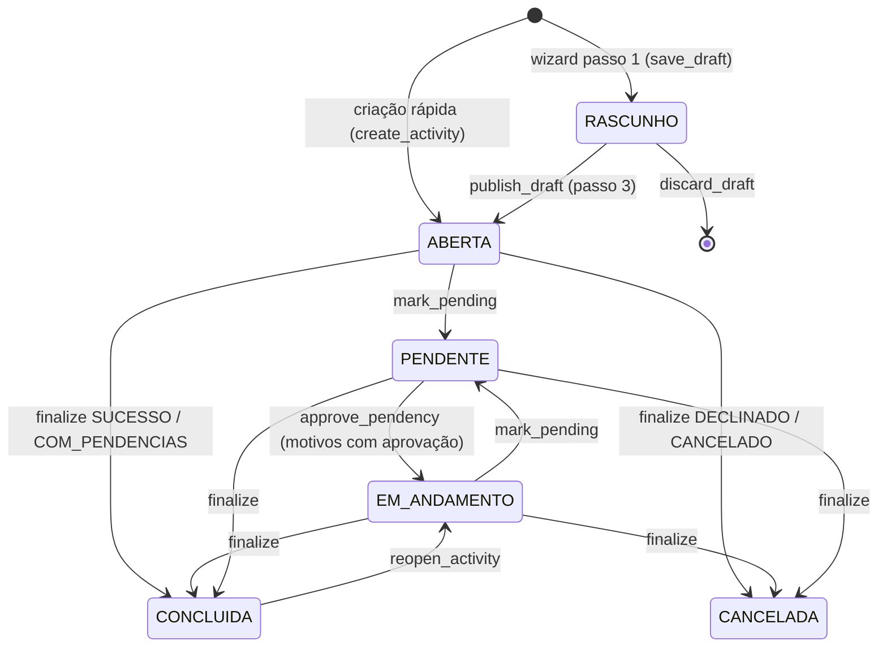
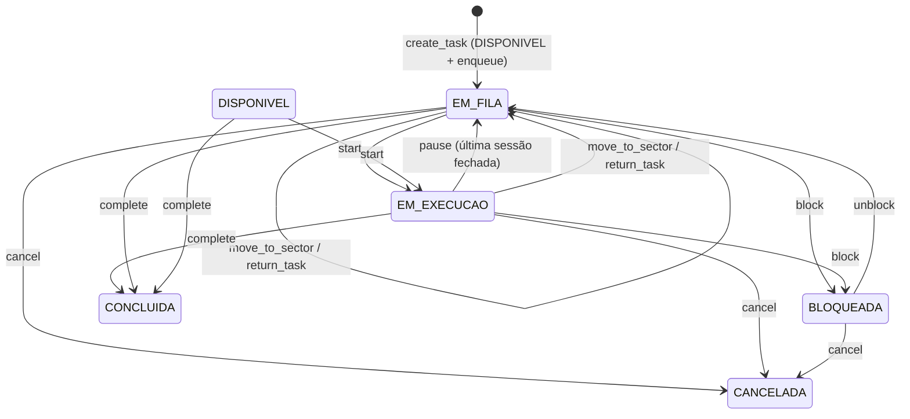

# 06 — Atividades e tarefas

> O núcleo operacional da LPS, em `activities/`. Uma **atividade** é um
> resultado a alcançar e tem exatamente um dono. Uma **tarefa** é uma unidade
> de trabalho de uma atividade, endereçada a um setor, com um responsável e
> participantes. As regras de produto estão em
> `Regras/02_ATIVIDADES_TAREFAS_E_FLUXOS.md` e
> `Regras/03_FILAS_PRAZOS_E_ESCALONAMENTO.md`.
>
> Toda a regra está em `activities/services.py` (`ActivityService`,
> `TaskService`, `QueueService`, `DeadlineService`, `MessageService`,
> `ActivityAttachmentService`). Cada método verifica a ação do catálogo,
> valida a transição, grava, audita e notifica.

---

## 1. Atividade

### 1.1 Estados

- Nenhum fluxo leva `ABERTA` → `EM_ANDAMENTO` automaticamente (iniciar uma
  tarefa só marca `first_action_at`). `EM_ANDAMENTO` hoje só é alcançado por
  reabertura ou aprovação de pendência.
- `BLOQUEADA` existe no enum, mas nenhum serviço coloca uma atividade nesse
  estado.
- Pendências sem aprovação (`MATERIAL`, `INFORMACOES_CLIENTE`) só saem de
  `PENDENTE` pela finalização.

Esses três pontos estão em [13_PENDENCIAS_CONHECIDAS.md](13_PENDENCIAS_CONHECIDAS.md).

### 1.2 Criação

**Wizard em 3 passos** (`/atividades/nova/`):

| Passo | URL | Campos | Serviço |
|---|---|---|---|
| 1. Essencial | `atividades/nova/` (`?pk=` retoma um rascunho) | título, cliente, obra, setor, dono, prazo solicitado, urgência | `ActivityService.save_draft` — exige `atividade.criar`; cria em `RASCUNHO` (sem auditoria nem notificação). O código `ATV-AAAA-NNNNN` já é gerado aqui. |
| 2. Contexto | `atividades/<pk>/nova/contexto/` | empresa, centro de custo, solicitante, endereço, tags | salva o form diretamente |
| 3. Detalhes | `atividades/<pk>/nova/detalhes/` | descrição, notas internas, anexos, resumo | `publish_draft` — re-verifica `atividade.criar`, exige título real e dono, vai para `ABERTA`, audita `CREATE`, notifica dono e criador (`ACTIVITY_CREATED`) e processa @menções. "Publicar e criar tarefas" leva direto para a criação de tarefas. |

`discard_draft` (só o criador) apaga o rascunho e seus anexos.

**Criação rápida** (`atividades/nova-rapida/`, JSON): só título; dono = quem
criou; nasce `ABERTA`. Usada pelos seletores que criam atividade sem sair da
tela.

### 1.3 Dono, edição e pendência

| Operação | Serviço | Ação | Efeitos |
|---|---|---|---|
| Trocar dono | `change_owner` | `atividade.alterar_dono` | `OwnerChangeLog`, audita `OWNER_CHANGED`, notifica antigo e novo dono |
| Assumir do grupo | `claim` | `atividade.assumir` | atividade precisa ter setor designado |
| Editar | `update_activity` | `atividade.editar` | audita `UPDATE` por campo; bloqueado se concluída/cancelada; nova descrição reprocessa menções |
| Marcar pendente | `mark_pending` | `atividade.marcar_pendente` | de `ABERTA`/`EM_ANDAMENTO`; motivo e comentário obrigatórios; audita `PENDENCY_OPENED` e gera mensagem |
| Aprovar pendência | `approve_pendency` | `atividade.aprovar_pendencia` | pendência `APROVADA`, atividade `EM_ANDAMENTO`, dono volta ao anterior, audita `PENDENCY_APPROVED`, notifica `ACTIVITY_APPROVED` |

Pendência **com aprovação** (`APROVACAO_GESTOR`, `AJUSTES_REVISOES`): exige
prazo de decisão e setor designado com gestor. O primeiro gestor do setor
vira dono temporário (com `OwnerChangeLog`); todos os gestores recebem
`ACTIVITY_APPROVAL_NEEDED` por notificação **e e-mail**; o dono anterior recebe
`ACTIVITY_PENDING`.

Pendência **sem aprovação**: o dono recebe `ACTIVITY_PENDING`. Em
`INFORMACOES_CLIENTE` com "avisar cliente", o cliente recebe e-mail
(`Client.email`).

### 1.4 Finalização e reabertura

`finalize(outcome, comment)` é o popup único de encerramento; comentário
obrigatório.

| Resultado | Ação | Estado final | Pré-condição |
|---|---|---|---|
| `SUCESSO`, `CONCLUIDO_COM_PENDENCIAS` | `atividade.concluir` | `CONCLUIDA` | nenhuma tarefa aberta |
| `DECLINADO`, `CANCELADO` | `atividade.cancelar` | `CANCELADA` (comentário vira `cancelled_reason`) | — |

Pendências abertas viram `ENCERRADA`; audita `COMPLETE`/`CANCEL`; notifica o
dono. `reopen_activity` (`atividade.reabrir`) leva `CONCLUIDA` →
`EM_ANDAMENTO` com motivo obrigatório (`REOPEN`). Os endpoints antigos
`complete_activity`/`cancel_activity` ainda existem.

### 1.5 Anexos, mensagens e menções

- **Anexos** (`ActivityAttachmentService`): adicionar exige `atividade.editar`
  (ou ser o criador do próprio rascunho); remover exige `atividade.editar` e
  apaga o arquivo. Auditado como `UPDATE` no campo "anexo". Local de gravação
  em [03_CONFIGURACAO.md](03_CONFIGURACAO.md#4-arquivos-estáticos-mídia-e-anexos).
- **Mensagens** (`MessageService.post_activity_message`): exige
  `comunicacao.participar`. Notifica dono, criador, participantes e
  responsáveis das tarefas (menos o autor e os mencionados) com
  `MESSAGE_POSTED`.
- **@menções** (`find_mentioned_users`): `@username` em descrições, mensagens
  e comentários de finalização, pendência, bloqueio, devolução, recusa e
  conflito. Só notifica (`MENTIONED`) quem tem `comunicacao.participar` no
  recurso. Não há menção a setor.

### 1.6 Kanban e calendário

- Colunas do Kanban (`/atividades/kanban/`) são os `ActivityStage` da
  organização, mais "sem estágio". Mover o card (`mover-estagio/`) altera só
  `stage` e `stage_changed_at` (usado para "dias no estágio") — **não** mexe
  em `status`, não passa por serviço e não é auditado.
- Lista, Kanban e calendário usam o mesmo filtro
  (`filtered_activities_queryset`). Rascunhos nunca aparecem; concluídas e
  canceladas só na aba "concluídas" ou filtrando.
- Abas da lista: minhas (padrão), grupo, participando, concluídas, todas
  (esta depende de `atividade.visualizar_todas`).

---

## 2. Tarefa

### 2.1 Estados

O diagrama mostra os caminhos usuais; em código, `block` aceita qualquer
estado exceto já bloqueada, e `cancel` qualquer estado exceto concluída ou
cancelada.

- Uma tarefa recém-criada termina em `EM_FILA`: `create_task` grava
  `DISPONIVEL` e `QueueService.enqueue` troca para `EM_FILA`.
- `return_task` grava `DEVOLVIDA`, mas em seguida chama `move_to_sector`, que
  enfileira e sobrescreve para `EM_FILA`. Na prática nenhuma tarefa fica
  `DEVOLVIDA` (ver pendências).
- `NAO_INICIADA` é o default do model, mas nenhum fluxo usa.

### 2.2 Criação

`TaskService.create_task` — usado pela criação rápida dentro da atividade
(`atividades/<pk>/tarefas/rapida/`) e pela criação avulsa com seletor de
atividade (`tarefas/nova-rapida/`).

- Exige `tarefa.criar` no endereço do **setor da tarefa**.
- Exige um `responsavel` da mesma organização (setor idem).
- Participantes iniciais entram por `add_executor`.
- Audita `TASK_CREATED`, notifica membros e gestores do setor
  (`TASK_ASSIGNED`) e processa menções.
- No título rápido, `TaskService.parse_quick_title` entende `#tag` (acha ou
  cria a tag) e `@username` (define o responsável se casar com exatamente uma
  pessoa da organização).

### 2.3 Responsável × participantes

- **Responsável**: um único usuário (`Task.responsavel`), responde pela
  conclusão.
- **Participantes**: `TaskExecutor`, podem ser vários; nunca incluem o
  responsável.

| Operação | Serviço | Ação | Efeito |
|---|---|---|---|
| Assumir (entrar como participante) | `add_executor` em si mesmo | `tarefa.assumir` | participante imediato, `EXECUTOR_ADDED` |
| Atribuir a outra pessoa | `add_executor` | `tarefa.atribuir` | cria `TaskAssignment` `PENDENTE`, notifica `TASK_ASSIGNMENT_PENDING` |
| Aceitar atribuição | `accept_assignment` | `tarefa.aceitar` | vira participante (`ASSIGNMENT_ACCEPTED` + `EXECUTOR_ADDED`) |
| Recusar atribuição | `reject_assignment` | `tarefa.recusar` | motivo (`ReturnReason`) obrigatório; notifica quem atribuiu |
| Remover participante | `remove_executor` | `tarefa.assumir` (a si) / `tarefa.atribuir` (outro) | remoção lógica (`removed_at`) |
| Trocar responsável | `change_responsavel` | `tarefa.alterar_responsavel` | `TaskResponsavelChangeLog`, `RESPONSAVEL_CHANGED`, notifica |

### 2.4 Execução e tempo

- `start` (`tarefa.iniciar`): só responsável ou participante; abre uma
  `WorkSession` da pessoa (se ainda não houver) e vai para `EM_EXECUCAO`.
  Marca `first_action_at` na tarefa e na atividade. Uma pessoa **pode** ter
  sessões abertas em várias tarefas ao mesmo tempo (Regras 04 §115, revisada).
- `pause` (`tarefa.pausar`): fecha a sessão da pessoa; se não restar nenhuma
  sessão aberta, volta a `EM_FILA`.
- `resume` (`tarefa.retomar`): delega para `start`.
- `log_manual_time` (`tempo.lancar_manual`): cria `WorkSession` com
  `is_manual=True`; sem datas futuras ou invertidas.
- O cronômetro da barra superior lista as sessões abertas do usuário
  (context processor `my_active_sessions`).

### 2.5 Bloqueio, mudança de setor e devolução

| Operação | Serviço | Ação | Efeito |
|---|---|---|---|
| Bloquear | `block` | `tarefa.bloquear` | motivo obrigatório; `TaskBlock`; `BLOQUEADA`; notifica dono (`TASK_BLOCKED`) |
| Desbloquear | `unblock` | `tarefa.bloquear` | fecha o bloqueio; `EM_FILA`; `TASK_UNBLOCKED` |
| Enviar a outro setor | `move_to_sector` | `tarefa.mover_setor` | sai da fila antiga (renumera), `SectorTransfer`, entra na fila nova; notifica o novo setor |
| Devolver | `return_task` | `tarefa.devolver` | motivo (`ReturnReason`) obrigatório; `TaskReturn`; depois `move_to_sector`; notifica os dois setores e o dono |

### 2.6 Fila

- Cada setor tem uma fila; a posição é sempre mostrada como "N de M".
- `QueueService.enqueue` põe no fim; `renumber` fecha buracos na conclusão,
  cancelamento e saída de setor (motivo `AUTOMATICA_CONCLUSAO`).
- `QueueService.reorder` (`fila.reordenar` no setor): a tarefa movida recebe
  `MANUAL`, as deslocadas `AUTOMATICA_ENTRADA`; cada mudança é auditada
  (`QUEUE_POSITION_CHANGED`) e o dono da atividade é notificado.
- `/fila/` mostra a fila completa só com `fila.visualizar_completa` no setor;
  sem ela, só as entradas em que a pessoa é dona, responsável ou participante.

### 2.7 Prazo

- **Solicitado** (`requested_deadline`): quem pede. **Comprometido**
  (`committed_deadline`): o que o executor assumiu.
- `DeadlineService.propose` (`prazo.propor`) cria `DeadlineProposal`
  `PENDENTE` e notifica o dono.
- Só o **dono da atividade** aceita (`prazo.aceitar`, grava o prazo
  comprometido) ou recusa (`prazo.recusar`).
- Recusar abre um `DeadlineConflict` e notifica setor e dono
  (`DEADLINE_CONFLICT`). `resolve_conflict` exige `escalonamento.resolver`. O
  motor de escalonamento automático é D1 (Regras 10 §57) — hoje só registra e
  notifica.

### 2.8 Checklist

`TaskChecklistItem`, editado via Ajax (`static/js/checklist.js`). Adicionar e
remover exigem `tarefa.editar`; marcar/desmarcar também é permitido ao
responsável ou participante. Guarda `done_by`/`done_at`. Não é auditado.

### 2.9 Atraso

`python manage.py check_overdue_tasks` → `TaskService.mark_overdue_tasks()`:

1. seleciona tarefas com `committed_deadline` no passado,
   `overdue_notified_at` nulo e status `DISPONIVEL`, `EM_FILA`, `EM_EXECUCAO`
   ou `BLOQUEADA`;
2. notifica membros e gestores do setor, dono da atividade e responsável
   (`TASK_OVERDUE`) e envia e-mail (`notifications/email/task_overdue.txt`);
3. grava `overdue_notified_at` — cada tarefa é avisada uma única vez.

Precisa ser agendado externamente (não há Celery/worker).

### 2.10 Kanban de tarefas

Mesma ideia das atividades: colunas = `TaskStage` da organização, mover
altera só `stage`. A ordem das colunas é arrastável em Cadastros → Estágios
(`TaskStageReorderView`).

---

## 3. Processos (`processes/`)

Modelos reutilizáveis e versionados de "como fazer" um tipo de atividade, por
empresa (Regras 11 / `Regras/12_PROCESSOS_INPUTS_OUTPUTS_E_CRITERIOS_DE_ACEITE.md`).

- `ProcessService.create` cria o processo e a **v1 em rascunho**
  (`processo.criar`).
- Rascunho é editável (`processo.editar_rascunho`): inputs, output com tipo de
  evidência, critérios de aceite e fluxo linear de etapas por setor.
- `publish` (`processo.publicar`) exige output e ao menos uma etapa; a versão
  publicada anterior vira `SUBSTITUIDO`. Versão publicada não muda mais.
- `create_new_version` (`processo.criar_versao`) copia a publicada para
  v(n+1) em rascunho; recusa se já houver rascunho.
- `set_active` (`processo.inativar`).

> **Ainda não ligado às atividades.** `Activity.process_version`,
> `ActivityInputValue` e `ActivityCriterionCheck` existem no banco, mas nenhum
> código aplica um processo a uma atividade nem gera tarefas a partir das
> etapas. `processo.aplicar` só existe no catálogo.
