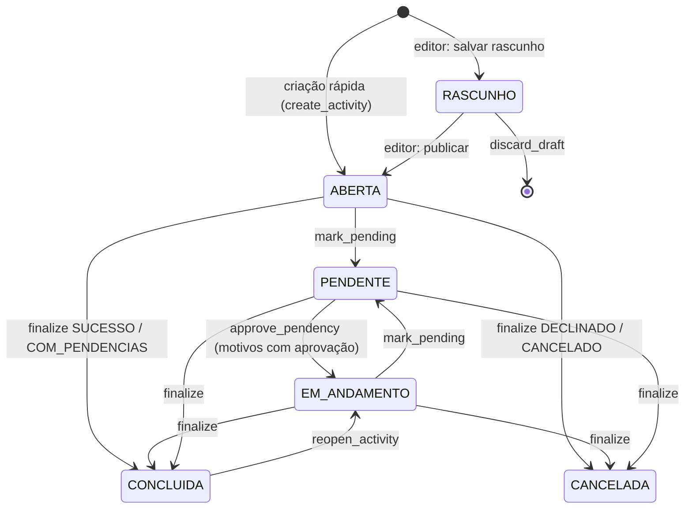
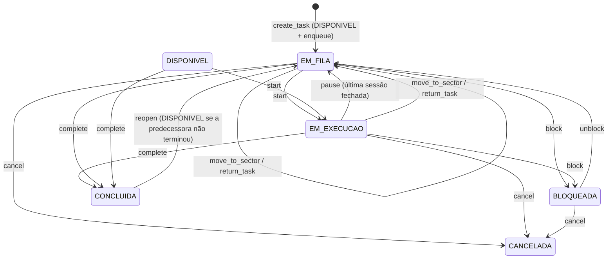

# 06 — Atividades e tarefas

> O núcleo operacional da LPS, em `activities/`. Uma **atividade** é um
> resultado a alcançar e tem exatamente um dono. Uma **tarefa** é uma unidade
> de trabalho de uma atividade, endereçada a um setor, com um responsável e
> participantes. As regras de produto estão em
> `Regras/02_ATIVIDADES_TAREFAS_E_FLUXOS.md` e
> `Regras/03_FILAS_PRAZOS_E_ESCALONAMENTO.md`.
>
> Toda a regra está em `activities/services.py` (`ActivityService`,
> `TaskService`, `QueueService`, `DeadlineService`, `MessageService`,
> `ActivityAttachmentService`). Cada método verifica a ação do catálogo,
> valida a transição, grava, audita e notifica.

---

## 1. Atividade

### 1.1 Estados



- Nenhum fluxo leva `ABERTA` → `EM_ANDAMENTO` automaticamente (iniciar uma
  tarefa só marca `first_action_at`). `EM_ANDAMENTO` hoje só é alcançado por
  reabertura ou aprovação de pendência.
- `BLOQUEADA` existe no enum, mas nenhum serviço coloca uma atividade nesse
  estado.
- Pendências sem aprovação (`MATERIAL`, `INFORMACOES_CLIENTE`) só saem de
  `PENDENTE` pela finalização.

Esses três pontos estão em [13_PENDENCIAS_CONHECIDAS.md](13_PENDENCIAS_CONHECIDAS.md).

### 1.2 Editor único de atividades

`activities/activity_editor.py` reúne criação, retomada de rascunho e edição.
Todas usam `ActivityEditorForm` e `activities/activity_form.html`: **a mesma janela,
em três etapas**, tanto para “Nova atividade” quanto para “Editar atividade”.

| Etapa | Campos (formulário → modelo) |
|---|---|
| 1. Informações principais | Nome da atividade (`title`, *), Atribuído a (`owner`, *), Setor responsável (`sector`, *), Prazo de vencimento (`requested_deadline`: data + hora opcional), Urgência (`urgency`, pílulas Baixa/Média/Alta), Organização (`company`) |
| 2. Informações do cliente | Cliente (`client`), Obra (`site`), Centro de custo (`cost_center`), Solicitante (Externo) (`external_requester`, texto), Endereço complementar (`address`) |
| 3. Descrição e arquivos | Observações (`description`, editor de texto) e Link / caminho dos arquivos (`files_location`, texto) |

*Obrigatórios ao criar e ao salvar uma edição (a etapa 1 é validada antes de avançar
e de novo no servidor, em `ActivityEditorForm.clean`).

- **Sem upload:** a etapa 3 só aponta onde os arquivos estão (link do Drive/OneDrive,
  caminho de rede ou de pasta). `files_location` aceita qualquer texto até 500
  caracteres; na ficha da atividade só vira link clicável se começar por
  `http://` ou `https://`. Os anexos já enviados antes continuam na ficha e podem ser
  removidos pelo editor (lista “Anexos enviados antes”); o envio de anexos pela
  conversa da atividade não mudou.
- **Fora do formulário, de propósito:** marcadores, solicitante interno
  (`requested_by`), anotações internas (`internal_notes`) e o envio de arquivos. Os
  campos seguem no modelo e na ficha, mas, por não estarem no `ModelForm`, salvar uma
  edição **nunca os altera** nem os apaga.
- **Cliente → Obra → Centro de custo:** a busca de obras aceita `?client=<id>` e a de
  centros de custo `?site=<id>`; ao mudar o campo de cima, o de baixo é zerado
  (`data-filter-field`, em `person-picker.js`). O servidor recusa obra de outro
  cliente e centro de custo de outra obra; obra ou centro de custo **sem vínculo**
  valem para qualquer um. Hoje só os centros de custo sem obra aparecem junto dos da
  obra escolhida; obras sem cliente somem da busca quando há cliente escolhido.
- **Organização** é o cadastro de empresas (`company`) — a mesma origem de dados de
  antes; só o rótulo mudou.
- O contador “0/2000” do editor de observações é só orientação: o servidor não corta
  o texto.
- Nada é gravado antes do botão final (`Criar atividade` / `Salvar alterações`): as
  três etapas são painéis do mesmo formulário e o backend de criação continua sendo
  `ActivityService.save_draft` + `publish_draft` (edição: `update_activity`).

Rotas e respostas:

- `/atividades/nova/`: publica em uma única submissão, exigindo nome, responsável e setor.
  Aberta pelos botões (`data-activity-action data-activity-navigate`), responde JSON:
  sucesso `{redirect_url}` (a tela segue para a ficha), erro `400 {errors}` (a janela abre
  na etapa do primeiro erro). Sem JavaScript é uma página com as três etapas empilhadas.
- Rascunho antigo (`acao=rascunho`, sem botão na tela): aceita tudo vazio; `?pk=<id>`
  retoma apenas um rascunho da organização criado pela pessoa atual.
- `/atividades/<pk>/editar/`: mesmo formulário; exige `atividade.editar`.
  A troca de responsável exige também `atividade.alterar_dono` e passa pelo serviço
  de transferência, com histórico. Sem essa ação, o responsável é somente leitura.
- `/atividades/nova-rapida/`: mesma janela dentro do seletor de atividades de uma
  tarefa; retorna `{id, name}` em Ajax. O envio antigo só com título continua válido
  (sem exigir responsável nem setor).
- Auditoria: `update_activity` registra cada campo alterado (inclusive
  `external_requester` e `files_location`).

Criação usa `save_draft` e `publish_draft` na mesma transação. A publicação mantém
as verificações de permissão, auditoria, notificações e menções existentes.
`discard_draft` continua disponível somente para o criador.

Links antigos das etapas 2/3 redirecionam ao editor. Seus POSTs permanecem
compatíveis para formulários já abertos antes da atualização.

Lista, Quadro e Calendário abrem a ficha completa da atividade. A antiga rota de
painel lateral redireciona à ficha. O parâmetro `next`, validado em `navigation.py`,
preserva o retorno à visualização e aos filtros de origem; URLs externas não são aceitas.
Alterar prazo, transferir responsável, concluir, cancelar, pendência e reabertura
usam janelas sobre a tela atual, com alternativa de página sem JavaScript.

### 1.3 Dono, edição e pendência

| Operação | Serviço | Ação | Efeitos |
|---|---|---|---|
| Trocar dono | `change_owner` | `atividade.alterar_dono` | `OwnerChangeLog`, audita `OWNER_CHANGED`, notifica antigo e novo dono |
| Assumir do grupo | `claim` | `atividade.assumir` | atividade precisa ter setor designado |
| Editar | `update_activity` | `atividade.editar` | audita `UPDATE` por campo; bloqueado se concluída/cancelada; nova descrição reprocessa menções |
| Marcar pendente | `mark_pending` | `atividade.marcar_pendente` | de `ABERTA`/`EM_ANDAMENTO`; motivo e comentário obrigatórios; audita `PENDENCY_OPENED` e gera mensagem |
| Aprovar pendência | `approve_pendency` | `atividade.aprovar_pendencia` | pendência `APROVADA`, atividade `EM_ANDAMENTO`, dono volta ao anterior, audita `PENDENCY_APPROVED`, notifica `ACTIVITY_APPROVED` |

Pendência **com aprovação** (`APROVACAO_GESTOR`, `AJUSTES_REVISOES`): exige
prazo de decisão e setor designado com gestor. O primeiro gestor do setor
vira dono temporário (com `OwnerChangeLog`); todos os gestores recebem
`ACTIVITY_APPROVAL_NEEDED` por notificação **e e-mail**; o dono anterior recebe
`ACTIVITY_PENDING`.

Pendência **sem aprovação**: o dono recebe `ACTIVITY_PENDING`. Em
`INFORMACOES_CLIENTE` com "avisar cliente", o cliente recebe e-mail
(`Client.email`).

### 1.4 Finalização e reabertura

`finalize(outcome, comment)` é o popup único de encerramento; comentário
obrigatório.

| Resultado | Ação | Estado final | Pré-condição |
|---|---|---|---|
| `SUCESSO`, `CONCLUIDO_COM_PENDENCIAS` | `atividade.concluir` | `CONCLUIDA` | nenhuma tarefa aberta |
| `DECLINADO`, `CANCELADO` | `atividade.cancelar` | `CANCELADA` (comentário vira `cancelled_reason`) | — |

Se a atividade tem processo aplicado, `SUCESSO` também exige os critérios de
aceite obrigatórios atendidos (§3.4).

Pendências abertas viram `ENCERRADA`; audita `COMPLETE`/`CANCEL`; notifica o
dono. `reopen_activity` (`atividade.reabrir`) leva `CONCLUIDA` →
`EM_ANDAMENTO` com motivo obrigatório (`REOPEN`, com o estado anterior em
`old_value`). Só atividade **concluída** reabre; cancelada não (o serviço recusa
e a tela não oferece). O botão "Reabrir atividade" aparece no aviso "Concluída
em…" da ficha (e no menu ⋮ e no menu da lista, aba "concluídas") para quem tem
`atividade.reabrir` — hoje só o perfil Administrador. Os endpoints antigos
`complete_activity`/`cancel_activity` ainda existem.

### 1.5 Anexos, mensagens e menções

- **Anexos** (`ActivityAttachmentService`): adicionar exige `atividade.editar`
  (ou ser o criador do próprio rascunho); remover exige `atividade.editar` e
  apaga o arquivo. Auditado como `UPDATE` no campo "anexo". Local de gravação
  em [03_CONFIGURACAO.md](03_CONFIGURACAO.md#4-arquivos-estáticos-mídia-e-anexos).
- **Mensagens** (`MessageService.post_activity_message`): exige
  `comunicacao.participar`. Notifica dono, criador, participantes e
  responsáveis das tarefas (menos o autor e os mencionados) com
  `MESSAGE_POSTED`.
- **@menções** (`find_mentioned_users`): `@username` em descrições, mensagens
  e comentários de finalização, pendência, bloqueio, devolução, recusa e
  conflito. Só notifica (`MENTIONED`) quem tem `comunicacao.participar` no
  recurso. Não há menção a setor.

### 1.6 Kanban e calendário

- Colunas do Kanban (`/atividades/kanban/`) são os `ActivityStage` da
  organização, mais "sem estágio". Mover o card (`mover-estagio/`) altera só
  `stage` e `stage_changed_at` (usado para "dias no estágio") — **não** mexe
  em `status`, não passa por serviço e não é auditado.
- Lista, Kanban e calendário usam o mesmo filtro
  (`filtered_activities_queryset`). Rascunhos nunca aparecem; concluídas e
  canceladas só na aba "concluídas" ou filtrando.
- Abas da lista: minhas (padrão), grupo, participando, concluídas, todas
  (esta depende de `atividade.visualizar_todas`).

---

## 2. Tarefa

### 2.1 Estados



O diagrama mostra os caminhos usuais; em código, `block` aceita qualquer
estado exceto já bloqueada, e `cancel` qualquer estado exceto concluída ou
cancelada.

- Uma tarefa recém-criada termina em `EM_FILA`: `create_task` grava
  `DISPONIVEL` e `QueueService.enqueue` troca para `EM_FILA`. **Exceção:** a etapa
  de um processo que depende da anterior fica `DISPONIVEL` e fora da fila até a
  predecessora ser concluída (§3.2); só então `QueueService.enqueue` a leva a
  `EM_FILA`.
- `start` e `complete` recusam a tarefa cuja predecessora (`depends_on`) não está
  `CONCLUIDA`, e a tarefa gerada por processo enquanto houver input obrigatório
  não recebido (§3.3).
- `return_task` grava `DEVOLVIDA`, mas em seguida chama `move_to_sector`, que
  enfileira e sobrescreve para `EM_FILA`. Na prática nenhuma tarefa fica
  `DEVOLVIDA` (ver pendências).
- `NAO_INICIADA` é o default do model, mas nenhum fluxo usa.

### 2.2 Criação

`TaskService.create_task` — usado pela criação rápida dentro da atividade
(`atividades/<pk>/tarefas/rapida/`) e pela criação avulsa com seletor de
atividade (`tarefas/nova-rapida/`).

- Exige `tarefa.criar` no endereço do **setor da tarefa**.
- Exige um `responsavel` da mesma organização (setor idem).
- Participantes iniciais entram por `add_executor`.
- Audita `TASK_CREATED`, notifica membros e gestores do setor
  (`TASK_ASSIGNED`) e processa menções.
- No título rápido, `TaskService.parse_quick_title` entende `#tag` (acha ou
  cria a tag) e `@username` (define o responsável se casar com exatamente uma
  pessoa da organização).

### 2.3 Responsável × participantes

- **Responsável**: um único usuário (`Task.responsavel`), responde pela
  conclusão.
- **Participantes**: `TaskExecutor`, podem ser vários; nunca incluem o
  responsável.

| Operação | Serviço | Ação | Efeito |
|---|---|---|---|
| Assumir (entrar como participante) | `add_executor` em si mesmo | `tarefa.assumir` | participante imediato, `EXECUTOR_ADDED` |
| Atribuir a outra pessoa | `add_executor` | `tarefa.atribuir` | cria `TaskAssignment` `PENDENTE`, notifica `TASK_ASSIGNMENT_PENDING` |
| Aceitar atribuição | `accept_assignment` | `tarefa.aceitar` | vira participante (`ASSIGNMENT_ACCEPTED` + `EXECUTOR_ADDED`) |
| Recusar atribuição | `reject_assignment` | `tarefa.recusar` | motivo (`ReturnReason`) obrigatório; notifica quem atribuiu |
| Remover participante | `remove_executor` | `tarefa.assumir` (a si) / `tarefa.atribuir` (outro) | remoção lógica (`removed_at`) |
| Trocar responsável | `change_responsavel` | `tarefa.alterar_responsavel` | `TaskResponsavelChangeLog`, `RESPONSAVEL_CHANGED`, notifica |

### 2.4 Execução e tempo

- `start` (`tarefa.iniciar`): só responsável ou participante; abre uma
  `WorkSession` da pessoa (se ainda não houver) e vai para `EM_EXECUCAO`.
  Marca `first_action_at` na tarefa e na atividade. Uma pessoa **pode** ter
  sessões abertas em várias tarefas ao mesmo tempo (Regras 04 §115, revisada).
- `pause` (`tarefa.pausar`): fecha a sessão da pessoa; se não restar nenhuma
  sessão aberta, volta a `EM_FILA`.
- `resume` (`tarefa.retomar`): delega para `start`.
- `log_manual_time` (`tempo.lancar_manual`, “Adicionar tempo trabalhado”): cria
  `WorkSession` com `is_manual=True` e `logged_at` = agora; sem datas futuras
  ou invertidas. **A tela pede o motivo** (os mesmos de “Já realizei este
  trabalho”) e o comentário, com as mesmas regras (*Outro* e mais de 7 dias exigem
  comentário); em código `reason` continua opcional para não invalidar chamadores
  antigos. Só acrescenta tempo — não conclui a tarefa (para isso, ver §2.10.1).
- O cronômetro da barra superior lista as sessões abertas do usuário
  (context processor `my_active_sessions`).

### 2.5 Bloqueio, mudança de setor e devolução

| Operação | Serviço | Ação | Efeito |
|---|---|---|---|
| Bloquear | `block` | `tarefa.bloquear` | motivo obrigatório; `TaskBlock`; `BLOQUEADA`; notifica dono (`TASK_BLOCKED`) |
| Desbloquear | `unblock` | `tarefa.bloquear` | fecha o bloqueio; `EM_FILA`; `TASK_UNBLOCKED` |
| Enviar a outro setor | `move_to_sector` | `tarefa.mover_setor` | sai da fila antiga (renumera), `SectorTransfer`, entra na fila nova; notifica o novo setor |
| Devolver | `return_task` | `tarefa.devolver` | motivo (`ReturnReason`) obrigatório; `TaskReturn`; depois `move_to_sector`; notifica os dois setores e o dono |

### 2.6 Fila

- Cada setor tem uma fila; a posição é sempre mostrada como "N de M".
- `QueueService.enqueue` põe no fim; `renumber` fecha buracos na conclusão,
  cancelamento e saída de setor (motivo `AUTOMATICA_CONCLUSAO`).
- `QueueService.reorder` (`fila.reordenar` no setor): a tarefa movida recebe
  `MANUAL`, as deslocadas `AUTOMATICA_ENTRADA`; cada mudança é auditada
  (`QUEUE_POSITION_CHANGED`) e o dono da atividade é notificado.
- `/fila/` mostra a fila completa só com `fila.visualizar_completa` no setor;
  sem ela, só as entradas em que a pessoa é dona, responsável ou participante.

### 2.7 Prazo

- **Solicitado** (`requested_deadline`): quem pede. **Comprometido**
  (`committed_deadline`): o que o executor assumiu.
- `DeadlineService.propose` (`prazo.propor`) cria `DeadlineProposal`
  `PENDENTE` e notifica o dono.
- Só o **dono da atividade** aceita (`prazo.aceitar`, grava o prazo
  comprometido) ou recusa (`prazo.recusar`).
- Recusar abre um `DeadlineConflict` e notifica setor e dono
  (`DEADLINE_CONFLICT`). `resolve_conflict` exige `escalonamento.resolver`. O
  motor de escalonamento automático é D1 (Regras 10 §57) — hoje só registra e
  notifica.

### 2.8 Checklist

`TaskChecklistItem`, editado via Ajax (`static/js/checklist.js`). Adicionar e
remover exigem `tarefa.editar`; marcar/desmarcar também é permitido ao
responsável ou participante. Guarda `done_by`/`done_at`. Não é auditado.

### 2.9 Atraso

`python manage.py check_overdue_tasks` → `TaskService.mark_overdue_tasks()`:

1. seleciona tarefas com `committed_deadline` no passado,
   `overdue_notified_at` nulo e status `DISPONIVEL`, `EM_FILA`, `EM_EXECUCAO`
   ou `BLOQUEADA`;
2. notifica membros e gestores do setor, dono da atividade e responsável
   (`TASK_OVERDUE`) e envia e-mail (`notifications/email/task_overdue.txt`);
3. grava `overdue_notified_at` — cada tarefa é avisada uma única vez.

Precisa ser agendado externamente (não há Celery/worker).

### 2.10 Kanban de tarefas

Mesma ideia das atividades: colunas = `TaskStage` da organização, mover
altera só `stage`. A ordem das colunas é arrastável em Cadastros → Estágios
(`TaskStageReorderView`).

### 2.10.1 “Já realizei este trabalho”

`TaskService.register_completed_work(task, user, started_at, ended_at, reason, note="")`
— para a tarefa que foi feita mas **ninguém iniciou**. Registra o período
trabalhado e **conclui a tarefa agora**.

> **Princípio:** a pessoa informa *quando trabalhou*; o sistema registra
> *quando soube*. Nunca se reescreve o passado operacional da fila.

| Verdade | Onde fica | Exemplo (registrado às 14:00) |
|---|---|---|
| Quando o trabalho aconteceu | `WorkSession.started_at/ended_at` (informado) | 09:00 → 10:30 |
| Quando o sistema soube | `Task.completed_at`, `QueueEntry.left_at`, liberação da sucessora, `first_action_at` e `WorkSession.logged_at` = **agora** | 14:00 |

Por isso `completed_at` **não** recebe o “terminei às” informado: não existe o
histórico impossível “concluída às 10h, mas na fila até as 14h, com a sucessora
liberada às 14h”.

| Aspecto | Regra |
|---|---|
| Quem pode | responsável ou participante com `tarefa.concluir` (o Colaborador já tem). **Não** exige `tempo.lancar_manual`, que continua valendo só para “Adicionar tempo trabalhado” |
| Status | só `EM_FILA` ou `DISPONIVEL` (ainda não iniciada). `EM_EXECUCAO` → “use Concluir tarefa”; bloqueada, devolvida, concluída e cancelada são recusadas |
| Travas de `complete` | mesmas: etapa anterior concluída (`_assert_dependency_satisfied`) e inputs obrigatórios do processo recebidos (`_assert_process_inputs_ready`) |
| Período | fim depois do início; nada no futuro; o fim não pode ser anterior à criação da tarefa. Sobreposição com outras sessões da pessoa é permitida (Regras 04 §115) |
| Motivo | obrigatório: **Esqueci de iniciar** (padrão), **Trabalhei fora da LPS**, **Ajuste do período**, **Outro** |
| Comentário | até 255 caracteres; obrigatório para **Outro** e quando o início foi há mais de `RETROACTIVE_JUSTIFICATION_DAYS` (**7**, constante em `activities/services.py`) dias |
| Governança | sem aprovação: mesmo dia é livre; dia anterior é permitido e **destacado** na ficha (“Dia anterior”); período antigo exige justificativa |
| Auditoria | `RETROACTIVE_LOGGED` (“Trabalho informado depois”): `new_value` = período, `reason` = “Informado em … · motivo · comentário”; depois o `COMPLETE` normal |
| Atomicidade | sessão, primeira ação, auditoria e conclusão na mesma transação; se a conclusão falhar, nada fica para trás |

A conclusão é `TaskService.complete`, sem alteração: saída da fila e
renumeração, `TASK_COMPLETED` e `_release_dependents` acontecem no instante do
registro.

Na ficha, o cartão **Tempo registrado** separa **Cronometrado** (`is_manual`
falso) de **Informado pela pessoa** (`is_manual` verdadeiro) — o total da equipe
continua sendo a soma — e mostra, em cada período informado, quem informou,
quando, o motivo e o comentário. “Adicionar tempo trabalhado”
(`TaskService.log_manual_time`, antes “Registrar tempo já trabalhado”) só
acrescenta tempo, não conclui a tarefa e também grava `logged_at`.

**Ações da tarefa** (ficha): barra com **Editar tarefa** à vista e o menu
**Mais ações** — Devolver para correção, Enviar para outro setor, **Gerenciar
dependência**, Registrar bloqueio, Propor novo prazo, Adicionar tempo trabalhado
e, separado e em vermelho, Cancelar tarefa. Cada item só aparece para quem tem a
ação (`can_return`, `can_move`, `can_manage_dependency`, `can_block`,
`can_propose`, `can_log_time`, `can_cancel_task`); se nada é permitido a barra
some. **Todas abrem em janela** sobre a ficha (`data-activity-action` +
`LPSModal`) e, sem JavaScript, continuam sendo páginas: `TaskFormActionView`
usa `ActivityActionResponseMixin` (sucesso → `{redirect_url}`, erro de campo ou
de serviço → 400 com `{errors}`).

#### Editor da tarefa (`task-edit`)

Janela única no padrão do editor de atividade: **título, instruções, marcadores,
prazo pedido pelo solicitante, responsável e participantes**, salvos por
`TaskService.edit_task` numa transação só — se qualquer parte for recusada, nada
é gravado. A ação `tarefa.editar` é exigida já ao **abrir** (403 no GET).

| Parte | Ação exigida | Observação |
|---|---|---|
| Título, instruções, prazo pedido, marcadores | `tarefa.editar` | Cada mudança é auditada (`UPDATE`, com antes e depois — inclusive `tags`) |
| Responsável | `tarefa.alterar_responsavel` | Sem a ação, o campo **sai do formulário** e aparece como informação; quem vira responsável deixa de ser participante |
| Participantes | `tarefa.atribuir` (ou `tarefa.assumir`, para si) | Adicionar **outra** pessoa cria um **convite** (`TaskAssignment` pendente): aparece como “aguardando aceite” no editor e na ficha e só vira participante quando ela aceita. Adicionar a si mesmo é imediato |

Fora do editor, de propósito: o **setor** (texto apontando “Enviar para outro
setor”) e a **dependência**, que mudam o fluxo. O prazo que a equipe se
comprometeu a cumprir (`committed_deadline`) também não se edita ali — é
combinado por “Propor novo prazo”. Na tela os dois prazos têm nomes distintos:
**Prazo pedido pelo solicitante** × **Prazo que a equipe se comprometeu a
cumprir**. O prazo pedido continua editável por quem tem `tarefa.editar`
(hoje, o Gestor de Setor): restringi-lo ao dono da atividade é uma decisão em
aberto (F15).

#### Gerenciar dependência (`task-dependency`)

`TaskService.change_dependency(task, user, depends_on)` — exige `tarefa.editar`;
janela própria em Mais ações. O formulário só oferece tarefas que podem ser
predecessoras (`TaskService.dependency_candidates`: mesma atividade, não
canceladas, sem ciclo). O serviço recusa:

- **ciclo**, direto ou indireto (A→B→C e C←A) — também em `update_task`;
- tarefa de outra atividade, cancelada ou a própria tarefa;
- **nova espera numa tarefa que já começou** (em execução, bloqueada, devolvida ou
  na fila com sessões de trabalho).

Consequências: tarefa `EM_FILA` que passa a esperar sai da fila (renumera) e volta
a `DISPONIVEL`, com auditoria; tarefa que deixa de esperar é liberada para a fila.
Auditoria `UPDATE` de `depends_on` com os títulos antes e depois.

### 2.11 Reabrir tarefa concluída

`TaskService.reopen(task, user, reason)` — ação **`tarefa.reabrir`** (sensível;
perfis sugeridos Gestor de Setor e Administrador), motivo obrigatório, só para
tarefa `CONCLUIDA`. As Regras eram omissas; as decisões estão em `Regras/02`
(seção "Reabertura de tarefa concluída").

| Aspecto | O que acontece |
|---|---|
| Estado | `CONCLUIDA` → `EM_FILA`. Se a **própria** predecessora ainda não terminou, fica `DISPONIVEL` fora da fila ("Aguardando etapa anterior") |
| Fila | nova passagem (`QueueEntry`) no **fim** da fila do setor; a passagem antiga fica como histórico |
| Preservado | sessões de trabalho e tempo, checklist, participantes, prazos, `first_action_at` (o histórico é fato); limpa `completed_at`/`completed_by` |
| Atividade `CONCLUIDA` | é reaberta **junto**, na mesma transação e com o mesmo motivo — exige também `atividade.reabrir`; sem ela a reabertura é recusada e nada é gravado |
| Atividade `CANCELADA` | recusa |
| Tarefas que dependiam dela | se alguma **já foi trabalhada** (em execução, concluída, bloqueada, devolvida ou com sessão registrada), a reabertura é recusada listando-as; as que só esperam na fila voltam a `DISPONIVEL` (saem da fila, fila renumerada, auditoria `UPDATE` de situação) e são liberadas de novo quando esta for concluída |
| Auditoria / avisos | `REOPEN` da tarefa (`old_value=CONCLUIDA`, motivo); `TASK_ASSIGNED` "Tarefa reaberta" para setor, responsável e dono da atividade; menções no motivo |

Onde aparece: botão **Reabrir tarefa** na ficha da tarefa e no painel lateral
(bloco "O que fazer agora" de tarefa concluída) e item no menu ⋮ das linhas da
lista com filtro "concluídas", sempre em popup de motivo
(`activities/task_action_form.html`, rota `task-reopen`). Tarefa cancelada não
reabre.

---

## 3. Processos (`processes/`)

Modelos reutilizáveis e versionados de "como fazer" um tipo de atividade, por
empresa (Regras 11 / `Regras/12_PROCESSOS_INPUTS_OUTPUTS_E_CRITERIOS_DE_ACEITE.md`).

- `ProcessService.create` cria o processo e a **v1 em rascunho**
  (`processo.criar`).
- Rascunho é editável (`processo.editar_rascunho`): inputs, output com tipo de
  evidência, critérios de aceite e fluxo linear de etapas por setor.
- `publish` (`processo.publicar`) exige output e ao menos uma etapa; a versão
  publicada anterior vira `SUBSTITUIDO`. Versão publicada não muda mais.
- `create_new_version` (`processo.criar_versao`) copia a publicada para
  v(n+1) em rascunho; recusa se já houver rascunho.
- `set_active` (`processo.inativar`).
- Cada etapa pode ter um **responsável padrão** (`ProcessStep.default_responsavel`,
  opcional, só editável em rascunho, copiado por `create_new_version`).

### 3.1 Aplicar um processo a uma atividade

Um `ProcessVersion` publicado é um **molde imutável**. Aplicá-lo a uma atividade
(`ProcessApplicationService.apply`, em `activities/process_application.py`)
materializa, numa única transação:

```
versão publicada ─► Activity.process_version        vínculo permanente
                 ├─► ActivityInputValue × inputs    um por ProcessInput, is_received=False
                 ├─► ActivityCriterionCheck × crit. um por ProcessCriterion, is_met=False
                 └─► Task × etapas                  ordem, setor, título e process_step da etapa
```

**Antes de gravar** (qualquer falha aborta sem deixar nada): a pessoa está na
organização da atividade e tem `processo.aplicar` nela; processo da mesma
organização e **da mesma empresa da atividade**; processo ativo; versão
`PUBLICADO`; atividade sem processo, não `RASCUNHO`, `CONCLUIDA` nem `CANCELADA`;
todos os setores das etapas ativos e da organização; **toda etapa com
responsável** (padrão da etapa ou escolhido agora, sempre pessoa ativa da
organização — todas as etapas que faltam são listadas de uma vez); valores
iniciais de input válidos.

**Concorrência:** a atividade é relida com `select_for_update` dentro da
transação; uma segunda aplicação (clique duplo, duas abas com a página antiga)
vê `process_version` já preenchido e é recusada. A constraint
`unique_task_per_activity_process_step` é a rede de segurança no banco; um
`IntegrityError` vira "Este processo já foi aplicado a esta atividade".

**Não existe** trocar, reaplicar, atualizar para a versão nova nem remover o
processo de uma atividade: essas operações apagariam ou corromperiam o histórico.

**Autorização:** `processo.aplicar` na atividade autoriza materializar as
tarefas de todos os setores do fluxo, sem exigir `tarefa.criar` em cada um
(detalhes em [05_AUTORIZACAO.md](05_AUTORIZACAO.md) §4.1).
`TaskService.create_task` e a aplicação compartilham `_create_task_core`, que não
autoriza e é privado.

### 3.2 Dependência e liberação das etapas

`ProcessStep.depends_on_previous` vira `Task.depends_on`: a tarefa da etapa *n*
depende da tarefa da etapa *n − 1* (dependência linear; não há grafo).

| Etapa | Estado ao aplicar |
|---|---|
| sem dependência (a primeira, ou `depends_on_previous=False`) | entra na fila do setor → `EM_FILA` |
| depende da anterior | criada e ligada, mas **fora da fila**, `DISPONIVEL`; a tela diz "Aguardando etapa anterior" |

Regras (no serviço, não só na tela):

- **iniciar** e **concluir** uma tarefa cuja predecessora não está `CONCLUIDA`
  levantam `Esta tarefa depende da conclusão de «X».` O estado da predecessora é
  lido do banco, não do objeto em cache;
- **concluir a predecessora** libera as dependentes que estavam `DISPONIVEL`, fora
  da fila e em atividade ainda aberta: `QueueService.enqueue` (fila do setor certo),
  auditoria `TASK_RELEASED` e aviso ao setor e ao responsável. É idempotente;
- **só `CONCLUIDA` satisfaz a dependência.** Predecessora cancelada, bloqueada ou
  devolvida mantém a sucessora esperando (a sucessora nunca é liberada sozinha; quem
  gerencia pode remover a dependência em Mais ações → Gerenciar dependência, o que
  também a libera);
- `move_to_sector` de uma tarefa que espera muda o setor mas não a enfileira;
  `unblock` a devolve a `DISPONIVEL`; `return_task` é recusado (não há o que devolver).

### 3.3 Inputs, critérios e entrega esperada

- **Inputs** (`ActivityInputValue`): registrados na ficha da atividade por quem pode
  atualizá-los (`ActivityProcessService.can_update`, ver doc 05). Cada tipo é
  validado (`TEXTO`, `DATA`, `NUMERO`, `LINK`); `ARQUIVO` e `SELECAO` só confirmam o
  recebimento com uma observação. Cada mudança é auditada (`INPUT_UPDATED`, com o
  estado de antes e de depois).
- **Input obrigatório faltante não impede aplicar o processo** (a atividade pode
  nascer incompleta), **mas impede o início do fluxo**: `start` e `complete` de uma
  tarefa *gerada por processo* recusam enquanto houver input obrigatório não recebido
  (`Antes de trabalhar nesta tarefa, registre o recebimento dos inputs obrigatórios…`).
  Tarefas manuais não são afetadas.
- **Critérios de aceite** (`ActivityCriterionCheck`): marcar/desmarcar grava
  `met_by`/`met_at` e audita `CRITERION_UPDATED` (inclusive reabrir). O critério do
  molde não muda.
- **Entrega esperada** (`output_description`) e **tipo de evidência** aparecem no
  painel; ainda não há onde registrar a evidência (ver pendências).

### 3.4 Finalização de atividade com processo

| Resultado | Critérios obrigatórios em aberto |
|---|---|
| `SUCESSO` | **bloqueia**, listando os que faltam (`Falta atender: A; B`) |
| `CONCLUIDO_COM_PENDENCIAS` | permite, com comentário obrigatório; os critérios abertos entram na auditoria e na conversa da atividade |
| `DECLINADO` / `CANCELADO` | não olha critérios |

O caminho antigo `complete_activity` segue a regra do `SUCESSO`. Critérios
opcionais nunca bloqueiam. Atividade sem processo não muda de comportamento.

### 3.5 Tela

- Ficha da atividade → cartão **Processo** (âncora `#processo`): identificação da
  versão, resultado esperado, **Entradas** (`x / y recebidas`), **Etapas**
  (`x / y concluídas`, com o estado de cada uma) e **Critérios de aceite**
  (`x / y atendidos`, com caixa para marcar).
- Sem processo, quem tem `processo.aplicar` vê **Aplicar processo**: popup em 4
  passos (Processo → Responsáveis → Entradas → Confirmar). O passo 1 lista só
  processos elegíveis (ativos, com versão publicada, da organização e da empresa da
  atividade); o passo 2 vem com o responsável padrão preenchido e sugere primeiro as
  pessoas do setor da etapa.

### 3.6 Notificações

- Ao aplicar: um aviso por tarefa que **já nasceu na fila** (setor + responsável,
  `TASK_ASSIGNED`); etapas que esperam não geram aviso; o dono da atividade, se não
  foi quem aplicou, recebe um resumo (`PROCESS_APPLIED`).
- Ao liberar uma etapa: aviso ao setor e ao responsável (`TASK_ASSIGNED`,
  "Tarefa liberada para a fila").
