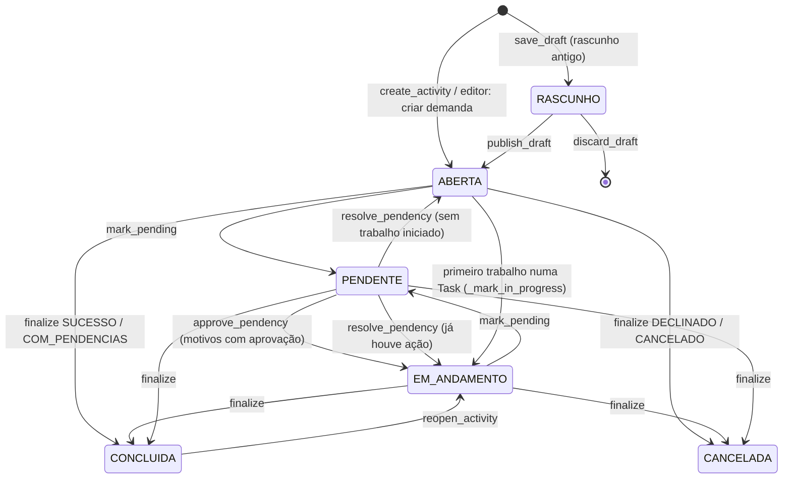
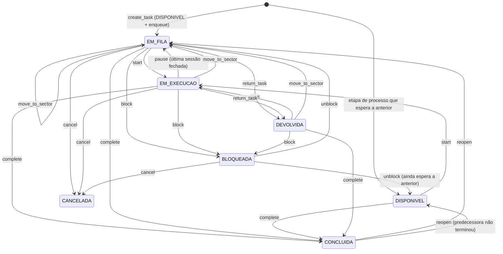

# 06 — Atividades (Demandas) e tarefas

> O núcleo operacional da LPS: as regras estão em `activities/` e os quadros em
> `boards/`. Uma **atividade** — **Demanda** na interface e no endereço
> (`/demandas/…`; o código segue `Activity` e as rotas `activity-*`) — é um
> resultado a alcançar e tem exatamente um dono. Desde 02/10/2026 as **tarefas**
> de uma Demanda são itens do **Quadro da Demanda** (§2.0); o modelo operacional
> antigo — `Task` com fila, cronômetro, prazo negociado e processos — foi
> **desativado** (§0). Na interface, "Situação" virou **Etapa** e "Condição" virou
> **Status**. Atualizado em 03/10/2026, sobre o commit `add5acd`. As regras de
> produto estão em `Regras/02_ATIVIDADES_TAREFAS_E_FLUXOS.md` e
> `Regras/03_FILAS_PRAZOS_E_ESCALONAMENTO.md` (parte delas descreve o que foi
> desativado).
>
> A regra de Demanda está em `activities/services.py` (`ActivityService`,
> `ActivityAttachmentService`, `MessageService`); o quadro de cada Demanda, em
> `boards/demand_services.py` (`BoardInstantiationService`, `DemandBoardAccess`).
> `TaskService`, `QueueService` e `DeadlineService` continuam no código, mas
> sem rota que os alcance. Cada método verifica a ação do catálogo, valida a
> transição, grava, audita e notifica.

---

## 0. O que está ativo e o que foi desativado em 02/10/2026

Em 02/10/2026 (commits `74fff88` a `add5acd`, migração `boards/0008`) a LPS
centralizou o trabalho das Demandas em **quadros**. Rotas desativadas respondem
**410 Gone** (texto simples) e seguem declaradas para links e favoritos antigos
(lista completa em [09_ROTAS.md](09_ROTAS.md)).

| Capacidade | Estado | Onde |
|---|---|---|
| Criar, editar, finalizar, cancelar e reabrir Demanda; dono, prazo, pendência, mensagens, anexos | **Ativo** | §1 |
| Lista, **Quadro por etapas** (Kanban), Calendário de prazos e edição inline das Demandas | **Ativo** | §1.6, §1.7 |
| Quadro da Demanda (tarefas como itens, com visões Tabela, Kanban e Calendário) | **Ativo** | §2.0; [09_ROTAS.md](09_ROTAS.md) §6.2 |
| Painel Tarefas (`/tarefas/`, `/tarefas/kanban/`, `/tarefas/calendario/`), só leitura | **Ativo** | §2.0 |
| Quadros modelo (`/quadros/`) | **Ativo** | §2.0 |
| Kanban por setor (`/demandas/kanban-legado/`, ações `kanban/…`) e lista anterior (`/demandas/lista-legada/`) | Ativo, por compatibilidade | §1.6 |
| `/atividades/…` | Redireciona (301/308) para `/demandas/…` | §1.2 |
| Tarefa operacional (`Task`): ações, ficha, editor, dependência, "Já realizei este trabalho", tempo, checklist, participantes e atribuições, mensagens | **Desativado** — `/tarefas/<pk>/…` responde 410 | §2.1–2.11 |
| Fila do setor (`/fila/*`) e reordenação | **Desativado** (410) | §2.6 |
| Prazo comprometido, propostas e conflitos (`tarefas/<pk>/prazo/propor/`, `/prazos/*`, `/conflitos/*`) | **Desativado** (410) | §2.7 |
| Cronômetro e sessões de trabalho (iniciar, pausar, retomar) | **Desativado** (rotas em 410) | §2.4 |
| Criar tarefa rápida (`demandas/<pk>/tarefas/rapida/`, `tarefas/nova-rapida/`) | **Desativado** (410) | §2.2 |
| Processos (`/processos/*`) e "Aplicar processo" (`demandas/<pk>/processo/*`) | **Desativado** (410); dados preservados | §3 |
| Caixa de Entrada (`/entrada/`) | **Inativa por padrão** (`INTAKE_ENABLED`): 404 | §4 |

A migração `boards/0008_centralize_demand_board_items` converteu cada item de
quadro ligado a uma `Task` (nome e responsável viraram valores do próprio item),
**cancelou** toda `Task` ainda aberta (`CANCELADA`, auditoria `CANCEL` com o
motivo "Tarefa operacional arquivada na centralização do quadro."), encerrou as
sessões de trabalho e as passagens de fila abertas (renumerando as filas) e
removeu `BoardItem.task` e `BoardColumn.binding`. As `Task` já concluídas ou
canceladas continuam como histórico. A Demanda em si não mudou de estado.

---

## 1. Demanda (atividade)

### 1.1 Estados



- `ABERTA` → `EM_ANDAMENTO` só ocorre quando o trabalho começa numa `Task`
  (`start`, `log_manual_time` e `register_completed_work` chamam
  `ActivityService._mark_in_progress`, que audita `UPDATE` do status). Como as
  `Task` operacionais foram desativadas (§0), nenhuma rota dispara essa
  transição hoje: `EM_ANDAMENTO` é alcançado pela reabertura, pela aprovação de
  pendência e pela resolução de pendência simples.
- `BLOQUEADA` existe no enum, mas nenhum serviço coloca uma atividade nesse
  estado.
- `resolve_pendency` (ação `demanda.marcar_pendente`; audita
  `PENDENCY_RESOLVED`) encerra a pendência que só avisava (`MATERIAL`,
  `INFORMACOES_CLIENTE`) e volta a `EM_ANDAMENTO` se já houve a primeira ação, ou
  a `ABERTA`. O serviço e a política existem, mas **nenhuma view o chama**: pela
  interface essas pendências só saem de `PENDENTE` pela finalização.
- Concluir exige que não haja `Task` aberta; os **itens do Quadro da Demanda
  não são verificados** (§1.4).

Os pontos acima estão em [13_PENDENCIAS_CONHECIDAS.md](13_PENDENCIAS_CONHECIDAS.md).

### 1.2 Editor único de Demandas

`activities/activity_editor.py` reúne criação, retomada de rascunho e edição.
Todas usam `ActivityEditorForm` e `activities/activity_form.html`: **a mesma janela,
em quatro etapas** (Informações principais, Cliente e obra, Quadro de tarefas, Descrição e arquivos), tanto para “Nova demanda” quanto para “Editar demanda”. Ao editar, a etapa do quadro mostra o quadro atual e deixa trocá-lo com confirmação (exclui as tarefas do quadro atual: ver `docs/13` F36). A **Etapa** e o **Status** da Demanda (rótulos novos de "Situação" e "Condição") são escolhidos na etapa 1.

| Etapa | Campos (formulário → modelo) |
|---|---|
| 1. Informações principais | Nome da demanda (`title`, *), Atribuído a (`owner`, *), Setor responsável (`sector`, *), Etapa (`stage`) e Status (`condition`) — as opções do setor escolhido; sem escolha valem os padrões do setor —, Prazo de vencimento (`requested_deadline`: data + hora opcional), Urgência (`urgency`, pílulas Baixa/Média/Alta), Organização (`company`) |
| 2. Cliente e obra | Cliente (`client`), Obra (`site`), Centro de custo (`cost_center`), Solicitante (Externo) (`external_requester`, texto), Endereço complementar (`address`) |
| 3. Quadro de tarefas | Quadro de tarefas (`board_setup_mode`: **Começar em branco** ou **Usar quadro existente**) e Modelo de quadro (`board_template`, obrigatório no segundo caso: um quadro modelo ativo da organização, de qualquer setor) |
| 4. Descrição e arquivos | Observações (`description`, editor de texto) e Link / caminho dos arquivos (`files_location`, texto) |

*Obrigatórios ao criar e ao salvar uma edição (a etapa 1 é validada antes de avançar
e de novo no servidor, em `ActivityEditorForm.clean`). Sem escolha, o quadro nasce em branco.

- **Sem upload:** a etapa 4 só aponta onde os arquivos estão (link do Drive/OneDrive,
  caminho de rede ou de pasta). `files_location` aceita qualquer texto até 500
  caracteres; na ficha da atividade só vira link clicável se começar por
  `http://` ou `https://`. Os anexos já enviados antes continuam na ficha e podem ser
  removidos pelo editor (lista “Anexos enviados antes”); o envio de anexos pela
  conversa da atividade não mudou.
- **Fora do formulário, de propósito:** marcadores, solicitante interno
  (`requested_by`), anotações internas (`internal_notes`) e o envio de arquivos. Os
  campos seguem no modelo e na ficha, mas, por não estarem no `ModelForm`, salvar uma
  edição **nunca os altera** nem os apaga.
- **Cliente → Obra → Centro de custo:** a busca de obras aceita `?client=<id>` e a de
  centros de custo `?site=<id>`; ao mudar o campo de cima, o de baixo é zerado
  (`data-filter-field`, em `person-picker.js`). O servidor recusa obra de outro
  cliente e centro de custo de outra obra; obra ou centro de custo **sem vínculo**
  valem para qualquer um. Hoje só os centros de custo sem obra aparecem junto dos da
  obra escolhida; obras sem cliente somem da busca quando há cliente escolhido.
- **Organização** é o cadastro de empresas (`company`) — a mesma origem de dados de
  antes; só o rótulo mudou.
- O contador “0/2000” do editor de observações é só orientação: o servidor não corta
  o texto.
- Nada é gravado antes do botão final (`Criar demanda` / `Salvar alterações`): as
  quatro etapas são painéis do mesmo formulário e o backend de criação continua sendo
  `ActivityService.save_draft` + `publish_draft` (edição: `update_activity`); o quadro é criado em `publish_draft` (§2.0).

Rotas e respostas:

- `/demandas/nova/`: publica em uma única submissão, exigindo nome, responsável e setor.
  Aberta pelos botões (`data-activity-action data-activity-navigate`), responde JSON:
  sucesso `{redirect_url}` (a tela segue para a ficha), erro `400 {errors}` (a janela abre
  na etapa do primeiro erro). Sem JavaScript é uma página com as quatro etapas empilhadas.
- Rascunho antigo (`acao=rascunho`, sem botão na tela): aceita tudo vazio; `?pk=<id>`
  retoma apenas um rascunho da organização criado pela pessoa atual.
- `/demandas/<pk>/editar/`: mesmo formulário; exige `demanda.editar` (403 já ao abrir). `?passo=N` abre direto na etapa N (o clique em Cliente / Obra da lista abre na 2). Etapa e Status gravam pelos serviços próprios (`demanda.definir_etapa` ou `demanda.mover_estagio`; `demanda.definir_condicao`); trocar o **setor** redefine Etapa e Status para o padrão do novo setor, exige `demanda.editar` também no setor de destino e é recusado enquanto houver pendência com aprovação aberta.
  A troca de responsável exige também `demanda.alterar_dono` e passa pelo serviço
  de transferência, com histórico. Sem essa ação, o responsável é somente leitura.
- `/demandas/nova-rapida/`: mesma janela dentro do seletor de atividades de uma
  tarefa; retorna `{id, name, summary}` em Ajax. O envio antigo só com título continua válido
  (sem exigir responsável nem setor).
- **Quadro de tarefas (etapa 3):** ao criar, escolhe o quadro que a Demanda terá (§2.0). Ao editar, mostra o quadro **real** da Demanda e só deixa trocá-lo a quem gere a estrutura dele (dono, criador ou `quadro.gerir_colunas`); para as demais pessoas os campos ficam somente leitura. Trocar por outra escolha exige `confirm_board_replace` (sem ele: `400 {errors: {board_setup_mode}}` e nada é gravado) e **exclui definitivamente** as tarefas, colunas, grupos e visões do quadro atual (`BoardInstantiationService.replace_for_activity`, na mesma transação da edição; audita `BOARD_UPDATED` com `items_deleted`). Pedido sem o campo do quadro nunca vira "em branco": o quadro fica como está.
- Auditoria: `update_activity` registra cada campo alterado (inclusive
  `external_requester` e `files_location`).

Criação usa `save_draft` e `publish_draft` na mesma transação. A publicação mantém
as verificações de permissão, auditoria, notificações e menções existentes.
`discard_draft` continua disponível somente para o criador.

Links antigos das etapas 2/3 redirecionam ao editor. Seus POSTs permanecem
compatíveis para formulários já abertos antes da atualização.

O código da Demanda é `DEM-AAAA-NNNNN` (antes `ATV-…`; a busca ainda aceita o prefixo antigo). Os endereços `/atividades/<resto>` redirecionam (301; **308** em POST) para `/demandas/<resto>`, com a consulta, sem exigir login, e `/atividade-arquivos/…` responde 410.

Lista, Quadro e Calendário abrem a ficha completa da atividade. A antiga rota de
painel lateral redireciona à ficha. O parâmetro `next`, validado em `navigation.py`,
preserva o retorno à visualização e aos filtros de origem; URLs externas não são aceitas.
Alterar prazo, transferir responsável, concluir, cancelar, pendência e reabertura
usam janelas sobre a tela atual, com alternativa de página sem JavaScript.

### 1.3 Dono, edição e pendência

| Operação | Serviço | Ação | Efeitos |
|---|---|---|---|
| Trocar dono | `change_owner` | `demanda.alterar_dono` | `OwnerChangeLog`, audita `OWNER_CHANGED`, notifica antigo e novo dono |
| Assumir do grupo | `claim` | `demanda.assumir` | atividade precisa ter setor designado |
| Editar | `update_activity` | `demanda.editar` | audita `UPDATE` por campo; bloqueado se concluída/cancelada; nova descrição reprocessa menções; trocar o setor redefine Etapa e Status do novo setor |
| Definir etapa | `set_stage` | `demanda.definir_etapa` (ou `demanda.mover_estagio`) | só etapa ativa **do setor da demanda**; recusada em demanda concluída/cancelada; grava `stage_changed_at` e audita `UPDATE` "etapa" |
| Definir status | `set_condition` | `demanda.definir_condicao` | só status ativo do setor; recusado em demanda concluída/cancelada; audita `UPDATE` "status". Não muda o `status` operacional da Demanda |
| Marcar pendente | `mark_pending` | `demanda.marcar_pendente` | de `ABERTA`/`EM_ANDAMENTO`; motivo e comentário obrigatórios; audita `PENDENCY_OPENED` e gera mensagem |
| Aprovar pendência | `approve_pendency` | `demanda.aprovar_pendencia` | pendência `APROVADA`, atividade `EM_ANDAMENTO`, dono volta ao anterior, audita `PENDENCY_APPROVED`, notifica `ACTIVITY_APPROVED` |

Pendência **com aprovação** (`APROVACAO_GESTOR`, `AJUSTES_REVISOES`): exige
prazo de decisão e setor designado com gestor. O primeiro gestor do setor
vira dono temporário (com `OwnerChangeLog`); todos os gestores recebem
`ACTIVITY_APPROVAL_NEEDED` por notificação **e e-mail**; o dono anterior recebe
`ACTIVITY_PENDING`.

Pendência **sem aprovação**: o dono recebe `ACTIVITY_PENDING`. Em
`INFORMACOES_CLIENTE` com "avisar cliente", o cliente recebe e-mail
(`Client.email`).

A pendência **sem aprovação** só tem a rota de abertura (`demandas/<pk>/pendente/`); o serviço `resolve_pendency` não está ligado a nenhuma tela (§1.1).

### 1.4 Finalização e reabertura

`finalize(outcome, comment)` é o popup único de encerramento; comentário
obrigatório.

| Resultado | Ação | Estado final | Pré-condição |
|---|---|---|---|
| `SUCESSO`, `CONCLUIDO_COM_PENDENCIAS` | `demanda.concluir` | `CONCLUIDA` | nenhuma `Task` aberta (as operacionais foram arquivadas em 02/10; os itens do Quadro da Demanda **não** impedem a conclusão) |
| `DECLINADO`, `CANCELADO` | `demanda.cancelar` | `CANCELADA` (comentário vira `cancelled_reason`) | — |

Se a atividade tem processo aplicado, `SUCESSO` também exige os critérios de
aceite obrigatórios atendidos (§3.4; processos foram desativados em 02/10, então vale só para demandas que já tinham processo aplicado).

Pendências abertas viram `ENCERRADA`; audita `COMPLETE`/`CANCEL`; notifica o
dono. `reopen_activity` (`demanda.reabrir`) leva `CONCLUIDA` →
`EM_ANDAMENTO` com motivo obrigatório (`REOPEN`, com o estado anterior em
`old_value`). Só atividade **concluída** reabre; cancelada não (o serviço recusa
e a tela não oferece). O botão "Reabrir demanda" aparece no aviso "Concluída
em…" da ficha (e no menu ⋮ e no menu da lista, aba "concluídas") para quem tem
`demanda.reabrir` — hoje só o perfil Administrador. Os caminhos antigos
`complete_activity`/`cancel_activity` ainda existem (`concluir/` e `cancelar/`; `cancelar/` por GET redireciona ao popup de finalização).

### 1.5 Anexos, mensagens e menções

- **Anexos** (`ActivityAttachmentService`): adicionar exige `demanda.editar`
  (ou ser o criador do próprio rascunho); remover exige `demanda.editar` e
  apaga o arquivo. Auditado como `UPDATE` no campo "anexo". Local de gravação
  em [03_CONFIGURACAO.md](03_CONFIGURACAO.md#4-arquivos-estáticos-mídia-e-anexos). O download só sai de `demandas/<pk>/anexos/<attachment_pk>/download/`, que confere organização, `demanda.visualizar` e a visibilidade da mensagem a que o anexo pertence; não há rota pública de arquivos (o endereço antigo `atividade-arquivos/…` responde 410).
- **Mensagens** (`MessageService.post_activity_message`): exige
  `comunicacao.participar`. Notifica dono, criador, participantes e
  responsáveis das tarefas (menos o autor e os mencionados) com
  `MESSAGE_POSTED`. Participantes e responsáveis são os das `Task` históricas; os itens do quadro não entram nesta lista.
- **Tipos, visibilidade e respostas:** cada atualização tem um tipo (Mensagem, Decisão registrada, Risco, Compromisso, Impedimento — só `DECISAO` ganha destaque) e uma visibilidade (*Todas as pessoas com acesso*, *Somente participantes*, *Somente meu setor* — esta exige setor definido). A regra vale na leitura, não só no seletor. Uma resposta (`parent`) herda a visibilidade da mensagem de origem e não a amplia; `demandas/<pk>/continuar/` envia comentário e/ou anexo num só envio.
- **Reações:** 👍 👏 🎉 ✅ 👀, alternadas por pessoa (`comunicacao.participar`), só em mensagem que a pessoa pode ver.
- **@menções** (`find_mentioned_users`): `@username` em descrições, mensagens
  e comentários de finalização, pendência, bloqueio, devolução, recusa e
  conflito. Só notifica (`MENTIONED`) quem tem `comunicacao.participar` no
  recurso. Não há menção a setor.

### 1.6 Lista, Quadro por etapas e Calendário

`/demandas/` (Lista), `/demandas/kanban/` (**Quadro por etapas**) e
`/demandas/calendario/` (**Calendário de prazos**) são **a mesma tela operacional**,
`DemandWorkBoardView` (`boards/work_views.py`), montada sobre o **quadro de domínio**
das Demandas (`DomainBoard`, um por organização, criado sob demanda por
`ensure_domain_board`). Ele é uma configuração de *campos* e *visões* que **lê e grava
o próprio `Activity`**; não usa `BoardItem` (isso é o Quadro da Demanda, §2.0).

- **Campos padrão:** Título, Responsável (dono), Setor, Prioridade (`urgency`), Prazo
  (`requested_deadline`), Etapa, Status (`condition`) e Tarefas. Quem tem `quadro.gerir_colunas`
  acrescenta campos próprios (Texto, Número, Moeda, Data e hora, Lista, Confirmação), guardados em
  `DomainCustomValue` e auditados como `quadro:<chave>`.
- **Visões padrão:** *Quadro principal* (a lista, agrupada por etapa), *Kanban*
  (`group_by=stage`, raias vazias visíveis — o fluxo aparece completo) e *Calendário* (por prazo).
  `?visao=`/`?view=` escolhe a visão. Com `quadro.gerir_colunas`: **+ Campo**, **Configurar cartões**,
  agrupamento (etapa, status, setor, responsável, prioridade), `show_empty`, nomes dos campos e
  largura/visibilidade das colunas.
- **Abas de escopo** (`?tab=`): *Sob minha responsabilidade* (`minhas`, padrão), *Do meu setor*
  (`grupo`), *Em que participo* (`participando`), *Concluídas* e, só com `demanda.visualizar_todas`,
  *Todas as demandas*. Rascunhos nunca aparecem; concluídas e canceladas só na aba *Concluídas* ou
  filtrando.
- **Filtros:** busca `q` (título, cliente, obra e código — aceita o prefixo antigo `ATV-`), setor,
  pessoa, Etapa, Status, cliente, obra, marcador, prazo (atrasadas, hoje, 7 dias, 30 dias, sem prazo),
  atalhos (*Atrasadas*, *Vencem hoje*) e ordenação (prazo, mais recentes, título). Os mesmos
  parâmetros valem nas três visões e os links entre elas os preservam. Valor inválido é ignorado.
- **O que cada gesto grava:** editar uma célula ou soltar o cartão grava **só** aquele campo
  (`workboard-value` → `DomainBoardMutationService.set_value` → `ActivityService`): título e prazo
  por `update_activity` (o prazo exige também `prazo.alterar_solicitado`), responsável por
  `change_owner`, setor por `update_activity`, Etapa por `set_stage`, Status por `set_condition`,
  prioridade por `update_activity`. Nenhum mexe no `status` operacional. A tela só deixa arrastar
  entre raias a quem tem a ação do campo agrupado (`demanda.mover_estagio`, `demanda.definir_condicao`,
  `demanda.editar` para setor e prioridade, `demanda.alterar_dono`); o serviço confere de novo.
  A tela manda a versão lida (`updated_at`): se a Demanda mudou desde então, a resposta é **409**
  e a célula é recarregada.
- **Calendário de prazos:** posiciona cada Demanda no dia do prazo solicitado.
- Lista, Kanban e Calendário abrem a ficha completa (`?next=` preserva a visão e os filtros).

**Kanban por setor (anterior)** — `/demandas/kanban-legado/` (`activities/kanban.py`), mantido
por compatibilidade junto com as ações `kanban/…` e a gaveta `demandas/<pk>/gaveta/`:
sempre de **um setor** por vez (`?setor=`); colunas = etapas ativas do setor (`ActivityStage`), mais
"Sem etapa" quando sobra demanda sem etapa; quem participa do setor (ou tem `demanda.visualizar_todas`
nele) vê todas as demandas, as demais só as em que atuam; arrastar grava **só** a etapa
(`ActivityService.set_stage`) e escolher o Status grava **só** o status (`set_condition`); "+" na
coluna cria a Demanda (setor do quadro, etapa da coluna, a pessoa como dona); o limite da coluna
(`ActivityStage.column_limit`, `etapa.gerir`) é só informativo; a gaveta mostra dados, Etapa e Status,
anexos, conversa e últimas atualizações. A versão para tarefas (`TaskBoard`) responde 410.

### 1.7 Edição inline da Lista

Na Lista de Demandas, título, responsável, setor, Etapa, Status e prazo editam no lugar
(`demandas/<pk>/inline/`, só JSON; opções dos pop-overs em `…/inline/opcoes/`). É um adapter
fino sobre o `ActivityService`: toda regra, autorização, auditoria e notificação vive no serviço
(`update_activity`, `change_owner`, `set_stage`, `set_condition`), e a troca de setor confere a
autorização também no setor de destino. Quem tem `etapa.gerir`/`condicao.gerir` no setor da demanda
cria e edita Etapas e Status ali mesmo. O contrato de resposta e os códigos (403, 400, 404) estão em
[09_ROTAS.md](09_ROTAS.md) §4.

---

## 2. Tarefa

### 2.0 Tarefas hoje: itens do Quadro da Demanda (ativo)

Desde 02/10/2026 uma tarefa de Demanda é um **item (`BoardItem`) do Quadro da Demanda**,
não uma linha de `Task`.

- **O quadro:** `Board` com `kind = DEMAND`, um por Demanda (`Activity.task_board`, relação 1:1),
  criado na mesma transação em que a Demanda é publicada — `publish_draft` (editor), `create_activity`
  (criação rápida, sempre em branco) e a conversão da Caixa de Entrada — por
  `BoardInstantiationService.create_for_activity`. Se a Demanda já tem quadro, nada é recriado.
- **Em branco:** um grupo padrão e as colunas **Responsável** (Pessoa), **Status** (etiquetas
  *Não iniciado* — padrão —, *Em andamento* e *Concluído* — marca de conclusão) e **Data**, mais as
  visões Kanban e Calendário (a Tabela é a visão base). **Usando um quadro existente:** cópia
  **independente** de um quadro modelo (`kind = TEMPLATE`, de qualquer setor): grupos, colunas,
  etiquetas, visões e itens; `Board.source_template` guarda a origem, sem vínculo posterior.
  A estrutura mínima é recomposta se o modelo não a tiver.
- **Colunas:** Texto, Número, Moeda, Data, Pessoa, Status, Lista suspensa e Sinal de confirmação
  (os demais tipos estão reservados). A "tarefa" que o Painel Tarefas mostra é o item, com a
  célula **Pessoa** como responsável, o **Status** como situação e a coluna **Data** como prazo.
- **O que não existe mais para a tarefa:** fila, cronômetro e sessões, prazo solicitado ×
  comprometido negociado, dependência, bloqueio, devolução, checklist, participantes e atribuições,
  processo e "Já realizei este trabalho". Tudo isso era da `Task` (§2.1–2.11) e agora, se for
  preciso, é uma coluna do quadro. O módulo `boards` não envia notificações: mexer num item não avisa ninguém (as menções da Demanda continuam valendo, §1.5).
- **Acesso** (`DemandBoardAccess`): vê o quadro quem participa da Demanda (dono, criador ou pessoa
  em célula Pessoa de um item ativo), quem tem `demanda.visualizar` ou `quadro.visualizar`; cria e
  edita itens quem participa ou tem `quadro.editar_item`; muda a estrutura (colunas, visões,
  etiquetas, grupos) o dono, o criador ou quem tem `quadro.gerir_colunas`. O quadro de uma Demanda
  não pode ser excluído pela tela. Detalhes das rotas em [09_ROTAS.md](09_ROTAS.md) §6.2.
- **Na ficha da Demanda**, o bloco **Tarefas** é uma prévia **somente leitura** do quadro real
  (total, concluídas, em andamento e menções novas, mais as primeiras linhas) com o botão
  **Abrir quadro**; criar, atribuir e organizar é no quadro (`/quadros/<id>/`).
- **Trocar o quadro** só no editor da Demanda (§1.2), com confirmação, pois exclui as tarefas do
  quadro atual. A Demanda antiga sem quadro ganha o dela ao ser editada.
- **Painel Tarefas** (`/tarefas/`, `/tarefas/kanban/`, `/tarefas/calendario/`;
  `boards/task_center.py`, só leitura): o que está nos Quadros de Demanda em que a pessoa é
  **responsável** (célula Pessoa); Demandas em rascunho ou canceladas não aparecem. O estado vem do
  Status do item: etiqueta de conclusão = *Concluídas*; etiqueta padrão ou sem Status = *A fazer*;
  qualquer outra = *Em andamento*; "atrasada" é um selo (prazo anterior a hoje e não concluída). Lista
  (ordenada por prazo), Kanban de três colunas e Calendário semanal; filtros por busca, status,
  prazo e pessoa (a pessoa só se tem `quadro.visualizar` ou `demanda.visualizar_todas`). O
  endereço antigo `/tarefas/?demanda=<id>` redireciona ao quadro da Demanda.
- **Quadros modelo** (`/quadros/`): quadros de `kind = TEMPLATE` criados com `quadro.criar` (em branco
  ou a partir de um modelo inicial, sempre num setor). Servem de molde para o passo 3 do editor da
  Demanda. Visões Tabela, Kanban e Calendário; ver [09_ROTAS.md](09_ROTAS.md) §6.2.
- **A conclusão da Demanda não olha o quadro:** itens abertos não impedem finalizar (§1.4).

> **Task operacional — desativada em 02/10/2026.** O restante desta seção (2.1 a
> 2.11) descreve o comportamento do código de serviço (`TaskService`, `QueueService`,
> `DeadlineService`, `WorkTimeService`), que continua no repositório e nos testes, mas
> **nenhuma rota o alcança** (410; ver [09_ROTAS.md](09_ROTAS.md) §4). Serve de
> referência histórica e para entender os dados antigos (`Task`, `QueueEntry`,
> `WorkSession`, `DeadlineProposal`…).

### 2.1 Estados (`Task`, desativada)



O diagrama mostra os caminhos usuais; em código (`TaskTransitionPolicy`), `block` aceita
qualquer estado exceto já bloqueada, concluída ou cancelada, `cancel` qualquer estado exceto
concluída ou cancelada, e `move_to_sector` qualquer estado não terminal.

- Uma tarefa recém-criada termina em `EM_FILA`: `create_task` grava
  `DISPONIVEL` e `QueueService.enqueue` troca para `EM_FILA`. **Exceção:** a etapa
  de um processo que depende da anterior fica `DISPONIVEL` e fora da fila até a
  predecessora ser concluída (§3.2); só então `QueueService.enqueue` a leva a
  `EM_FILA`.
- `start` e `complete` recusam a tarefa cuja predecessora (`depends_on`) não está
  `CONCLUIDA`, e a tarefa gerada por processo enquanto houver input obrigatório
  não recebido (§3.3).
- `return_task` grava `DEVOLVIDA` e chama `move_to_sector(keep_status=True)`, que
  entra na fila do setor que recebeu **mantendo** `DEVOLVIDA` (o status diz a
  verdade até alguém agir); a tarefa sai de `DEVOLVIDA` ao ser iniciada,
  concluída, bloqueada, cancelada ou movida de novo. Uma etapa que ainda espera a
  anterior e nunca entrou na fila não pode ser devolvida.
- `NAO_INICIADA` é o default do model, mas nenhum fluxo usa.
- A `Task` ganhou **prioridade** (`priority`: Baixa/Média/Alta, `set_priority`) e
  Etapa/Status do setor (`set_stage`, `set_condition`; ações `tarefa.definir_etapa`,
  `tarefa.definir_condicao`); `move_to_sector` redefine os dois para o padrão do novo setor.

### 2.2 Criação

`TaskService.create_task` — usado pela criação rápida dentro da atividade
(`demandas/<pk>/tarefas/rapida/`) e pela criação avulsa com seletor de
atividade (`tarefas/nova-rapida/`); **as duas rotas respondem 410** e nada mais
cria `Task`.

- Exige `tarefa.criar` no endereço do **setor da tarefa**.
- Exige um `responsavel` da mesma organização (setor idem).
- Participantes iniciais entram por `add_executor`.
- Audita `TASK_CREATED`, notifica membros e gestores do setor
  (`TASK_ASSIGNED`) e processa menções.
- No título rápido, `TaskService.parse_quick_title` entende `#tag` (acha ou
  cria a tag) e `@username` (define o responsável se casar com exatamente uma
  pessoa da organização).

### 2.3 Responsável × participantes

- **Responsável**: um único usuário (`Task.responsavel`), responde pela
  conclusão.
- **Participantes**: `TaskExecutor`, podem ser vários; nunca incluem o
  responsável.

| Operação | Serviço | Ação | Efeito |
|---|---|---|---|
| Assumir (entrar como participante) | `add_executor` em si mesmo | `tarefa.assumir` | participante imediato, `EXECUTOR_ADDED` |
| Atribuir a outra pessoa | `add_executor` | `tarefa.atribuir` | cria `TaskAssignment` `PENDENTE`, notifica `TASK_ASSIGNMENT_PENDING` |
| Aceitar atribuição | `accept_assignment` | `tarefa.aceitar` | vira participante (`ASSIGNMENT_ACCEPTED` + `EXECUTOR_ADDED`) |
| Recusar atribuição | `reject_assignment` | `tarefa.recusar` | motivo (`ReturnReason`) obrigatório; notifica quem atribuiu |
| Remover participante | `remove_executor` | `tarefa.assumir` (a si) / `tarefa.atribuir` (outro) | remoção lógica (`removed_at`) |
| Trocar responsável | `change_responsavel` | `tarefa.alterar_responsavel` | `TaskResponsavelChangeLog`, `RESPONSAVEL_CHANGED`, notifica |

### 2.4 Execução e tempo

- `start` (`tarefa.iniciar`): só responsável ou participante; abre uma
  `WorkSession` da pessoa (se ainda não houver) e vai para `EM_EXECUCAO`.
  Marca `first_action_at` na tarefa e na atividade e leva a atividade de `ABERTA` a `EM_ANDAMENTO` (`_mark_in_progress`, auditado). Uma pessoa **pode** ter
  sessões abertas em várias tarefas ao mesmo tempo (Regras 04 §115, revisada).
- `pause` (`tarefa.pausar`): fecha a sessão da pessoa; se não restar nenhuma
  sessão aberta, volta a `EM_FILA`.
- `resume` (`tarefa.retomar`): delega para `start`.
- `log_manual_time` (`tempo.lancar_manual`, “Adicionar tempo trabalhado”): cria
  `WorkSession` com `is_manual=True` e `logged_at` = agora; sem datas futuras
  ou invertidas. **A tela pede o motivo** (os mesmos de “Já realizei este
  trabalho”) e o comentário, com as mesmas regras (*Outro* e mais de 7 dias exigem
  comentário); em código `reason` continua opcional para não invalidar chamadores
  antigos. Só acrescenta tempo — não conclui a tarefa (para isso, ver §2.10.1).
- O cronômetro da barra superior lista as sessões abertas do usuário
  (context processor `my_active_sessions`).

### 2.5 Bloqueio, mudança de setor e devolução

| Operação | Serviço | Ação | Efeito |
|---|---|---|---|
| Bloquear | `block` | `tarefa.bloquear` | motivo obrigatório; `TaskBlock`; `BLOQUEADA`; notifica dono (`TASK_BLOCKED`) |
| Desbloquear | `unblock` | `tarefa.bloquear` | fecha o bloqueio; `EM_FILA`; `TASK_UNBLOCKED` |
| Enviar a outro setor | `move_to_sector` | `tarefa.mover_setor` | encerra as sessões abertas, sai da fila antiga (renumera), redefine Etapa e Status para o padrão do novo setor, `SectorTransfer`, entra na fila nova; notifica o novo setor |
| Devolver | `return_task` | `tarefa.devolver` | motivo (`ReturnReason`) obrigatório; `TaskReturn`; `DEVOLVIDA`, depois `move_to_sector(keep_status=True)` (fica `DEVOLVIDA` na fila do setor que recebeu); notifica os dois setores e o dono |

### 2.6 Fila

> Desativada em 02/10/2026: `/fila/*` responde 410; `QueueService` e `QueueEntry` ficam como histórico.

- Cada setor tem uma fila; a posição é sempre mostrada como "N de M".
- `QueueService.enqueue` põe no fim; `renumber` fecha buracos na conclusão,
  cancelamento e saída de setor (motivo `AUTOMATICA_CONCLUSAO`).
- `QueueService.reorder` (`fila.reordenar` no setor): a tarefa movida recebe
  `MANUAL`, as deslocadas `AUTOMATICA_ENTRADA`; cada mudança é auditada
  (`QUEUE_POSITION_CHANGED`) e o dono da atividade é notificado.
- `/fila/` (hoje 410) mostrava a fila completa só com `fila.visualizar_completa` no setor;
  sem ela, só as entradas em que a pessoa é dona, responsável ou participante.

### 2.7 Prazo

> Desativado em 02/10/2026: `tarefas/<pk>/prazo/propor/`, `/prazos/*` e `/conflitos/*` respondem 410. O **prazo solicitado da Demanda** continua editável (`demanda.editar`; na Lista/Quadro, também `prazo.alterar_solicitado`).

- **Solicitado** (`requested_deadline`): quem pede. **Comprometido**
  (`committed_deadline`): o que o executor assumiu.
- `DeadlineService.propose` (`prazo.propor`) cria `DeadlineProposal`
  `PENDENTE` e notifica o dono.
- Só o **dono da atividade** aceita (`prazo.aceitar`, grava o prazo
  comprometido) ou recusa (`prazo.recusar`).
- Recusar abre um `DeadlineConflict` e notifica setor e dono
  (`DEADLINE_CONFLICT`). `resolve_conflict` exige `escalonamento.resolver`. O
  motor de escalonamento automático é D1 (Regras 10 §57) — hoje só registra e
  notifica.

### 2.8 Checklist

> Desativado em 02/10/2026: as rotas de checklist respondem 410.

`TaskChecklistItem`, editado via Ajax (`static/js/checklist.js`). Adicionar e
remover exigem `tarefa.editar`; marcar/desmarcar também é permitido ao
responsável ou participante. Guarda `done_by`/`done_at`. Não é auditado.

### 2.9 Atraso

`python manage.py check_overdue_tasks` → `TaskService.mark_overdue_tasks()`:

1. seleciona tarefas com `committed_deadline` no passado,
   `overdue_notified_at` nulo e status `DISPONIVEL`, `EM_FILA`, `EM_EXECUCAO`
   ou `BLOQUEADA`;
2. notifica membros e gestores do setor, dono da atividade e responsável
   (`TASK_OVERDUE`) e envia e-mail (`notifications/email/task_overdue.txt`);
3. grava `overdue_notified_at` — cada tarefa é avisada uma única vez.

Precisa ser agendado externamente (não há Celery/worker). Desde 02/10/2026 não há mais `Task` aberta a avisar: a migração `boards/0008` cancelou as existentes e nenhuma rota cria novas.

### 2.10 Kanban de tarefas

Mesma estrutura do quadro de demandas (`TaskBoard` em `activities/kanban.py`; hoje `/tarefas/kanban/` é o Painel Tarefas, §2.0, e `tarefas/kanban-legado/` responde 410): um setor por vez, colunas =
`TaskStage` ativas do setor, arrastar grava só a etapa (`TaskService.set_stage`, exige `tarefa.definir_etapa`) e a condição
grava só a condição (`tarefa.definir_condicao`). Diferenças:

- **Quem vê o quê:** quem participa do setor (ou tem `tarefa.visualizar` nele) vê todas as tarefas do setor; as demais pessoas,
  só as tarefas de que são responsáveis ou participantes. Concluídas e canceladas só com *Incluir concluídas e canceladas*.
- **Cartão:** título, "Demanda: …", responsável, prazo comprometido (ou o solicitado), Status, "Bloqueada" quando for o caso.
- **Menu "•••":** além de abrir, mover para etapa e copiar: **Concluir tarefa** (`task-complete-ajax`), **Mover para outro setor**,
  **Bloquear / Resolver bloqueio** e **Cancelar** — cada um só aparece se a pessoa pode e o estado permite; o servidor valida de
  novo (dependência, inputs do processo etc.) e a recusa aparece no aviso.
- **Criar:** uma tarefa precisa de uma demanda, então o "+" da coluna abre a janela *Nova tarefa* já com setor e etapa
  (`?sector=&stage=`), em vez do campo de nome na coluna.
- A gaveta da tarefa (`task-drawer`) ganhou os seletores de **Etapa** e **Status**, iguais aos do quadro; *Filtro* ganhou
  "Participante".

### 2.10.1 “Já realizei este trabalho”

> Desativado em 02/10/2026: `tarefas/<pk>/ja-realizei/` responde 410. O que segue vale para o serviço e para os dados antigos.

`TaskService.register_completed_work(task, user, started_at, ended_at, reason, note="")`
— para a tarefa que foi feita mas **ninguém iniciou**. Registra o período
trabalhado e **conclui a tarefa agora**.

> **Princípio:** a pessoa informa *quando trabalhou*; o sistema registra
> *quando soube*. Nunca se reescreve o passado operacional da fila.

| Verdade | Onde fica | Exemplo (registrado às 14:00) |
|---|---|---|
| Quando o trabalho aconteceu | `WorkSession.started_at/ended_at` (informado) | 09:00 → 10:30 |
| Quando o sistema soube | `Task.completed_at`, `QueueEntry.left_at`, liberação da sucessora, `first_action_at` e `WorkSession.logged_at` = **agora** | 14:00 |

Por isso `completed_at` **não** recebe o “terminei às” informado: não existe o
histórico impossível “concluída às 10h, mas na fila até as 14h, com a sucessora
liberada às 14h”.

| Aspecto | Regra |
|---|---|
| Quem pode | responsável ou participante com `tarefa.concluir` (o Colaborador já tem). **Não** exige `tempo.lancar_manual`, que continua valendo só para “Adicionar tempo trabalhado” |
| Status | só `EM_FILA` ou `DISPONIVEL` (ainda não iniciada). `EM_EXECUCAO` → “use Concluir tarefa”; bloqueada, devolvida, concluída e cancelada são recusadas |
| Travas de `complete` | mesmas: etapa anterior concluída (`_assert_dependency_satisfied`) e inputs obrigatórios do processo recebidos (`_assert_process_inputs_ready`) |
| Período | fim depois do início; nada no futuro; o fim não pode ser anterior à criação da tarefa. Sobreposição com outras sessões da pessoa é permitida (Regras 04 §115) |
| Motivo | obrigatório: **Esqueci de iniciar** (padrão), **Trabalhei fora da LPS**, **Ajuste do período**, **Outro** |
| Comentário | até 255 caracteres; obrigatório para **Outro** e quando o início foi há mais de `RETROACTIVE_JUSTIFICATION_DAYS` (**7**, constante em `activities/services.py`) dias |
| Governança | sem aprovação: mesmo dia é livre; dia anterior é permitido e **destacado** na ficha (“Dia anterior”); período antigo exige justificativa |
| Auditoria | `RETROACTIVE_LOGGED` (“Trabalho informado depois”): `new_value` = período, `reason` = “Informado em … · motivo · comentário”; depois o `COMPLETE` normal |
| Atomicidade | sessão, primeira ação, auditoria e conclusão na mesma transação; se a conclusão falhar, nada fica para trás |

A conclusão é `TaskService.complete`, sem alteração: saída da fila e
renumeração, `TASK_COMPLETED` e `_release_dependents` acontecem no instante do
registro.

Na ficha, o cartão **Tempo registrado** separa **Cronometrado** (`is_manual`
falso) de **Informado pela pessoa** (`is_manual` verdadeiro) — o total da equipe
continua sendo a soma — e mostra, em cada período informado, quem informou,
quando, o motivo e o comentário. “Adicionar tempo trabalhado”
(`TaskService.log_manual_time`, antes “Registrar tempo já trabalhado”) só
acrescenta tempo, não conclui a tarefa e também grava `logged_at`.

**Ações da tarefa** (ficha): barra com **Editar tarefa** à vista e o menu
**Mais ações** — Devolver para correção, Enviar para outro setor, **Gerenciar
dependência**, Registrar bloqueio, Propor novo prazo, Adicionar tempo trabalhado
e, separado e em vermelho, Cancelar tarefa. Cada item só aparece para quem tem a
ação (`can_return`, `can_move`, `can_manage_dependency`, `can_block`,
`can_propose`, `can_log_time`, `can_cancel_task`); se nada é permitido a barra
some. **Todas abrem em janela** sobre a ficha (`data-activity-action` +
`LPSModal`) e, sem JavaScript, continuam sendo páginas: `TaskFormActionView`
usa `ActivityActionResponseMixin` (sucesso → `{redirect_url}`, erro de campo ou
de serviço → 400 com `{errors}`).

#### Editor da tarefa (`task-edit`)

Janela única no padrão do editor de atividade: **título, instruções, marcadores,
prazo pedido pelo solicitante, responsável e participantes**, salvos por
`TaskService.edit_task` numa transação só — se qualquer parte for recusada, nada
é gravado. A ação `tarefa.editar` é exigida já ao **abrir** (403 no GET).

| Parte | Ação exigida | Observação |
|---|---|---|
| Título, instruções, prazo pedido, marcadores | `tarefa.editar` | Cada mudança é auditada (`UPDATE`, com antes e depois — inclusive `tags`) |
| Responsável | `tarefa.alterar_responsavel` | Sem a ação, o campo **sai do formulário** e aparece como informação; quem vira responsável deixa de ser participante |
| Participantes | `tarefa.atribuir` (ou `tarefa.assumir`, para si) | Adicionar **outra** pessoa cria um **convite** (`TaskAssignment` pendente): aparece como “aguardando aceite” no editor e na ficha e só vira participante quando ela aceita. Adicionar a si mesmo é imediato |

Fora do editor, de propósito: o **setor** (texto apontando “Enviar para outro
setor”) e a **dependência**, que mudam o fluxo. O prazo que a equipe se
comprometeu a cumprir (`committed_deadline`) também não se edita ali — é
combinado por “Propor novo prazo”. Na tela os dois prazos têm nomes distintos:
**Data/Hora do prazo** (o pedido pelo solicitante, em dois campos; sem hora vale até
23:59) × **Prazo que a equipe se comprometeu a cumprir**. O painel lateral ainda chama o
primeiro de “Prazo pedido pelo solicitante”. O prazo pedido continua editável por quem tem `tarefa.editar`
(hoje, o Gestor de Setor): restringi-lo ao dono da atividade é uma decisão em
aberto (F15).

#### Gerenciar dependência (`task-dependency`)

`TaskService.change_dependency(task, user, depends_on)` — exige `tarefa.editar`;
janela própria em Mais ações. O formulário só oferece tarefas que podem ser
predecessoras (`TaskService.dependency_candidates`: mesma atividade, não
canceladas, sem ciclo). O serviço recusa:

- **ciclo**, direto ou indireto (A→B→C e C←A) — também em `update_task`;
- tarefa de outra atividade, cancelada ou a própria tarefa;
- **nova espera numa tarefa que já começou** (em execução, bloqueada, devolvida ou
  na fila com sessões de trabalho).

Consequências: tarefa `EM_FILA` que passa a esperar sai da fila (renumera) e volta
a `DISPONIVEL`, com auditoria; tarefa que deixa de esperar é liberada para a fila.
Auditoria `UPDATE` de `depends_on` com os títulos antes e depois.

### 2.11 Reabrir tarefa concluída

> Desativado em 02/10/2026: `tarefas/<pk>/reabrir/` responde 410. A reabertura da **Demanda** (§1.4) segue ativa.

`TaskService.reopen(task, user, reason)` — ação **`tarefa.reabrir`** (sensível;
perfis sugeridos Gestor de Setor e Administrador), motivo obrigatório, só para
tarefa `CONCLUIDA`. As Regras eram omissas; as decisões estão em `Regras/02`
(seção "Reabertura de tarefa concluída").

| Aspecto | O que acontece |
|---|---|
| Estado | `CONCLUIDA` → `EM_FILA`. Se a **própria** predecessora ainda não terminou, fica `DISPONIVEL` fora da fila ("Aguardando etapa anterior") |
| Fila | nova passagem (`QueueEntry`) no **fim** da fila do setor; a passagem antiga fica como histórico |
| Preservado | sessões de trabalho e tempo, checklist, participantes, prazos, `first_action_at` (o histórico é fato); limpa `completed_at`/`completed_by` |
| Atividade `CONCLUIDA` | é reaberta **junto**, na mesma transação e com o mesmo motivo — exige também `demanda.reabrir`; sem ela a reabertura é recusada e nada é gravado |
| Atividade `CANCELADA` | recusa |
| Tarefas que dependiam dela | se alguma **já foi trabalhada** (em execução, concluída, bloqueada, devolvida ou com sessão registrada), a reabertura é recusada listando-as; as que só esperam na fila voltam a `DISPONIVEL` (saem da fila, fila renumerada, auditoria `UPDATE` de situação) e são liberadas de novo quando esta for concluída |
| Auditoria / avisos | `REOPEN` da tarefa (`old_value=CONCLUIDA`, motivo); `TASK_ASSIGNED` "Tarefa reaberta" para setor, responsável e dono da atividade; menções no motivo |

Onde aparece: botão **Reabrir tarefa** na ficha da tarefa e no painel lateral
(bloco "O que fazer agora" de tarefa concluída) e item no menu ⋮ das linhas da
lista com filtro "concluídas", sempre em popup de motivo
(`activities/task_action_form.html`, rota `task-reopen`). Tarefa cancelada não
reabre.

---

## 3. Processos (`processes/`)

> **Desativado em 02/10/2026.** `/processos/*` e `demandas/<pk>/processo/{aplicar,inputs,criterios}`
> respondem **410** ([09_ROTAS.md](09_ROTAS.md) §5): não se cria, publica nem aplica processo. Os
> dados (`Process`, `ProcessVersion`, `ActivityInputValue`, `ActivityCriterionCheck`,
> `Task.process_step`) ficam preservados e os serviços (`ProcessService`,
> `ProcessApplicationService`) seguem no código, sem rota. O substituto é o Quadro da Demanda
> (§2.0), que pode partir de um quadro modelo. A ficha ainda mostra o cartão **Processo** das
> demandas que já tinham versão aplicada; como as rotas de inputs e critérios estão em 410, esses
> itens não podem mais ser marcados, mas a finalização continua lendo os critérios obrigatórios em
> aberto (§3.4): nessas demandas **`SUCESSO` fica bloqueado** e o caminho é *Concluído com
> pendências* (comportamento do código atual, a confirmar com o produto). O texto abaixo descreve o
> que o código ainda implementa.

Modelos reutilizáveis e versionados de "como fazer" um tipo de atividade, por
empresa (Regras 11 / `Regras/12_PROCESSOS_INPUTS_OUTPUTS_E_CRITERIOS_DE_ACEITE.md`).

- `ProcessService.create` cria o processo e a **v1 em rascunho**
  (`processo.criar`).
- Rascunho é editável (`processo.editar_rascunho`): inputs, output com tipo de
  evidência, critérios de aceite e fluxo linear de etapas por setor.
- `publish` (`processo.publicar`) exige output e ao menos uma etapa; a versão
  publicada anterior vira `SUBSTITUIDO`. Versão publicada não muda mais.
- `create_new_version` (`processo.criar_versao`) copia a publicada para
  v(n+1) em rascunho; recusa se já houver rascunho.
- `set_active` (`processo.inativar`).
- Cada etapa pode ter um **responsável padrão** (`ProcessStep.default_responsavel`,
  opcional, só editável em rascunho, copiado por `create_new_version`).

### 3.1 Aplicar um processo a uma atividade

Um `ProcessVersion` publicado é um **molde imutável**. Aplicá-lo a uma atividade
(`ProcessApplicationService.apply`, em `activities/process_application.py`)
materializa, numa única transação:

```
versão publicada ─► Activity.process_version        vínculo permanente
                 ├─► ActivityInputValue × inputs    um por ProcessInput, is_received=False
                 ├─► ActivityCriterionCheck × crit. um por ProcessCriterion, is_met=False
                 └─► Task × etapas                  ordem, setor, título e process_step da etapa
```

**Antes de gravar** (qualquer falha aborta sem deixar nada): a pessoa está na
organização da atividade e tem `processo.aplicar` nela; processo da mesma
organização e **da mesma empresa da atividade**; processo ativo; versão
`PUBLICADO`; atividade sem processo, não `RASCUNHO`, `CONCLUIDA` nem `CANCELADA`;
todos os setores das etapas ativos e da organização; **toda etapa com
responsável** (padrão da etapa ou escolhido agora, sempre pessoa ativa da
organização — todas as etapas que faltam são listadas de uma vez); valores
iniciais de input válidos.

**Concorrência:** a atividade é relida com `select_for_update` dentro da
transação; uma segunda aplicação (clique duplo, duas abas com a página antiga)
vê `process_version` já preenchido e é recusada. A constraint
`unique_task_per_activity_process_step` é a rede de segurança no banco; um
`IntegrityError` vira "Este processo já foi aplicado a esta atividade".

**Não existe** trocar, reaplicar, atualizar para a versão nova nem remover o
processo de uma atividade: essas operações apagariam ou corromperiam o histórico.

**Autorização:** `processo.aplicar` na atividade autoriza materializar as
tarefas de todos os setores do fluxo, sem exigir `tarefa.criar` em cada um
(detalhes em [05_AUTORIZACAO.md](05_AUTORIZACAO.md) §4.1).
`TaskService.create_task` e a aplicação compartilham `_create_task_core`, que não
autoriza e é privado.

### 3.2 Dependência e liberação das etapas

`ProcessStep.depends_on_previous` vira `Task.depends_on`: a tarefa da etapa *n*
depende da tarefa da etapa *n − 1* (dependência linear; não há grafo).

| Etapa | Estado ao aplicar |
|---|---|
| sem dependência (a primeira, ou `depends_on_previous=False`) | entra na fila do setor → `EM_FILA` |
| depende da anterior | criada e ligada, mas **fora da fila**, `DISPONIVEL`; a tela diz "Aguardando etapa anterior" |

Regras (no serviço, não só na tela):

- **iniciar** e **concluir** uma tarefa cuja predecessora não está `CONCLUIDA`
  levantam `Esta tarefa depende da conclusão de «X».` O estado da predecessora é
  lido do banco, não do objeto em cache;
- **concluir a predecessora** libera as dependentes que estavam `DISPONIVEL`, fora
  da fila e em atividade ainda aberta: `QueueService.enqueue` (fila do setor certo),
  auditoria `TASK_RELEASED` e aviso ao setor e ao responsável. É idempotente;
- **só `CONCLUIDA` satisfaz a dependência.** Predecessora cancelada, bloqueada ou
  devolvida mantém a sucessora esperando (a sucessora nunca é liberada sozinha; quem
  gerencia pode remover a dependência em Mais ações → Gerenciar dependência, o que
  também a libera);
- `move_to_sector` de uma tarefa que espera muda o setor mas não a enfileira;
  `unblock` a devolve a `DISPONIVEL`; `return_task` é recusado (não há o que devolver).

### 3.3 Inputs, critérios e entrega esperada

- **Inputs** (`ActivityInputValue`): registrados na ficha da atividade por quem pode
  atualizá-los (`ActivityProcessService.can_update`, ver doc 05). Cada tipo é
  validado (`TEXTO`, `DATA`, `NUMERO`, `LINK`); `ARQUIVO` e `SELECAO` só confirmam o
  recebimento com uma observação. Cada mudança é auditada (`INPUT_UPDATED`, com o
  estado de antes e de depois).
- **Input obrigatório faltante não impede aplicar o processo** (a atividade pode
  nascer incompleta), **mas impede o início do fluxo**: `start` e `complete` de uma
  tarefa *gerada por processo* recusam enquanto houver input obrigatório não recebido
  (`Antes de trabalhar nesta tarefa, registre o recebimento dos inputs obrigatórios…`).
  Tarefas manuais não são afetadas.
- **Critérios de aceite** (`ActivityCriterionCheck`): marcar/desmarcar grava
  `met_by`/`met_at` e audita `CRITERION_UPDATED` (inclusive reabrir). O critério do
  molde não muda.
- **Entrega esperada** (`output_description`) e **tipo de evidência** aparecem no
  painel; ainda não há onde registrar a evidência (ver pendências).

### 3.4 Finalização de atividade com processo

| Resultado | Critérios obrigatórios em aberto |
|---|---|
| `SUCESSO` | **bloqueia**, listando os que faltam (`Falta atender: A; B`) |
| `CONCLUIDO_COM_PENDENCIAS` | permite, com comentário obrigatório; os critérios abertos entram na auditoria e na conversa da atividade |
| `DECLINADO` / `CANCELADO` | não olha critérios |

O caminho antigo `complete_activity` segue a regra do `SUCESSO`. Critérios
opcionais nunca bloqueiam. Atividade sem processo não muda de comportamento.

### 3.5 Tela (desativada)

- Ficha da atividade → cartão **Processo** (âncora `#processo`): identificação da
  versão, resultado esperado, **Entradas** (`x / y recebidas`), **Etapas**
  (`x / y concluídas`, com o estado de cada uma) e **Critérios de aceite**
  (`x / y atendidos`, com caixa para marcar).
- Sem processo, quem tem `processo.aplicar` vê **Aplicar processo**: popup em 4
  passos (Processo → Responsáveis → Entradas → Confirmar). O passo 1 lista só
  processos elegíveis (ativos, com versão publicada, da organização e da empresa da
  atividade); o passo 2 vem com o responsável padrão preenchido e sugere primeiro as
  pessoas do setor da etapa.

### 3.6 Notificações

- Ao aplicar: um aviso por tarefa que **já nasceu na fila** (setor + responsável,
  `TASK_ASSIGNED`); etapas que esperam não geram aviso; o dono da atividade, se não
  foi quem aplicou, recebe um resumo (`PROCESS_APPLIED`).
- Ao liberar uma etapa: aviso ao setor e ao responsável (`TASK_ASSIGNED`,
  "Tarefa liberada para a fila").

---

## 4. Caixa de Entrada (`intake/`) — inativa por padrão

Registra pedidos que chegam por fora (e-mail, Teams, conversa) e os transforma em Demandas.
**Inativa desde 01/10/2026** (commit `0135cc0`): com `INTAKE_ENABLED` desligado (padrão; ver
[03_CONFIGURACAO.md](03_CONFIGURACAO.md)) toda rota `entrada/*` responde **404**, a cada pedido, e o
item "Entrada" some do menu. Ligar a chave no ambiente reativa tudo, sem mexer em rotas. As rotas e
respostas estão em [09_ROTAS.md](09_ROTAS.md) §6.1.

- **Modelo:** `IntakeItem` (origem *E-mail*, *Teams*, *Pedido verbal ou conversa* ou *Formulário*,
  reservado; estado *Nova*, *Virou demanda* ou *Ignorada*; confiança *Alta*, *Média* ou *Baixa* das
  sugestões) e `IntakeEvent` (histórico).
- **Fluxo:** registrar (`entrada.registrar`) → triar (`entrada.triar`): editar as sugestões, **ignorar**
  (com motivo opcional), **restaurar** ou **criar demanda**.
- **Criar demanda** (`IntakeService.convert`): exige nome, dono (pessoa ativa da organização) e setor;
  confere organização, e obra × cliente. Cria a Demanda **pelo mesmo caminho do editor**
  (`ActivityService.save_draft` + `publish_draft`, o que cria também o Quadro da Demanda em branco)
  na mesma transação; se falhar, a solicitação continua nova. O item passa a *Virou demanda*, guarda a
  `activity` e o evento `CONVERTIDA` (com o código da Demanda). Solicitação já tratada não é tratada de
  novo.
