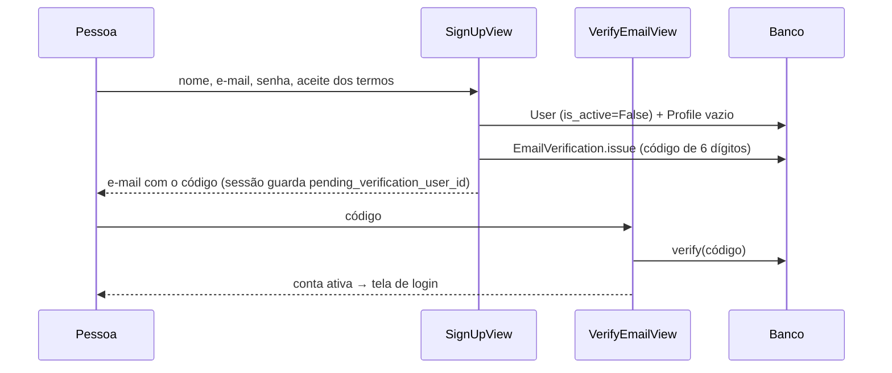

# 07 — Contas e autenticação

> Como uma pessoa passa a existir na LPS e como entra. Especificação das telas
> em `Telas/09_01_LOGIN.md`, `09_02_CRIAR_CONTA.md`, `09_03_CONFIRMAR_EMAIL.md`
> e `09_04_CADASTRO_NOVO_USUARIO_LPS.md`. Código em `accounts/` e nas telas de
> usuário de `core/`.

---

## 1. Duas formas de criar uma pessoa

| | Autocadastro (`/accounts/criar-conta/`) | Cadastro pelo administrador (`/usuarios/novo/`) |
|---|---|---|
| Quem faz | a própria pessoa | quem tem `usuario.editar` |
| Conta nasce | **inativa** até confirmar o e-mail | ativa, com senha definida pelo admin |
| `username` | gerado (`conta-<20 hex>`) | digitado pelo admin |
| Organização | **nenhuma** | a do admin (campo obrigatório, travado nela) |
| Setores | nenhum | escolhidos no formulário (`AccessService.sync_user_sectors`) |
| Auditoria | não | `USER_CREATED` (+ `SECTORS_CHANGED`) |

Em ambos os casos o signal `accounts.signals` cria o `Profile` vazio no
`post_save` do `User`; o `UserFormView` preenche a organização em seguida.

Uma conta criada pelo autocadastro consegue logar depois de confirmar o
e-mail, mas **toda tela da LPS a redireciona para `/accounts/me/`** até um
administrador vinculá-la a uma organização (hoje, pelo Admin do Django —
a tela `/usuarios/` só lista pessoas que já são da organização).

---

## 2. Autocadastro e confirmação de e-mail

- `SignUpForm` (`accounts/forms.py`): e-mail único sem diferenciar maiúsculas;
  valida a senha com os validadores do Django; aceite dos termos obrigatório.
- `EmailVerification` (`accounts/models.py`):
  - código de 6 dígitos, válido por **15 minutos** (`CODE_TTL`);
  - no máximo **5 tentativas** (`MAX_ATTEMPTS`);
  - reenviar só depois de **60 segundos** (`RESEND_COOLDOWN`); o novo código
    substitui o anterior.
- A tela de confirmação mostra o e-mail mascarado e usa a sessão
  (`PendingVerificationMixin`) para saber qual conta está pendente; sem ela,
  volta para o cadastro.
- `confirmar-email/alterar/` troca o e-mail da conta pendente (também único) e
  emite um novo código.
- Em dev, o e-mail com o código aparece no console do `runserver`.

| URL | Nome | View |
|---|---|---|
| `/accounts/criar-conta/` | `signup` | `SignUpView` |
| `/accounts/confirmar-email/` | `verify-email` | `VerifyEmailView` |
| `/accounts/confirmar-email/reenviar/` (POST) | `verify-email-resend` | `ResendVerificationCodeView` |
| `/accounts/confirmar-email/alterar/` | `verify-email-change` | `ChangeVerificationEmailView` |

---

## 3. Login

- `/accounts/login/` usa `LoginView` com `EmailAuthenticationForm` (o campo
  "username" vira um campo de e-mail).
- `accounts.auth_backends.EmailBackend` é o **único** backend: busca
  `User` por `email__iexact`, confere a senha e `user_can_authenticate`
  (contas inativas são recusadas). Se houver dois usuários com o mesmo e-mail,
  o login é recusado.
- O `username` continua existindo como identificador interno e para
  @menções.
- Após o login: `home` (`/`). Logout: `/accounts/logout/` → login.

---

## 4. Recuperação de senha

Views nativas do Django, com templates próprios em `templates/accounts/`:

| URL | Nome |
|---|---|
| `/accounts/esqueci-senha/` | `password_reset` |
| `/accounts/esqueci-senha/enviado/` | `password_reset_done` |
| `/accounts/redefinir-senha/<uidb64>/<token>/` | `password_reset_confirm` |
| `/accounts/redefinir-senha/concluido/` | `password_reset_complete` |

Corpo e assunto do e-mail: `templates/registration/password_reset_email.html`
e `password_reset_subject.txt`. A troca pelo próprio usuário **não** é
auditada; `AuditLog.PASSWORD_RESET` só é gravado quando um admin define nova
senha em `/usuarios/<id>/`.

---

## 5. Perfil e superusuário

- `/accounts/me/` (`profile`): a pessoa edita telefone e setor principal
  (`ProfileForm`). A organização aparece só para leitura.
- Superusuário: criado por `createsuperuser` (local) ou `ensure_superuser`
  (deploy). Passa por todas as verificações de autorização, mas precisa de
  organização no `Profile` para usar as telas da LPS — e de **e-mail** para
  conseguir logar.
